# 🚀 第一章：系统设计入门

> **"好的系统设计不是一蹴而就的，而是在权衡中不断演进的。"**

欢迎来到系统设计的世界！无论你是准备面试，还是想在工作中构建更好的系统，这一章都将为你打下坚实的基础。

---

## 📑 本章目录

- [1.1 什么是系统设计](#11-什么是系统设计)
- [1.2 分布式系统的核心特性](#12-分布式系统的核心特性)
- [1.3 系统设计四步法](#13-系统设计四步法)
- [1.4 估算的艺术：粗略估算](#14-估算的艺术粗略估算)
- [1.5 重要的设计权衡](#15-重要的设计权衡)
- [1.6 本章小结](#16-本章小结)

---

## 1.1 什么是系统设计

### 🤔 一个简单的类比

想象你要开一家**餐厅** 🍽️：

- 只有 10 个客人时，一个厨师、一个服务员就够了
- 当客人增加到 1000 人时，你需要更多的厨师、更大的厨房、更多的服务员、甚至分店
- 当客人增加到 100 万人时，你需要供应链管理、中央厨房、标准化流程……

**系统设计就是解决"当规模变大时，如何让系统依然高效运转"这个问题。**

### 📖 正式定义

**系统设计（System Design）** 是定义系统架构、模块、接口和数据流的过程，目标是满足特定的功能需求和非功能需求。

```
功能需求 = 系统"做什么"（What）
非功能需求 = 系统"做得多好"（How well）
```

### 🌍 为什么系统设计很重要？

| 场景 | 没有好的系统设计 | 有好的系统设计 |
|------|-----------------|---------------|
| 用户量增长 10 倍 | 😱 系统崩溃 | 😊 自动扩展 |
| 某台服务器宕机 | 😱 全站不可用 | 😊 自动切换，用户无感知 |
| 新功能上线 | 😱 牵一发而动全身 | 😊 模块独立，快速迭代 |
| 数据量爆炸 | 😱 查询慢如蜗牛 | 😊 分库分表，毫秒响应 |

### 🏗️ 系统设计的全景图

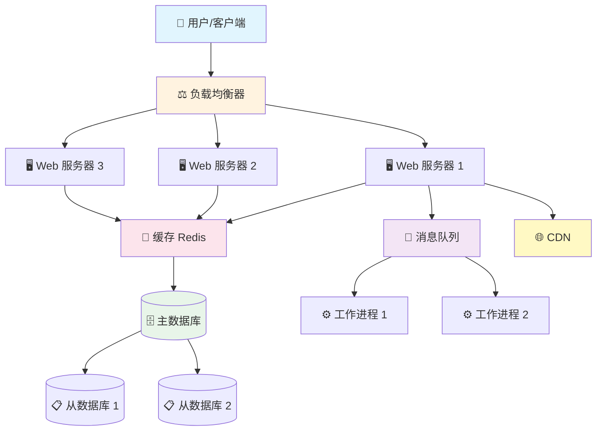

这就是一个典型的分布式系统架构。接下来，我们逐一理解它背后的核心特性。

---

## 1.2 分布式系统的核心特性

一个好的分布式系统需要具备以下 **五大核心特性**：

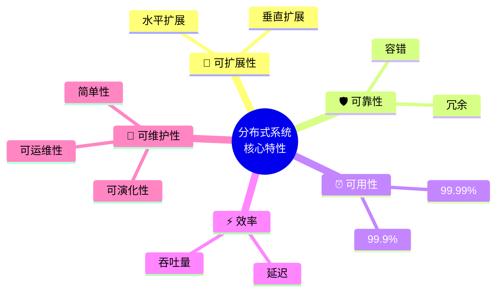

### 🔄 1. 可扩展性（Scalability）

**类比：图书馆 📚**

当你的小区图书馆书越来越多、读者越来越多时：

- **垂直扩展（Scale Up）**：换一栋更大的楼 → 更强的服务器（更多 CPU、内存）
- **水平扩展（Scale Out）**：开更多分馆 → 增加更多服务器

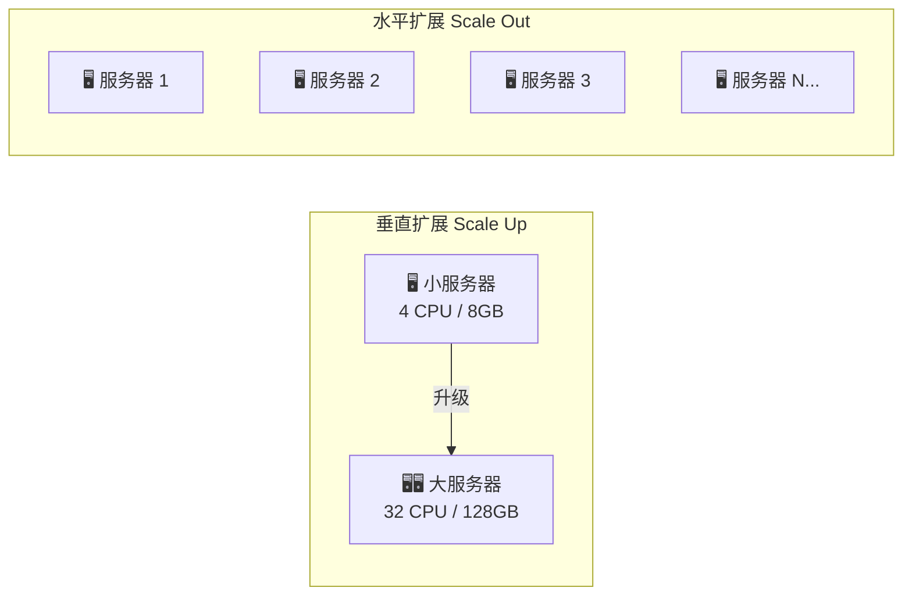

| 对比 | 垂直扩展 | 水平扩展 |
|------|---------|---------|
| 方式 | 升级单机硬件 | 增加更多机器 |
| 成本 | 越来越贵（指数级） | 线性增长 |
| 上限 | 有物理上限 | 理论上无限 |
| 复杂度 | 低 | 高（需要分布式协调） |
| 宕机影响 | 全部不可用 | 部分不可用 |

> 💡 **实践原则**：优先考虑水平扩展，因为单机性能总有上限。

### 🛡️ 2. 可靠性（Reliability）

**类比：邮局 📮**

一个可靠的邮局系统应该做到：
- 即使某个邮递员生病了，信件仍然能被送达（**容错**）
- 重要的信件会有备份（**冗余**）
- 不会把你的信弄丢或者送错（**数据完整性**）

**可靠性的核心手段是冗余（Redundancy）**：

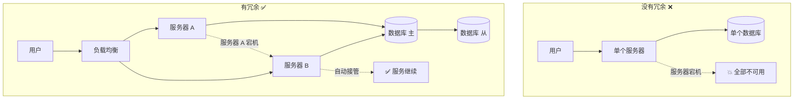

### ⏰ 3. 可用性（Availability）

可用性用 **"几个 9"** 来衡量：

| 可用性等级 | 年停机时间 | 描述 |
|-----------|-----------|------|
| 99%（两个 9） | 3.65 天 | 基本可用 |
| 99.9%（三个 9） | 8.76 小时 | 较高可用 |
| 99.99%（四个 9） | 52.6 分钟 | 高可用 |
| 99.999%（五个 9） | 5.26 分钟 | 极高可用 |

> 🤔 **可靠性 vs 可用性**
>
> - **可靠性**：系统在给定时间内正确工作的概率（不出错）
> - **可用性**：系统在给定时间内可被使用的概率（在线）
>
> 一个系统可以"可用但不可靠"（虽然在线但偶尔返回错误结果），
> 但一个"可靠的系统一定是可用的"。

### ⚡ 4. 效率（Efficiency）

效率通常用两个指标衡量：

- **延迟（Latency）**：完成一次操作需要多少时间？→ 响应有多快
- **吞吐量（Throughput）**：单位时间内能完成多少操作？→ 能处理多少

**类比：高速公路 🛣️**
- 延迟 = 从 A 城到 B 城需要多久（车速）
- 吞吐量 = 这条路每小时能通过多少辆车（车道数）

```python
# 效率优化的思路示例
# 场景：用户请求个人主页数据

# ❌ 低效方式：串行请求
def get_profile_slow(user_id):
    user = db.query("SELECT * FROM users WHERE id = ?", user_id)       # 50ms
    posts = db.query("SELECT * FROM posts WHERE user_id = ?", user_id)  # 100ms
    friends = db.query("SELECT * FROM friends WHERE user_id = ?", user_id)  # 80ms
    # 总延迟: 50 + 100 + 80 = 230ms

# ✅ 高效方式：并行请求 + 缓存
async def get_profile_fast(user_id):
    cache_key = f"profile:{user_id}"
    cached = cache.get(cache_key)
    if cached:
        return cached  # 缓存命中: ~1ms

    # 并行查询
    user, posts, friends = await asyncio.gather(
        db.query_async("SELECT * FROM users WHERE id = ?", user_id),
        db.query_async("SELECT * FROM posts WHERE user_id = ?", user_id),
        db.query_async("SELECT * FROM friends WHERE user_id = ?", user_id),
    )
    # 总延迟: max(50, 100, 80) = 100ms

    result = {"user": user, "posts": posts, "friends": friends}
    cache.set(cache_key, result, ttl=300)
    return result
```

### 🔧 5. 可维护性（Maintainability）

一个好的系统应该让后来的工程师**不痛苦**：

- **可运维性（Operability）**：运维团队能方便地监控和管理
- **简单性（Simplicity）**：新工程师能快速理解系统
- **可演化性（Evolvability）**：能方便地做出修改和扩展

> 💡 **记住**：代码被阅读的次数远远多于被编写的次数。花在维护上的时间远超开发。

---

## 1.3 系统设计四步法

面对一个系统设计问题，不要上来就画架构图！按照以下 **四步法** 有条不紊地推进：

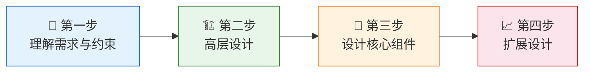

### 🎯 第一步：理解需求与约束

**这是最重要的一步！** 很多人在面试中失败，不是因为技术不好，而是因为没有搞清楚问题。

你需要明确：

#### 功能需求（Use Cases）
- 系统要支持哪些功能？
- 谁是用户？他们怎么使用系统？
- 输入和输出是什么？

#### 非功能需求与约束（Constraints）
- 预期有多少用户？
- 读写比例是多少？
- 数据量有多大？
- 可用性和延迟要求是什么？

**示例：设计一个短链接系统（如 bit.ly）**

```markdown
✅ 需要搞清楚的问题：

功能需求：
- 用户提交长 URL，系统返回短 URL
- 用户访问短 URL，系统重定向到长 URL
- 短链接是否会过期？
- 用户能否自定义短链接？

约束与估算：
- 每月新建短链接数量？→ 假设 1 亿/月
- 读写比？→ 假设 100:1（读多写少）
- 短链接长度？→ 7 个字符
- 数据保留时间？→ 5 年
```

> 🎯 **关键心法**：先问清楚、再动手。错误的假设会导致完全错误的设计。

### 🏗️ 第二步：高层设计

用简单的框图描绘系统的主要组件及其交互关系。**不要一开始就考虑细节！**

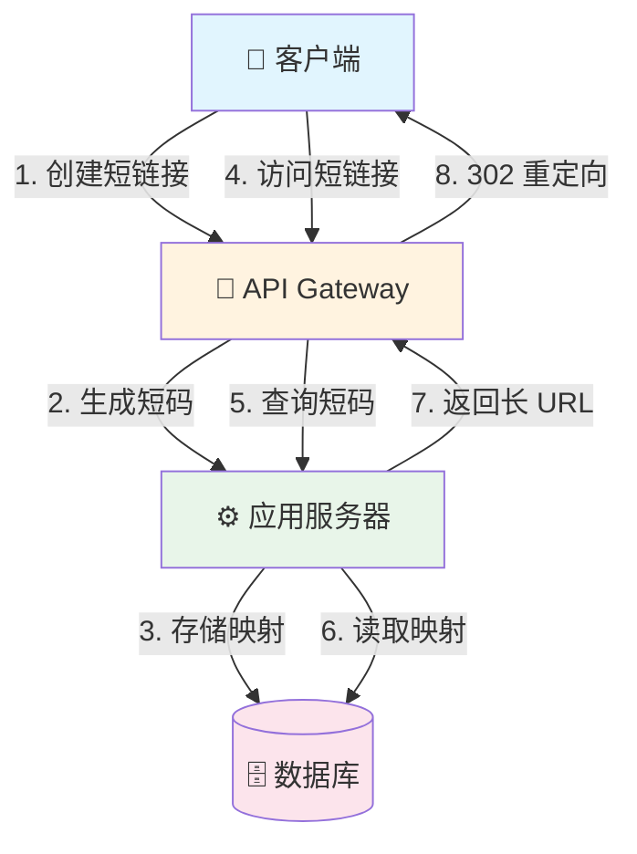

> 💡 **高层设计的目标**：让任何人在 30 秒内理解你的系统是怎么工作的。

### 🔩 第三步：设计核心组件

深入每个组件的细节。以短链接系统为例：

#### 如何生成短码？

```python
import hashlib
import base64

def generate_short_url(long_url: str) -> str:
    """方案一：Hash + 截断"""
    md5_hash = hashlib.md5(long_url.encode()).hexdigest()
    # 取前 7 个字符作为短码
    short_code = md5_hash[:7]
    return short_code

def generate_short_url_base62(counter: int) -> str:
    """方案二：自增 ID + Base62 编码"""
    chars = "0123456789abcdefghijklmnopqrstuvwxyzABCDEFGHIJKLMNOPQRSTUVWXYZ"
    result = []
    while counter > 0:
        result.append(chars[counter % 62])
        counter //= 62
    return "".join(reversed(result))

# 示例
print(generate_short_url("https://example.com/very/long/url"))
# 输出: "a3f2b7c"

print(generate_short_url_base62(123456789))
# 输出: "8M0kX"
```

#### 数据库 Schema 设计

```sql
CREATE TABLE url_mappings (
    id          BIGINT PRIMARY KEY AUTO_INCREMENT,
    short_code  VARCHAR(7) UNIQUE NOT NULL,
    long_url    TEXT NOT NULL,
    created_at  TIMESTAMP DEFAULT CURRENT_TIMESTAMP,
    expires_at  TIMESTAMP,
    click_count BIGINT DEFAULT 0,
    INDEX idx_short_code (short_code)
);
```

#### API 设计

```
POST /api/v1/urls
  Request:  { "long_url": "https://example.com/..." }
  Response: { "short_url": "https://short.ly/a3f2b7c" }

GET /:short_code
  Response: 302 Redirect → long_url
```

### 📈 第四步：扩展设计

当用户量从 1000 增长到 1000 万时，系统需要如何演进？

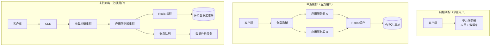

扩展设计时需要考虑的关键问题：

| 瓶颈 | 解决方案 |
|------|---------|
| 单机数据库性能不足 | 读写分离、分库分表（Sharding） |
| 热点数据访问慢 | 引入缓存层（Redis / Memcached） |
| 单点故障 | 多副本、自动故障转移（Failover） |
| 静态资源加载慢 | 使用 CDN |
| 突发流量 | 限流（Rate Limiting）、降级 |
| 跨地域延迟高 | 多数据中心部署 |

---

## 1.4 估算的艺术：粗略估算

在系统设计中，**粗略估算（Back-of-the-envelope Estimation）** 是一项至关重要的技能。它帮助你快速判断方案是否可行，而不需要精确到小数点后几位。

### 📊 2 的幂次表（Powers of 2）

每个工程师都应该牢记的基本数据：

| 幂次 | 精确值 | 近似值 | 含义 |
|------|--------|--------|------|
| 2^10 | 1,024 | ~1 千（1 KB） | 一千字节 |
| 2^20 | 1,048,576 | ~1 百万（1 MB） | 一百万字节 |
| 2^30 | 1,073,741,824 | ~10 亿（1 GB） | 十亿字节 |
| 2^40 | 1,099,511,627,776 | ~1 万亿（1 TB） | 一万亿字节 |
| 2^50 | — | ~1 千万亿（1 PB） | 一千万亿字节 |

> 💡 **记忆技巧**：每增加 10 个幂次，量级增大约 1000 倍（KB → MB → GB → TB）。

### ⏱️ 延迟数字（Latency Numbers Everyone Should Know）

Jeff Dean 经典的延迟数据（2023 年近似值）：

| 操作 | 延迟 | 类比 |
|------|------|------|
| L1 缓存引用 | ~1 ns | 眨一下眼 👁️ |
| L2 缓存引用 | ~4 ns | 打个响指 |
| 主内存引用 | ~100 ns | 翻一页书 📖 |
| SSD 随机读取 | ~16 μs | 走到书架前 🚶 |
| HDD 随机读取 | ~2 ms | 走到隔壁房间 🚪 |
| 同数据中心网络往返 | ~0.5 ms | 打个电话 📞 |
| 从内存顺序读 1 MB | ~3 μs | 读一段话 |
| 从 SSD 顺序读 1 MB | ~49 μs | 读一页 |
| 从 HDD 顺序读 1 MB | ~825 μs | 读一章 |
| 跨大陆网络往返 | ~150 ms | 寄一封跨城快递 📦 |

```
                         延迟可视化（对数刻度）
    1 ns ├──┤ L1 缓存
    4 ns ├────┤ L2 缓存
  100 ns ├──────────┤ 主内存
   16 μs ├─────────────────────────────┤ SSD 随机读
    2 ms ├─────────────────────────────────────────────────┤ HDD 随机读
  150 ms ├─────────────────────────────────────────────────────────────────┤ 跨洲往返
```

### 🧮 估算实战

**例题：估算 Twitter 的存储需求**

```
已知条件（假设）：
- 日活用户（DAU）：2 亿
- 每个用户平均每天发 2 条推文
- 每条推文平均 280 字节（纯文本）
- 20% 的推文带有图片，每张图片平均 200 KB
- 数据保留 5 年

计算过程：

每日推文数 = 2 亿 × 2 = 4 亿条/天

纯文本存储/天：
  4 亿 × 280 B = 1120 亿 B ≈ 112 GB/天

图片存储/天：
  4 亿 × 20% × 200 KB = 0.8 亿 × 200 KB = 16 TB/天

5 年总存储：
  文本：112 GB × 365 × 5 ≈ 200 TB
  图片：16 TB × 365 × 5 ≈ 29 PB

结论：需要约 30 PB 的存储空间，图片是存储大户！
```

### 📐 常用估算公式

```python
# QPS 估算
daily_active_users = 100_000_000   # 1 亿日活
actions_per_user_per_day = 10      # 每用户每天 10 次操作

daily_requests = daily_active_users * actions_per_user_per_day
# = 10 亿次/天

average_qps = daily_requests / 86400       # 86400 秒/天
# ≈ 11,574 QPS

peak_qps = average_qps * 3                 # 峰值通常是平均的 2~5 倍
# ≈ 34,722 QPS

# 存储估算
data_per_request = 500                      # 每次请求 500 字节
daily_storage = daily_requests * data_per_request
# = 5000 亿 B ≈ 500 GB/天

yearly_storage = daily_storage * 365
# ≈ 182 TB/年
```

---

## 1.5 重要的设计权衡

系统设计没有"完美方案"，只有"最合适的方案"。每一个设计决策都是一次**权衡（Trade-off）**。

### ⚖️ 核心权衡一览

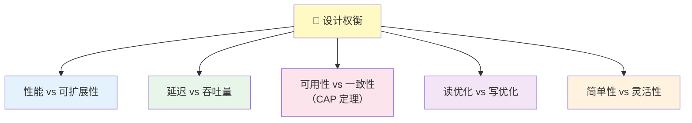

### 1️⃣ 性能 vs 可扩展性

- **性能问题**：系统对单个用户来说很慢
- **可扩展性问题**：系统对单个用户很快，但在高负载下变慢

> 如果你的系统只有一个用户时就很慢，那是性能问题；
> 如果只有一个用户时很快，一万个用户时变慢了，那是可扩展性问题。

### 2️⃣ 延迟 vs 吞吐量

- **延迟（Latency）**：完成一个操作花多长时间
- **吞吐量（Throughput）**：单位时间内完成多少操作

> 🎯 **目标**：在可接受的延迟下，尽可能最大化吞吐量。

### 3️⃣ 可用性 vs 一致性（CAP 定理）

这是分布式系统中最经典的权衡：

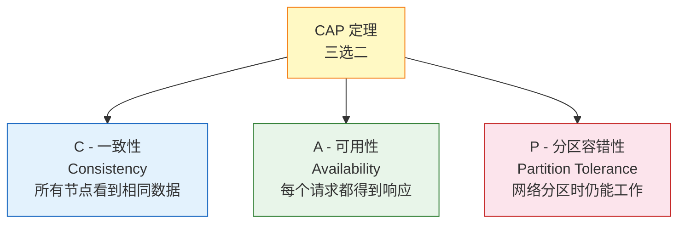

**CAP 定理说的是**：在网络分区发生时，你只能在一致性和可用性之间选择一个。

| 选择 | 含义 | 适用场景 |
|------|------|---------|
| CP（一致性 + 分区容错） | 牺牲可用性，保证数据一致 | 银行转账、库存管理 |
| AP（可用性 + 分区容错） | 牺牲一致性，保证服务可用 | 社交媒体动态、DNS |

**类比：银行 vs 社交网络 🏦📱**
- 银行转账：必须保证一致性（CP）— 你不希望转了钱但余额没变
- 朋友圈点赞：可以暂时不一致（AP）— 迟几秒看到新的点赞数是可以接受的

> ⚠️ **注意**：在现代系统中，网络分区是必然会发生的，所以 P 几乎总是必选的。真正的选择是在 C 和 A 之间。

### 4️⃣ 读优化 vs 写优化

| 策略 | 读性能 | 写性能 | 适用场景 |
|------|--------|--------|---------|
| 读优化 | ⚡ 快 | 🐢 慢 | 新闻网站、商品展示（读多写少） |
| 写优化 | 🐢 慢 | ⚡ 快 | 日志系统、IoT 数据采集（写多读少） |
| 平衡 | 🔄 适中 | 🔄 适中 | 社交平台（读写均衡） |

### 5️⃣ 简单性 vs 灵活性

```
简单的系统 → 容易理解、维护、调试，但可能不够灵活
灵活的系统 → 可以应对各种变化，但复杂度高、容易出错

🎯 原则：从简单开始，按需增加复杂度（YAGNI - You Ain't Gonna Need It）
```

### 🧭 如何做决策？

面对权衡时，问自己这些问题：

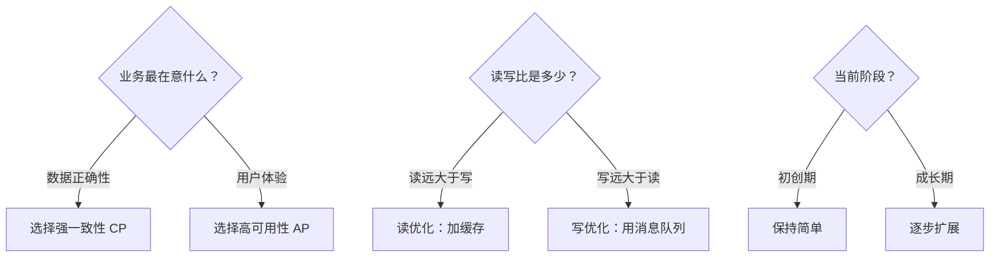

---

## 1.6 本章小结

### 📝 关键要点回顾

```
✅ 系统设计 = 在约束条件下构建满足需求的系统架构
✅ 五大核心特性：可扩展性、可靠性、可用性、效率、可维护性
✅ 四步法：需求 → 高层设计 → 核心组件 → 扩展设计
✅ 粗略估算：2 的幂次、延迟数字、QPS 和存储计算
✅ 设计权衡：没有完美方案，只有最适合的方案
```

### 🗺️ 核心概念总览

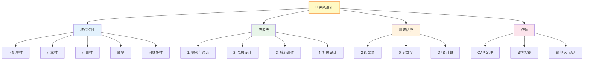

---

## 🏋️ 练习题

### 练习 1：概念理解

1. 用你自己的话解释**水平扩展**和**垂直扩展**的区别，并各举一个现实生活中的例子。
2. 为什么说 CAP 定理中 P（分区容错性）几乎总是必选的？
3. 一个系统的可用性是 99.99%，每年最多允许停机多长时间？

### 练习 2：粗略估算

> **题目**：估算微信朋友圈的存储需求
>
> 假设：
> - 日活用户 5 亿
> - 10% 的用户每天发一条朋友圈
> - 每条朋友圈平均包含 100 字文字 + 3 张图片
> - 每个中文字符占 3 字节（UTF-8），每张图片平均 500 KB
> - 数据保留 3 年
>
> 请估算：
> 1. 每天的文字存储量
> 2. 每天的图片存储量
> 3. 3 年的总存储量

<details>
<summary>💡 点击查看参考答案</summary>

```
每天发朋友圈的用户数 = 5 亿 × 10% = 5000 万

文字存储/天：
  5000 万 × 100 字 × 3 字节 = 150 亿字节 ≈ 15 GB/天

图片存储/天：
  5000 万 × 3 张 × 500 KB = 750 亿 KB ≈ 75 TB/天

3 年总存储：
  文字：15 GB × 365 × 3 ≈ 16.4 TB
  图片：75 TB × 365 × 3 ≈ 82 PB
  合计：约 82 PB（图片占绝对主导地位）
```

</details>

### 练习 3：设计思考

> **题目**：用四步法分析"设计一个在线停车场系统"
>
> 请完成以下步骤：
> 1. **第一步**：列出至少 5 个需要和面试官确认的需求问题
> 2. **第二步**：画出高层设计图（可以用文字描述组件和它们的关系）
> 3. **第三步**：设计停车位数据库的 Schema
> 4. **第四步**：当系统需要支持 1000 个停车场时，你会如何扩展？

<details>
<summary>💡 点击查看参考思路</summary>

**第一步 - 需求确认：**
1. 停车场有多少层？多少个车位？
2. 是否需要支持不同类型的车位（小型、大型、残疾人）？
3. 是否需要计费？计费规则是什么？
4. 是否需要支持预约？
5. 是否需要实时显示剩余车位数？
6. 并发量有多高？（大型商场 vs 小区停车场）

**第二步 - 高层设计：**
- 客户端（App / 入口闸机） → API 服务器 → 数据库
- 入口传感器 → 实时车位更新 → 显示屏

**第三步 - 数据库 Schema（示例）：**
```sql
CREATE TABLE parking_spots (
    id          BIGINT PRIMARY KEY,
    lot_id      INT NOT NULL,
    floor       INT,
    spot_type   ENUM('small', 'large', 'handicap'),
    is_occupied BOOLEAN DEFAULT FALSE
);

CREATE TABLE parking_tickets (
    id          BIGINT PRIMARY KEY,
    spot_id     BIGINT REFERENCES parking_spots(id),
    vehicle_plate VARCHAR(20),
    entry_time  TIMESTAMP,
    exit_time   TIMESTAMP,
    fee         DECIMAL(10, 2)
);
```

**第四步 - 扩展思路：**
- 按停车场 ID 分片（Sharding）
- 热点停车场加缓存
- 车位状态用 Redis 维护（实时性）
- 计费异步处理（消息队列）

</details>

---

## 📚 推荐阅读

- 📖 本仓库的 [系统设计主题](../../README-zh-Hans.md) — 完整的系统设计学习路径
- 📖 [Designing Data-Intensive Applications](https://dataintensive.net/) — 数据密集型应用系统设计（经典必读）
- 📖 [System Design Interview](https://www.amazon.com/System-Design-Interview-insiders-Second/dp/B08CMF2CQF) — 系统设计面试指南

---

> ⬅️ 上一章：无（这是第一章） | ➡️ 下一章：[第二章：可扩展性与性能基础](../02-scalability/README.md)
