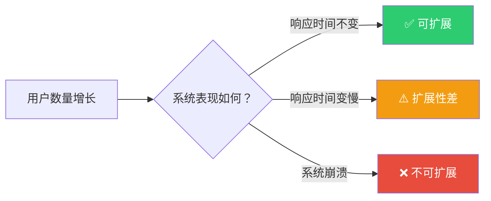
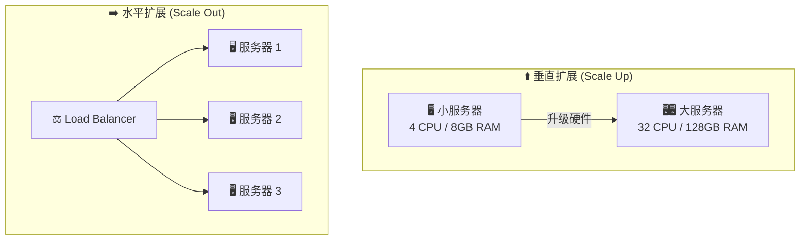
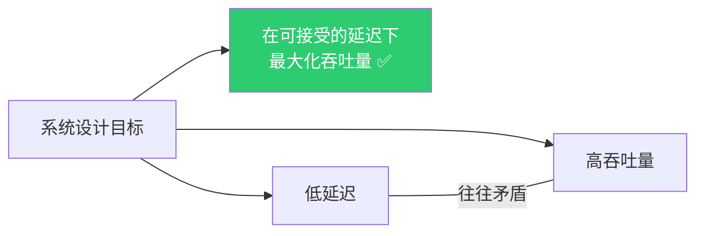
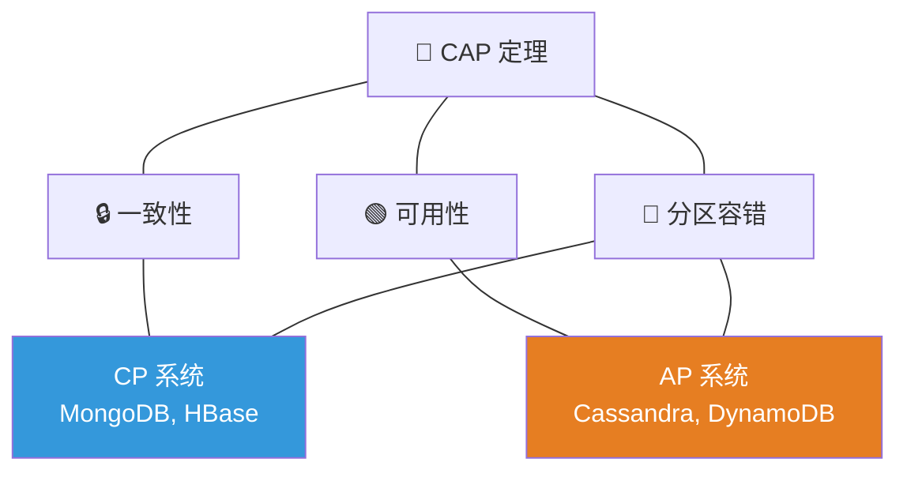
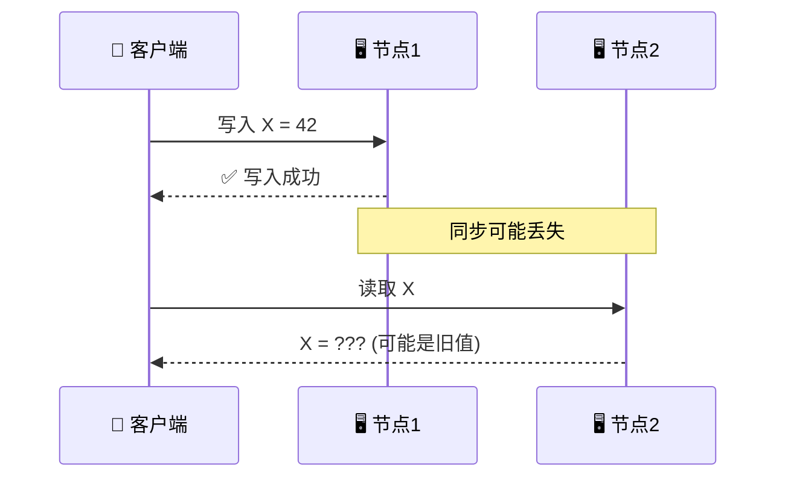
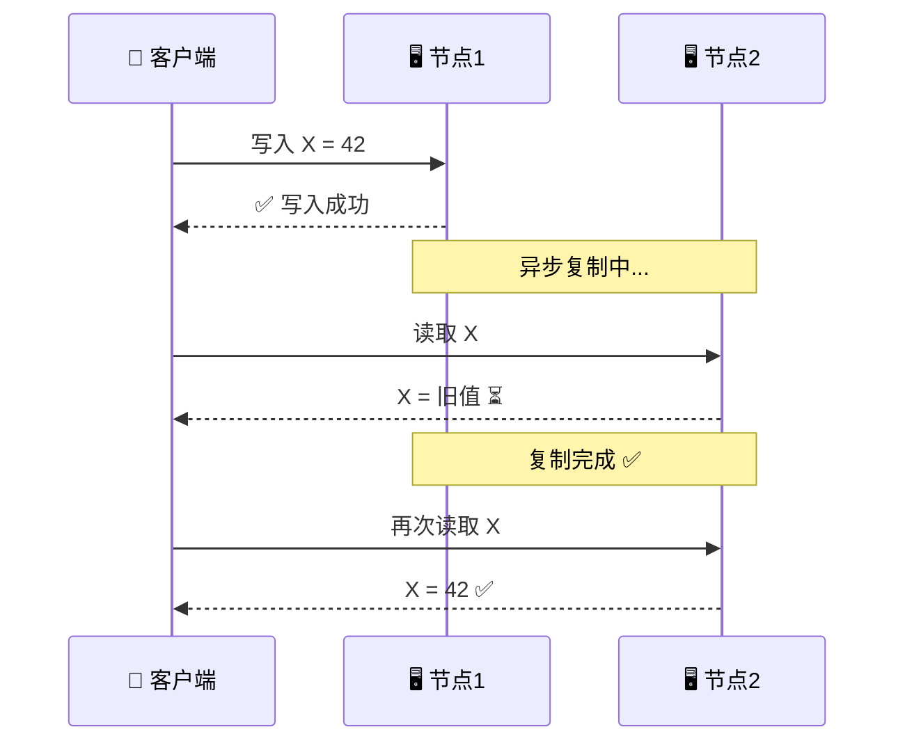
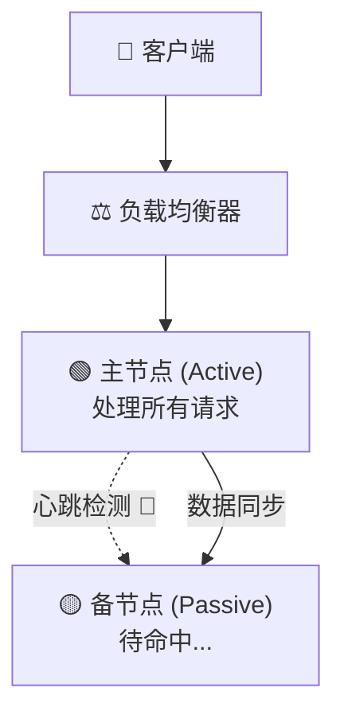
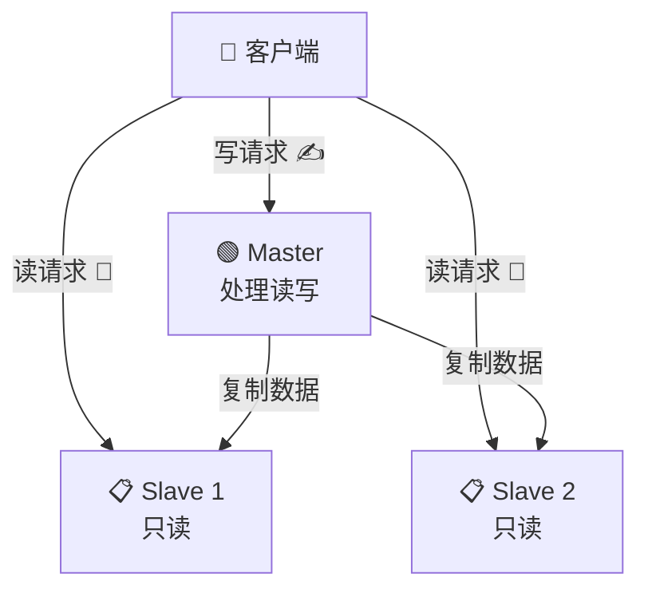
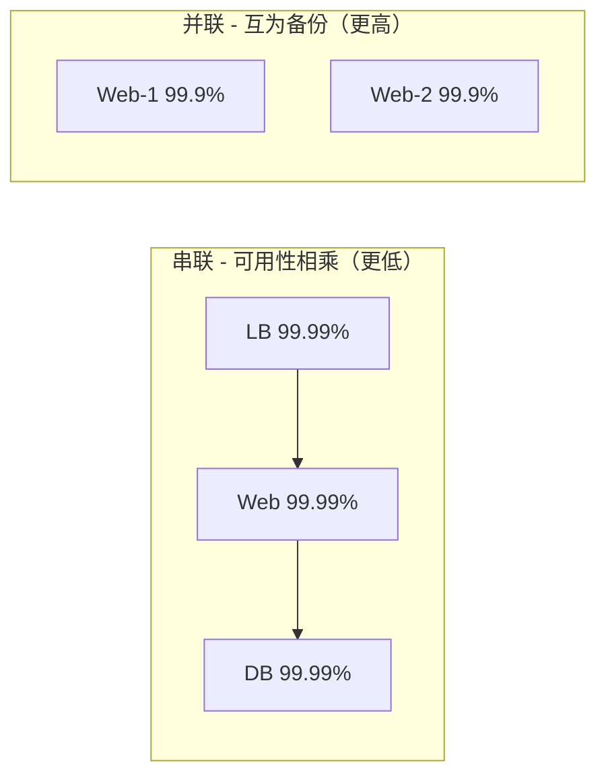
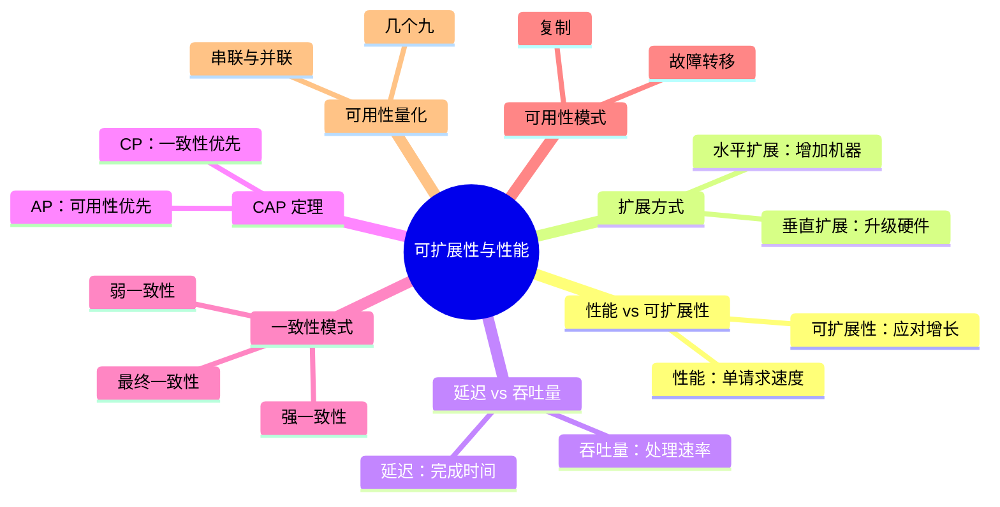

# 📊 第二章：可扩展性与性能基础

> **"系统设计的核心挑战不是让系统跑起来，而是让它在百万用户面前依然稳如泰山。"**

本章深入探讨构建大规模系统时最核心的话题：**性能（Performance）**、**可扩展性（Scalability）**、**可用性（Availability）** 和 **一致性（Consistency）**。

---

## 📑 本章目录

| 节号 | 主题 | 关键词 |
|------|------|--------|
| 2.1 | 性能与可扩展性 | Performance, Scalability |
| 2.2 | 垂直扩展 vs 水平扩展 | Vertical, Horizontal |
| 2.3 | 延迟与吞吐量 | Latency, Throughput |
| 2.4 | CAP 定理 | Consistency, Availability, Partition Tolerance |
| 2.5 | 一致性模式 | Weak, Eventual, Strong |
| 2.6 | 可用性模式 | Fail-over, Replication |
| 2.7 | 可用性的量化 | SLA, Nines |
| 2.8 | 本章小结 | 总结与练习 |

---

## 2.1 性能与可扩展性

### 🤔 它们有什么区别？

| 维度 | 性能 (Performance) | 可扩展性 (Scalability) |
|------|-------------------|----------------------|
| **关注点** | 单个请求的快慢 | 系统能否应对增长 |
| **衡量** | 响应时间、延迟 | 能处理多少并发用户/请求 |
| **类比** | 一辆跑车跑得多快 🏎️ | 一条公路能容纳多少车 🛣️ |

> 💡 **简单记忆**：
> - 性能问题 → 系统对 **一个用户** 也很慢
> - 可扩展性问题 → 系统对 **一个用户** 很快，但 **一万个用户** 同时访问就崩了

### 🍜 餐厅类比

```
性能问题：厨师做一碗面要 30 分钟（太慢了！）
  → 解决：换一个更熟练的厨师，或改进做面流程

可扩展性问题：厨师做一碗面只要 3 分钟，但午餐高峰来了 100 个客人
  → 解决：多雇几个厨师，或者开分店
```



---

## 2.2 垂直扩展 vs 水平扩展

### ⬆️ 垂直扩展 (Scale Up)

给现有机器增加更多资源（CPU、内存、硬盘）。

> 🏋️ 类比：让一个举重运动员吃更多蛋白粉，变得更强壮。

### ➡️ 水平扩展 (Scale Out)

增加更多的机器来分担负载。

> 👥 类比：请更多举重运动员一起来搬东西。



### 📋 详细对比

| 特性 | 垂直扩展 ⬆️ | 水平扩展 ➡️ |
|------|-------------|-------------|
| **方式** | 升级单台机器 | 增加更多机器 |
| **成本** | 高端硬件越来越贵 💰💰💰 | 普通硬件即可 💰 |
| **上限** | 有物理上限 | 理论上无限 ♾️ |
| **复杂度** | 简单，无需改代码 | 复杂，需要分布式设计 |
| **单点故障** | 有 | 无（一台挂了其他顶上）|
| **停机时间** | 升级需要停机 | 可以滚动升级 |
| **典型场景** | 数据库、早期创业公司 | 大规模 Web 应用 |

**水平扩展配置示例**（Nginx 负载均衡）：

```nginx
upstream backend_servers {
    server 192.168.1.101:8080 weight=3;
    server 192.168.1.102:8080 weight=2;
    server 192.168.1.103:8080 weight=1;
}

server {
    listen 80;
    location / {
        proxy_pass http://backend_servers;
    }
}
```

> 🎯 **实战建议**：先垂直扩展（便宜简单），到了瓶颈再水平扩展。

---

## 2.3 延迟与吞吐量

### 🚗 高速公路类比

```
延迟 (Latency) = 从北京开车到上海需要多长时间（12 小时）
吞吐量 (Throughput) = 这条高速公路每小时能通过多少辆车（5000 辆/小时）

  - 拓宽高速公路（增加车道）→ 提高吞吐量，但不影响延迟
  - 提高限速 → 降低延迟，但不一定提高吞吐量
  - 它们是相关但独立的指标！
```

### 📊 常见操作的延迟

| 操作 | 延迟 | 类比 |
|------|------|------|
| L1 缓存访问 | ~0.5 ns | 眨一下眼 👁️ |
| 主内存访问 | ~100 ns | 喝一口水 💧 |
| SSD 随机读取 | ~150 μs | 泡一杯茶 🍵 |
| HDD 随机读取 | ~10 ms | 煮一碗面 🍜 |
| 同城网络往返 | ~0.5 ms | 同城快递 🛵 |
| 跨国网络往返 | ~150 ms | 国际快递 ✈️ |

> 💡 内存访问比磁盘访问快 **10 万倍**！这就是为什么 **缓存（Cache）** 如此重要。

### 💻 延迟测量示例

```python
import time
import statistics

def measure_latency(func, iterations=100):
    """测量函数的延迟（毫秒）"""
    latencies = []
    for _ in range(iterations):
        start = time.perf_counter()
        func()
        end = time.perf_counter()
        latencies.append((end - start) * 1000)

    return {
        "p50": statistics.median(latencies),
        "p95": sorted(latencies)[int(0.95 * len(latencies))],
        "p99": sorted(latencies)[int(0.99 * len(latencies))],
    }

result = measure_latency(lambda: time.sleep(0.01))
print(f"P50: {result['p50']:.2f}ms, P99: {result['p99']:.2f}ms")
```

> ⚠️ **面试重点**：不要只看平均延迟！**P99 延迟** 才是衡量用户体验的关键。



---

## 2.4 CAP 定理

CAP 定理是分布式系统中 **最重要的理论之一**，由 Eric Brewer 于 2000 年提出。

### 🔺 三个核心属性

| 字母 | 含义 | 解释 |
|------|------|------|
| **C** | Consistency（一致性） | 每次读取都能获得最新写入的数据 |
| **A** | Availability（可用性） | 每个请求都能收到非错误的响应 |
| **P** | Partition Tolerance（分区容错） | 即使网络分区，系统仍能运行 |

> **核心观点：当发生网络分区（P）时，你只能在一致性（C）和可用性（A）之间二选一。**



### 🏦 银行 ATM 类比

两台 ATM 连接同一个账户（余额 1000 元），网络中断了。你在 ATM-A 取了 500 元...

```
选择 CP（一致性优先）：
  ATM-A: 余额 500 ✅ | ATM-B: 🚫 拒绝服务（直到网络恢复）
  → 保证数据正确，但牺牲可用性

选择 AP（可用性优先）：
  ATM-A: 余额 500 ✅ | ATM-B: 余额 1000 ⚠️（数据过期）
  → 保证服务可用，但数据可能不一致
```

> 🏦 银行选择 **CP**！钱的一致性比 ATM 的可用性更重要。

### 📱 社交媒体类比

```
你在微博发了一条动态...
  北京服务器：✅ 立刻看到
  上海服务器：⏳ 2 秒后看到
  广州服务器：⏳ 5 秒后看到

晚几秒看到朋友的动态 → 没关系 ✅
微博完全不能用 → 不可接受 ❌
→ 社交媒体选择 AP（可用性优先）
```

### 📋 CP vs AP 对比

| 特性 | CP 系统 🔒 | AP 系统 🟢 |
|------|-----------|-----------|
| **优先保证** | 数据一致性 | 服务可用性 |
| **网络分区时** | 可能拒绝请求 | 继续服务 |
| **典型场景** | 金融交易、库存管理 | 社交媒体、DNS |
| **代表产品** | MongoDB, HBase, Redis | Cassandra, DynamoDB, CouchDB |

> ⚠️ **P（分区容错）是必须的**，网络分区不可避免，实际选择是 CP 还是 AP。

---

## 2.5 一致性模式

### 2.5.1 🔓 弱一致性 (Weak Consistency)

写入之后，读取**可能看到也可能看不到**最新数据。系统尽力（best-effort）同步。



**案例**：VoIP 通话（丢帧不重传）、在线游戏（位置可能短暂不准）、Memcached

> 🎮 类比：玩《王者荣耀》时，对面英雄的位置可能有轻微跳动，但游戏不会因此暂停。

### 2.5.2 ⏳ 最终一致性 (Eventual Consistency)

写入之后，数据**最终**会同步到所有节点。中间可能有短暂不一致窗口。



**案例**：电子邮件、微信朋友圈、DNS、搜索引擎索引

> 📱 类比：你发了朋友圈，北京朋友 1 秒后看到，广州朋友 3 秒后看到。最终所有人都能看到。

### 2.5.3 🔒 强一致性 (Strong Consistency)

写入之后，所有后续读取都能**立即**看到最新数据。

**案例**：银行转账、库存管理、用户认证（改密码必须立刻生效）

> 🏦 类比：转 1000 元给朋友，必须等对方确认入账后才显示"转账成功"。

### 📋 三种模式对比

| 特性 | 弱一致性 🔓 | 最终一致性 ⏳ | 强一致性 🔒 |
|------|------------|--------------|------------|
| **读取保证** | 不保证 | 最终能读到 | 立即读到 |
| **性能** | 最高 🚀 | 高 🏃 | 最低 🐢 |
| **延迟** | 最低 | 低 | 较高 |
| **适用场景** | 实时通信、游戏 | 社交媒体、搜索 | 金融、库存 |

---

## 2.6 可用性模式

### 2.6.1 🔄 故障转移 (Fail-over)

#### 主备模式 (Active-Passive)



**工作原理**：主节点处理请求，备节点通过心跳（Heartbeat）监控。心跳停止 → 备节点自动接管。

> 🏥 类比：主治医生生病，值班医生立刻顶上。

**优点**：简单可靠 | **缺点**：备节点闲置浪费资源

#### 双主模式 (Active-Active)

两个节点都处理读写请求，流量通过 DNS/LB 分配，一个挂了另一个承担全部。

> 🏪 类比：两家分店都营业，一家关门客户自动去另一家。

**优点**：资源利用率高 | **缺点**：需要处理数据冲突

| 特性 | Active-Passive | Active-Active |
|------|---------------|---------------|
| **资源利用** | 备节点闲置 50% | 两节点都工作 |
| **切换时间** | 短暂停机（秒级）| 几乎无感知 |
| **复杂度** | 简单 | 复杂（数据冲突）|

#### ⚠️ 故障转移的挑战

- **数据丢失**：主节点故障时最后几秒的写入可能未同步
- **脑裂 (Split Brain)**：两个节点都认为自己是主节点
- **切换延迟**：检测故障到完成切换需要几秒到几十秒

### 2.6.2 📋 复制 (Replication)

#### 主从复制 (Master-Slave)



- **写操作** → 只发给 Master
- **读操作** → 分散到 Slave（读可水平扩展）
- 适合 **读多写少** 的场景

> 📚 类比：老师（Master）讲课，学生（Slave）做笔记。问问题找老师，看笔记可以找任何同学。

#### 主主复制 (Master-Master)

多个 Master 都接受写操作，之间双向同步。写操作也可水平扩展，但**写冲突处理非常复杂**。

> ⚠️ 用户 A 在 Master-A 把名字改为"张三"，同时用户 B 在 Master-B 改为"李四"。谁赢？

**MySQL 主从复制配置示例**：

```sql
-- Master 上创建复制用户
CREATE USER 'repl'@'%' IDENTIFIED BY 'password';
GRANT REPLICATION SLAVE ON *.* TO 'repl'@'%';

-- Slave 上配置
CHANGE MASTER TO
    MASTER_HOST = '192.168.1.100',
    MASTER_USER = 'repl',
    MASTER_PASSWORD = 'password',
    MASTER_LOG_FILE = 'mysql-bin.000001',
    MASTER_LOG_POS = 0;
START SLAVE;
```

---

## 2.7 可用性的量化

### 📊 "几个 9"

| 可用性 | 称呼 | 每年停机 | 每月停机 | 适用场景 |
|--------|------|---------|---------|---------|
| 99% | 两个 9 | 3.65 天 | 7.31 小时 | 内部工具 |
| 99.9% | 三个 9 | 8.77 小时 | 43.8 分钟 | 商业应用 |
| 99.99% | 四个 9 | 52.6 分钟 | 4.38 分钟 | 电商平台 |
| 99.999% | 五个 9 | 5.26 分钟 | 26.3 秒 | 金融、电信 |

> 💡 每增加一个 9，成本和复杂度都会 **指数级增长**！

### 🧮 组合可用性计算

**串联**（所有组件都必须工作）：

```
可用性 = A × B × C
例：LB(99.99%) → Web(99.99%) → DB(99.99%)
  = 0.9999³ = 99.97%   ← 三个四个9 串联后降为三个半9
```

**并联**（只要一个工作就行）：

```
可用性 = 1 - (1-A)(1-B)
例：两台 Web 服务器(各 99.9%)
  = 1 - 0.001² = 99.9999%   ← 两个三个9 并联后变为六个9！
```



### 💻 可用性计算器

```python
def serial(*components):
    """串联可用性"""
    result = 1.0
    for c in components:
        result *= c
    return result

def parallel(*components):
    """并联可用性"""
    unavail = 1.0
    for c in components:
        unavail *= (1 - c)
    return 1 - unavail

def downtime_per_year(avail):
    minutes = (1 - avail) * 365.25 * 24 * 60
    if minutes >= 60: return f"{minutes/60:.1f} 小时"
    if minutes >= 1:  return f"{minutes:.1f} 分钟"
    return f"{minutes*60:.1f} 秒"

# 串联：LB → Web → DB
s = serial(0.9999, 0.9999, 0.9999)
print(f"串联: {s*100:.4f}%  停机: {downtime_per_year(s)}/年")

# 并联：两台 Web
p = parallel(0.999, 0.999)
print(f"并联: {p*100:.6f}%  停机: {downtime_per_year(p)}/年")

# 混合：LB → (Web1 || Web2) → DB
web_p = parallel(0.999, 0.999)
m = serial(0.9999, web_p, 0.9999)
print(f"混合: {m*100:.6f}%  停机: {downtime_per_year(m)}/年")
```

---

## 2.8 本章小结

### 🗺️ 知识地图



### 📝 核心要点

| # | 要点 | 记忆口诀 |
|---|------|---------|
| 1 | 性能 ≠ 可扩展性 | 跑车快 ≠ 公路宽 |
| 2 | 先垂直后水平 | 先升级，再加机器 |
| 3 | 延迟看 P99 | 别只看平均值 |
| 4 | CAP 二选一 | 分区时：一致 or 可用 |
| 5 | 最终一致性最常用 | 朋友圈模式 |
| 6 | 冗余提高可用性 | 并联 > 串联 |
| 7 | 每多一个 9 成本翻倍 | 99.99% 比 99.9% 贵 10 倍 |

### 🏋️ 练习题

**练习 1：场景分析** — 选择 CP 还是 AP？

1. 电商平台的购物车系统
2. 银行的转账系统
3. 社交媒体的点赞计数
4. 机票预订系统
5. 用户头像的 CDN 缓存

<details>
<summary>💡 点击查看参考答案</summary>

1. **购物车** → AP（短暂不一致可接受）
2. **银行转账** → CP（必须强一致性，宁可暂时不可用）
3. **点赞计数** → AP（显示 1.2 万还是 1.3 万赞，用户不在意）
4. **机票预订** → CP（不能超卖，否则多人买到同一座位）
5. **CDN 缓存** → AP（头像晚几分钟更新完全可接受）

</details>

**练习 2：可用性计算**

```
用户 → LB(99.99%) → [Web1(99.9%) | Web2(99.9%)] → DB(99.99%)
```

1. Web 并联后的可用性？
2. 整体可用性？
3. 每年停机多久？

<details>
<summary>💡 点击查看参考答案</summary>

1. Web 并联 = 1 - (1 - 0.999)² = 99.9999%
2. 整体 = 0.9999 × 0.999999 × 0.9999 ≈ 99.98%
3. 每年停机 ≈ 1.75 小时

</details>

**练习 3：设计题** — 全国性外卖平台

1. 垂直扩展还是水平扩展？为什么？
2. 订单系统选什么一致性模式？
3. 商家菜单系统选什么一致性模式？
4. 如何保证 99.99% 的可用性？

<details>
<summary>💡 点击查看参考答案</summary>

1. **水平扩展**：用户量大、流量高峰明显，需要弹性伸缩
2. **订单 → 强一致性**：不能重复下单或库存错误
3. **菜单 → 最终一致性**：修改后几秒延迟可接受
4. 多地域 Active-Active + 关键服务主备 + 数据库主从复制 + 所有单点加冗余

</details>

---

### 📚 延伸阅读

- [CAP Theorem Revisited](http://robertgreiner.com/cap-theorem-revisited/)
- [Designing Data-Intensive Applications](https://dataintensive.net/)
- [Google SRE Book](https://sre.google/sre-book/table-of-contents/)

---

> ⬅️ [第一章：系统设计入门](../01-introduction/README.md) | [第三章：网络基础](../03-networking/README.md) ➡️
