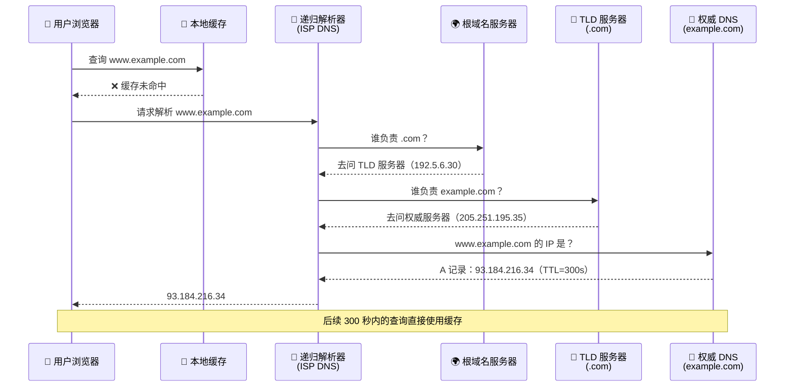
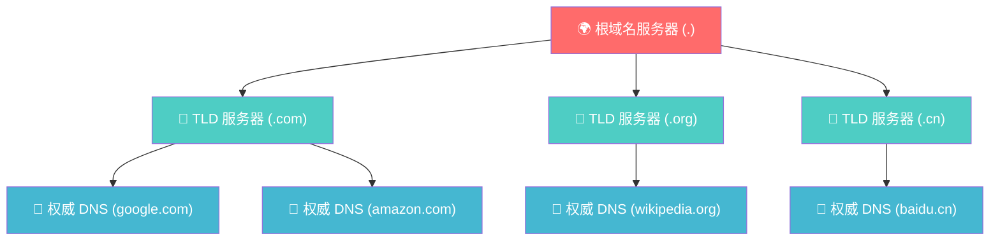
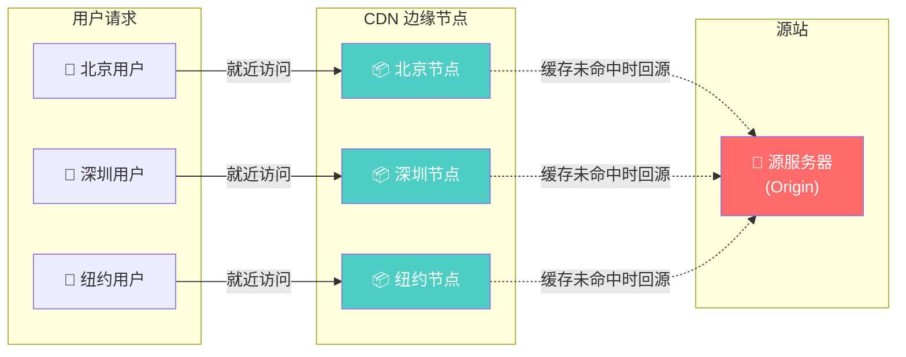
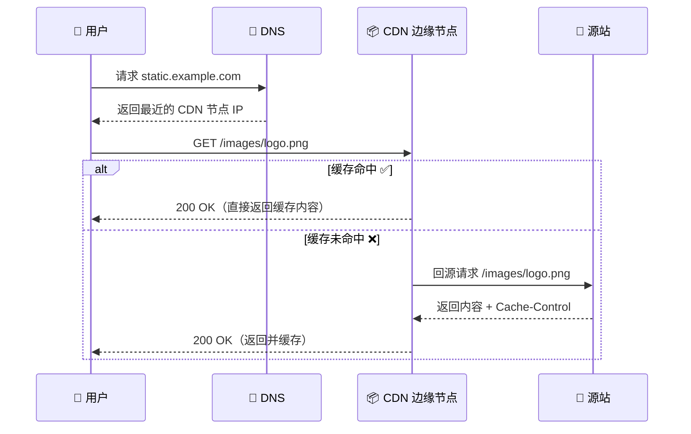
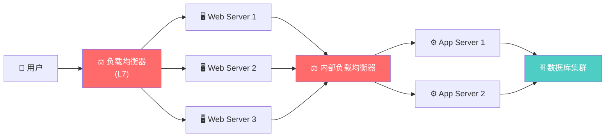
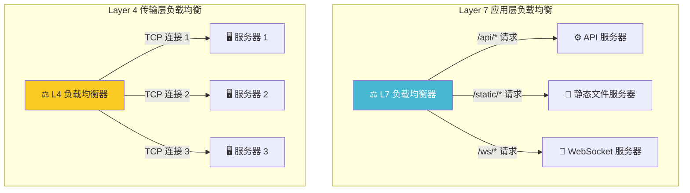
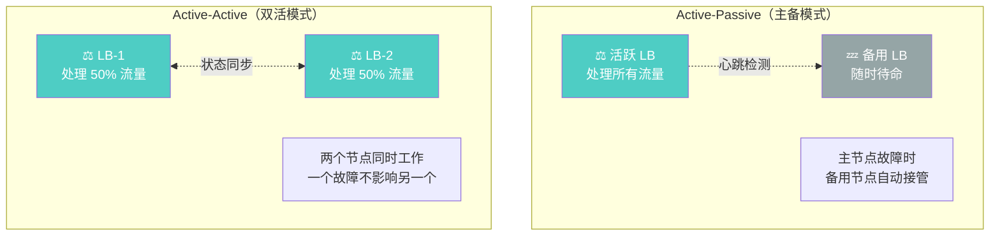
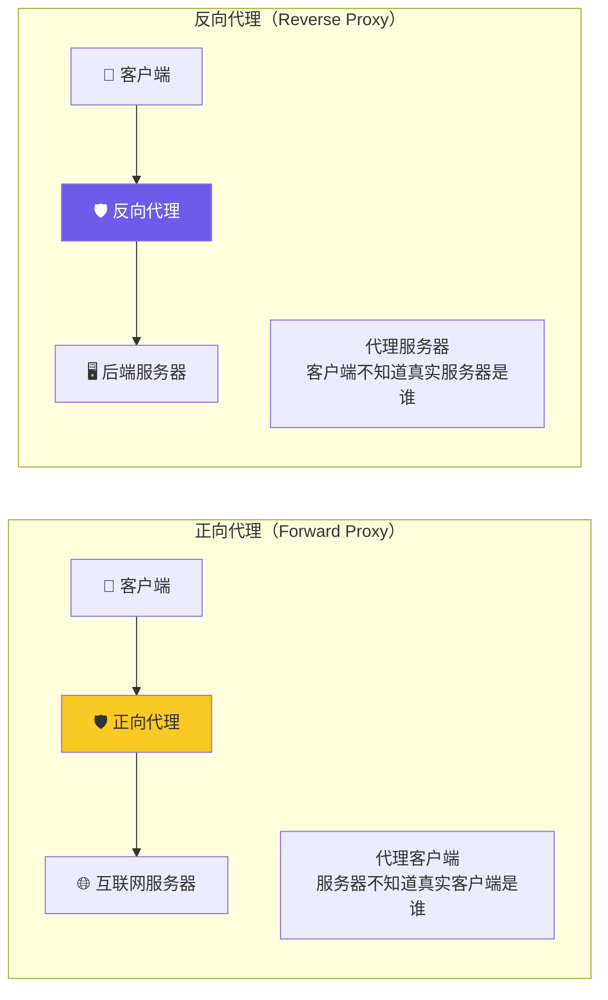
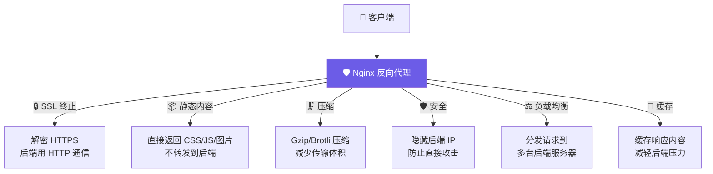
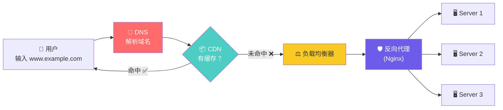

# 🌐 第三章：DNS、CDN 与负载均衡

> **核心问题**：用户在浏览器输入 `www.example.com` 后，请求是如何找到正确的服务器、如何就近获取内容、又如何在多台服务器间分配流量的？

本章将回答这三个问题，带你理解互联网流量从「域名」到「服务器」的完整链路。

---

## 3.1 域名系统（DNS）

### 3.1.1 什么是 DNS？

> 🎯 **类比：电话簿**
>
> 你想打电话给朋友，但你只记得他的名字，不记得号码。于是你翻开电话簿，用名字查到号码，然后拨过去。
>
> DNS 就是互联网的「电话簿」——把人类可读的域名（`www.google.com`）翻译成机器可读的 IP 地址（`142.250.80.46`）。

### 3.1.2 DNS 解析流程



### 3.1.3 DNS 层级结构



> 全球共有 **13 组**根域名服务器（A 到 M），通过 Anycast 技术在全球部署了数百个实例。

### 3.1.4 DNS 记录类型

| 记录类型 | 用途 | 示例 |
|---------|------|------|
| **A** | 域名 → IPv4 地址 | `example.com → 93.184.216.34` |
| **AAAA** | 域名 → IPv6 地址 | `example.com → 2606:2800:220:1:...` |
| **CNAME** | 域名 → 另一个域名（别名） | `www.example.com → example.com` |
| **MX** | 邮件交换服务器 | `example.com → mail.example.com` |
| **NS** | 指定权威域名服务器 | `example.com → ns1.example.com` |
| **TXT** | 文本信息（常用于验证） | `example.com → "v=spf1 ..."` |
| **SRV** | 服务定位（指定端口和优先级） | `_sip._tcp.example.com → ...` |

### 3.1.5 DNS 路由策略

DNS 不只是简单的"查地址"，它还可以根据策略返回不同的 IP：

| 路由策略 | 工作方式 | 适用场景 |
|---------|---------|---------|
| **轮询（Round Robin）** | 按顺序轮流返回不同 IP | 简单负载分配 |
| **加权轮询（Weighted）** | 按权重比例返回 IP | 灰度发布、AB 测试 |
| **基于延迟（Latency-based）** | 返回响应最快的服务器 IP | 全球部署，追求低延迟 |
| **地理位置（Geolocation）** | 根据用户所在地返回就近 IP | 合规要求、本地化内容 |
| **故障转移（Failover）** | 主服务器故障时切换到备用 IP | 高可用架构 |

```python
# 模拟 DNS 加权轮询
import random

dns_records = {
    "api.example.com": [
        {"ip": "10.0.1.1", "weight": 70},  # 新版本，承担 70% 流量
        {"ip": "10.0.1.2", "weight": 30},  # 旧版本，承担 30% 流量
    ]
}

def weighted_dns_resolve(domain):
    records = dns_records[domain]
    total = sum(r["weight"] for r in records)
    rand = random.randint(1, total)
    cumulative = 0
    for record in records:
        cumulative += record["weight"]
        if rand <= cumulative:
            return record["ip"]

# 模拟 10 次解析
for i in range(10):
    print(f"第 {i+1} 次解析: {weighted_dns_resolve('api.example.com')}")
```

### 3.1.6 DNS 优缺点

| ✅ 优点 | ❌ 缺点 |
|---------|---------|
| 将流量分散到多个服务器 | DNS 缓存导致更新延迟（TTL） |
| 支持地理位置路由 | 增加了一次网络往返的延迟 |
| 架构简单，广泛支持 | DNS 协议本身不加密（需要 DoH/DoT） |
| 可实现简单的负载均衡 | 无法感知服务器实际健康状态 |

---

## 3.2 内容分发网络（CDN）

### 3.2.1 什么是 CDN？

> 🎯 **类比：连锁超市 vs 单体仓库**
>
> 假设你经营一个电商，所有货物放在北京的总仓库。深圳的用户下单，货物要从北京发出，路途遥远，速度慢。
>
> 如果你在深圳、上海、成都等地各开一个**分仓**，提前把热门商品铺货过去，用户下单后就近发货——这就是 CDN 的思路！
>
> CDN = 把静态内容（图片、CSS、JS、视频）缓存到离用户最近的**边缘节点**。

### 3.2.2 CDN 工作原理



### 3.2.3 CDN 请求流程



### 3.2.4 Push CDN vs Pull CDN

| 特性 | 🔵 Push CDN | 🟢 Pull CDN |
|------|-----------|-----------|
| **工作方式** | 内容更新时，主动推送到 CDN 节点 | 用户首次请求时，CDN 自动从源站拉取 |
| **内容更新** | 你手动决定何时更新 | CDN 根据 TTL 自动更新 |
| **流量特点** | 适合内容不常变化的场景 | 适合流量大、内容频繁更新的场景 |
| **存储成本** | 较高（所有内容都推送） | 较低（只缓存被请求的内容） |
| **适用场景** | 小型网站、内容固定 | 大型网站、高流量 |
| **配置复杂度** | 需要手动管理推送逻辑 | 几乎零配置 |

```nginx
# Nginx 作为源站时的缓存控制配置
server {
    location /static/ {
        # 告诉 CDN 缓存 30 天
        add_header Cache-Control "public, max-age=2592000";
        # 使用文件 hash 作为 ETag
        etag on;
    }

    location /api/ {
        # API 响应不缓存
        add_header Cache-Control "no-cache, no-store, must-revalidate";
    }
}
```

### 3.2.5 CDN 优缺点

| ✅ 优点 | ❌ 缺点 |
|---------|---------|
| 大幅降低延迟，用户体验好 | 增加成本（按流量/请求计费） |
| 减轻源站压力 | 缓存一致性问题（旧内容残留） |
| 天然的 DDoS 防护 | 对动态内容支持有限 |
| 提高可用性（节点故障可切换） | 调试困难（需检查缓存状态） |
| 支持 HTTPS 和 HTTP/2 | 首次请求仍需回源（冷启动） |

---

## 3.3 负载均衡器（Load Balancer）

### 3.3.1 什么是负载均衡？

> 🎯 **类比：餐厅领位员**
>
> 想象一家热门餐厅，门口有一位领位员（Host/Hostess）。客人到来时，领位员不会让所有人都涌向同一张桌子，而是：
> - 查看哪些桌子**空闲**
> - 根据客人数量选择**合适大小**的桌子
> - 把客人**均匀分配**到不同区域
>
> 负载均衡器就是服务器集群的「领位员」，把用户请求均匀分发到多台后端服务器。

### 3.3.2 负载均衡器的位置



### 3.3.3 Layer 4 vs Layer 7 负载均衡



| 特性 | Layer 4（传输层） | Layer 7（应用层） |
|------|-----------------|-----------------|
| **工作层级** | TCP/UDP 层 | HTTP/HTTPS 层 |
| **决策依据** | 源/目的 IP、端口号 | URL、Header、Cookie、请求体 |
| **性能** | ⚡ 极快（不解析内容） | 🐢 相对较慢（需解析 HTTP） |
| **灵活性** | 低（无法感知应用层内容） | 高（可基于内容路由） |
| **SSL 终止** | ❌ 不支持 | ✅ 支持 |
| **典型工具** | HAProxy（TCP 模式）、LVS | Nginx、HAProxy（HTTP 模式）、Envoy |

### 3.3.4 负载均衡算法

| 算法 | 工作方式 | 适用场景 |
|------|---------|---------|
| **轮询（Round Robin）** | 按顺序依次分配 | 服务器配置相同 |
| **加权轮询（Weighted RR）** | 按权重比例分配 | 服务器配置不同 |
| **最少连接（Least Connections）** | 分配给当前连接数最少的服务器 | 请求处理时间差异大 |
| **IP Hash** | 根据客户端 IP 哈希选择服务器 | 需要会话保持 |
| **最短响应时间（Least Time）** | 分配给响应最快的服务器 | 追求最低延迟 |
| **随机（Random）** | 随机选择一台服务器 | 简单场景 |

```python
# 负载均衡算法实现示例
import hashlib
from collections import defaultdict

class LoadBalancer:
    def __init__(self, servers):
        self.servers = servers  # [("server1", 3), ("server2", 1)]
        self.current = 0
        self.connections = defaultdict(int)

    def round_robin(self):
        """轮询：简单但有效"""
        server = self.servers[self.current % len(self.servers)]
        self.current += 1
        return server[0]

    def weighted_round_robin(self):
        """加权轮询：考虑服务器性能差异"""
        expanded = []
        for server, weight in self.servers:
            expanded.extend([server] * weight)
        server = expanded[self.current % len(expanded)]
        self.current += 1
        return server

    def least_connections(self):
        """最少连接：动态感知负载"""
        server = min(self.servers, key=lambda s: self.connections[s[0]])
        self.connections[server[0]] += 1
        return server[0]

    def ip_hash(self, client_ip):
        """IP Hash：保证同一客户端访问同一服务器"""
        hash_val = int(hashlib.md5(client_ip.encode()).hexdigest(), 16)
        index = hash_val % len(self.servers)
        return self.servers[index][0]

# 使用示例
lb = LoadBalancer([("server-a", 3), ("server-b", 2), ("server-c", 1)])
for i in range(6):
    print(f"请求 {i+1} → {lb.weighted_round_robin()}")
# 输出示例:
# 请求 1 → server-a
# 请求 2 → server-a
# 请求 3 → server-a
# 请求 4 → server-b
# 请求 5 → server-b
# 请求 6 → server-c
```

### 3.3.5 Active-Passive vs Active-Active



| 模式 | Active-Passive | Active-Active |
|------|---------------|---------------|
| **资源利用率** | 低（备用节点闲置） | 高（所有节点都在工作） |
| **故障切换时间** | 有短暂停机（秒级） | 几乎无感知 |
| **复杂度** | 低 | 高（需要状态同步） |
| **成本** | 较低 | 较高 |
| **适用场景** | 中小型系统 | 大型高可用系统 |

### 3.3.6 健康检查（Health Check）

负载均衡器需要知道后端服务器是否"健康"，才能做出正确的路由决策：

```nginx
# Nginx 健康检查配置示例
upstream backend {
    server 10.0.1.1:8080 max_fails=3 fail_timeout=30s;
    server 10.0.1.2:8080 max_fails=3 fail_timeout=30s;
    server 10.0.1.3:8080 backup;  # 备用服务器
}

server {
    location / {
        proxy_pass http://backend;
        proxy_next_upstream error timeout http_500 http_502 http_503;
    }
}
```

```yaml
# HAProxy 健康检查配置示例
backend app_servers
    balance roundrobin
    option httpchk GET /health
    http-check expect status 200

    server app1 10.0.1.1:8080 check inter 5s fall 3 rise 2
    server app2 10.0.1.2:8080 check inter 5s fall 3 rise 2
    server app3 10.0.1.3:8080 check inter 5s fall 3 rise 2 backup
    # inter 5s  → 每 5 秒检查一次
    # fall 3    → 连续 3 次失败则标记为不可用
    # rise 2    → 连续 2 次成功则标记为可用
```

### 3.3.7 会话保持（Sticky Sessions）

> ❓ **问题**：用户在 Server A 上登录了，下一个请求被分配到 Server B，Session 丢失了怎么办？

**方案对比：**

| 方案 | 实现方式 | 优点 | 缺点 |
|------|---------|------|------|
| **Sticky Session** | 基于 Cookie 或 IP 将用户绑定到同一服务器 | 实现简单 | 负载不均衡，服务器故障丢失会话 |
| **集中式 Session** | Session 存储在 Redis/Memcached | 无状态服务器，可任意扩缩容 | 增加 Redis 依赖 |
| **JWT Token** | 会话信息加密在 Token 中 | 完全无状态，无需存储 | Token 较大，无法主动失效 |

```nginx
# Nginx Sticky Session 配置
upstream backend {
    ip_hash;  # 基于客户端 IP 的会话保持
    server 10.0.1.1:8080;
    server 10.0.1.2:8080;
}

# 或者基于 Cookie 的会话保持（需要 nginx-sticky-module）
upstream backend_cookie {
    sticky cookie srv_id expires=1h domain=.example.com path=/;
    server 10.0.1.1:8080;
    server 10.0.1.2:8080;
}
```

### 3.3.8 负载均衡器优缺点

| ✅ 优点 | ❌ 缺点 |
|---------|---------|
| 防止请求到不健康的服务器 | 性能瓶颈（所有流量经过 LB） |
| 水平扩展后端服务器 | 单点故障风险（需要冗余部署） |
| SSL 终止减轻后端负担 | 增加系统复杂度 |
| 提供会话保持能力 | 配置不当导致负载不均 |

---

## 3.4 反向代理（Reverse Proxy）

### 3.4.1 正向代理 vs 反向代理



| 特性 | 正向代理 | 反向代理 |
|------|---------|---------|
| **代理谁** | 代理客户端 | 代理服务器 |
| **谁不知情** | 服务器不知道真实客户端 | 客户端不知道真实服务器 |
| **典型用途** | 翻墙、隐藏客户端 IP | 负载均衡、安全防护 |
| **典型工具** | Squid、Shadowsocks | Nginx、HAProxy |
| **部署位置** | 客户端网络 | 服务器网络 |

### 3.4.2 反向代理的核心功能



### 3.4.3 Nginx 反向代理完整配置

```nginx
# /etc/nginx/conf.d/app.conf

# 定义后端服务器组
upstream api_servers {
    least_conn;  # 最少连接算法
    server 10.0.1.1:8080 weight=3;
    server 10.0.1.2:8080 weight=2;
    server 10.0.1.3:8080 weight=1;

    keepalive 32;  # 保持与后端的长连接
}

server {
    listen 443 ssl http2;
    server_name api.example.com;

    # ---------- SSL 终止 ----------
    ssl_certificate     /etc/ssl/certs/example.com.crt;
    ssl_certificate_key /etc/ssl/private/example.com.key;
    ssl_protocols       TLSv1.2 TLSv1.3;

    # ---------- Gzip 压缩 ----------
    gzip on;
    gzip_types text/plain application/json application/javascript text/css;
    gzip_min_length 1024;

    # ---------- 安全头 ----------
    add_header X-Frame-Options "SAMEORIGIN" always;
    add_header X-Content-Type-Options "nosniff" always;
    add_header X-XSS-Protection "1; mode=block" always;

    # ---------- 静态文件直接返回 ----------
    location /static/ {
        alias /var/www/static/;
        expires 30d;
        add_header Cache-Control "public, immutable";
    }

    # ---------- API 反向代理 ----------
    location /api/ {
        proxy_pass http://api_servers;
        proxy_set_header Host $host;
        proxy_set_header X-Real-IP $remote_addr;
        proxy_set_header X-Forwarded-For $proxy_add_x_forwarded_for;
        proxy_set_header X-Forwarded-Proto $scheme;

        # 超时设置
        proxy_connect_timeout 5s;
        proxy_read_timeout 60s;
        proxy_send_timeout 60s;
    }

    # ---------- WebSocket 支持 ----------
    location /ws/ {
        proxy_pass http://api_servers;
        proxy_http_version 1.1;
        proxy_set_header Upgrade $http_upgrade;
        proxy_set_header Connection "upgrade";
    }

    # ---------- 限流 ----------
    location /api/login {
        limit_req zone=login_limit burst=5 nodelay;
        proxy_pass http://api_servers;
    }
}

# HTTP → HTTPS 重定向
server {
    listen 80;
    server_name api.example.com;
    return 301 https://$host$request_uri;
}
```

### 3.4.4 反向代理 vs 负载均衡器

> 很多人容易混淆这两个概念。实际上它们**不是对立关系**，而是**包含关系**：

| 特性 | 反向代理 | 负载均衡器 |
|------|---------|-----------|
| **核心目标** | 代理后端服务器 | 分发流量 |
| **后端数量** | 单台也有意义 | 至少需要多台 |
| **功能范围** | SSL 终止、缓存、压缩、安全、限流 | 流量分发、健康检查 |
| **关系** | 负载均衡是反向代理的**功能之一** | 可以视为反向代理的子集 |

> 💡 **总结**：只有一台后端服务器也应该用反向代理（为了安全和缓存），但不需要负载均衡。有多台后端时，反向代理自然承担负载均衡的角色。

### 3.4.5 反向代理优缺点

| ✅ 优点 | ❌ 缺点 |
|---------|---------|
| 隐藏后端服务器 IP，增加安全性 | 增加架构复杂度 |
| SSL 终止减轻后端负担 | 可能成为单点故障 |
| 缓存静态内容提升性能 | 增加请求延迟（额外一跳） |
| 可集中管理日志和访问控制 | 需要额外的运维能力 |
| 支持压缩，减少带宽消耗 | 排查问题时调试链路更长 |

---

## 3.5 本章小结

### 🔗 四大组件协作全景图



> 实际生产中，负载均衡和反向代理常合二为一（比如 Nginx 同时承担两个角色）。

### 📋 核心概念速查表

| 组件 | 核心作用 | 关键技术 | 典型工具 |
|------|---------|---------|---------|
| **DNS** | 域名 → IP 地址 | A/CNAME 记录、TTL | Route 53、CloudFlare DNS |
| **CDN** | 就近缓存静态内容 | 边缘节点、回源 | CloudFront、Cloudflare、Akamai |
| **负载均衡器** | 分发流量到多台服务器 | L4/L7、健康检查 | Nginx、HAProxy、AWS ALB |
| **反向代理** | 代理后端、安全防护 | SSL 终止、缓存 | Nginx、Envoy、Traefik |

### 🤔 面试高频问题

1. **DNS 解析的完整流程是什么？**（递归查询 vs 迭代查询）
2. **Push CDN 和 Pull CDN 的区别？什么时候用哪个？**
3. **Layer 4 和 Layer 7 负载均衡的区别？**
4. **如何解决 Session 在多台服务器间不一致的问题？**
5. **反向代理和负载均衡器有什么区别和联系？**
6. **如何实现负载均衡器的高可用？**（Active-Passive / Active-Active）
7. **CDN 缓存了旧内容怎么处理？**（版本化 URL、Cache Purge）

### 📝 练习题

#### 练习 1：设计一个全球化的静态网站架构

要求：
- 用户分布在北美、欧洲和亚洲
- 网站内容包括 HTML、CSS、JS 和大量图片
- 要求所有地区的加载时间 < 2 秒

**思考方向**：如何组合 DNS（地理路由）+ CDN（边缘缓存）+ 源站？

#### 练习 2：为一个电商 API 设计负载均衡方案

要求：
- 3 台 API 服务器，配置分别为 4 核、8 核、8 核
- 用户登录后需要保持会话
- 需要灰度发布能力（新版本先承担 10% 流量）

**思考方向**：选择什么负载均衡算法？如何处理会话？如何实现灰度？

#### 练习 3：画出以下请求的完整路径

> 用户在上海，访问 `https://api.myapp.com/users/123`，服务器部署在北京和深圳两个机房。

请画出从域名解析到最终响应的每一步，标注涉及的组件（DNS → CDN → LB → 反向代理 → 应用服务器）。

---

> **下一章预告**：[第四章 - 数据库与存储](../04-databases/README.md) 🗄️ —— 我们将深入探讨关系型数据库、NoSQL、分库分表和数据库复制等核心话题。
