# 🗄️ 第四章：数据库设计

> "数据是新时代的石油，而数据库就是炼油厂。" —— 改编自 Clive Humby

在系统设计中，数据库的选择和设计决定了系统的**性能上限**和**扩展能力**。本章将带你从关系型数据库出发，深入了解复制、分片、NoSQL 等核心概念。

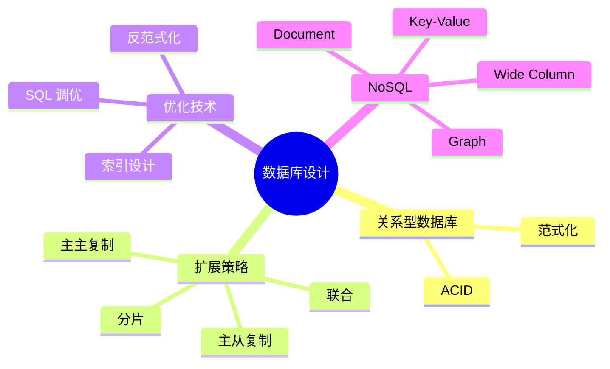

---

## 4.1 关系型数据库（RDBMS）

### 📖 什么是关系型数据库？

关系型数据库就像一本**精心设计的 Excel 表格集合**——每张表都有固定的列（Schema），表与表之间通过外键建立联系。

常见的关系型数据库：MySQL、PostgreSQL、Oracle、SQL Server。

### 🏦 ACID 特性：银行转账的故事

想象你要从账户 A 向账户 B 转账 100 元：

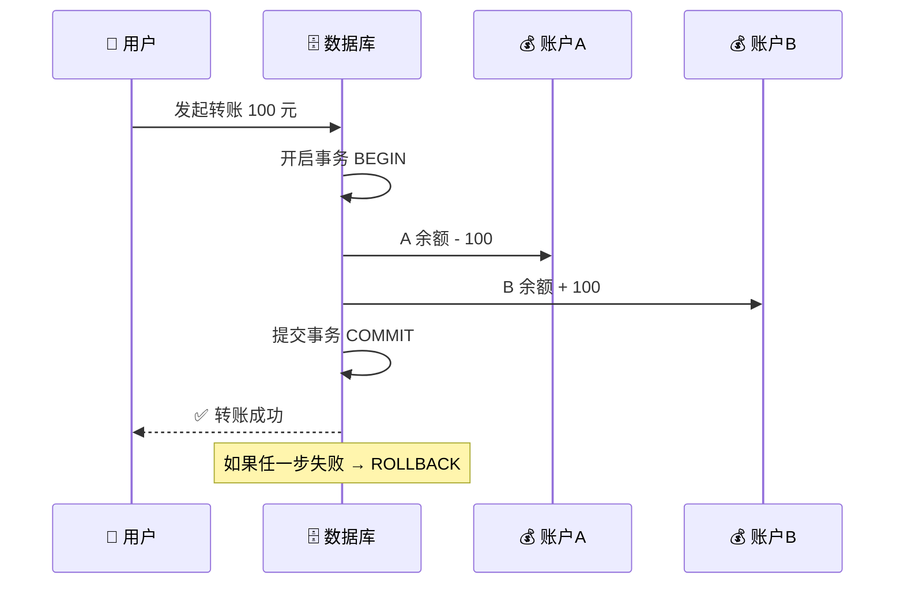

| 特性 | 英文 | 含义 | 银行转账类比 |
|------|------|------|-------------|
| **原子性** | Atomicity | 事务要么全部完成，要么全部回滚 | 要么 A 扣钱且 B 收到钱，要么什么都不发生 |
| **一致性** | Consistency | 事务前后数据满足所有约束 | 转账前后，A + B 的总额不变 |
| **隔离性** | Isolation | 并发事务互不干扰 | 两笔转账同时进行，各自独立 |
| **持久性** | Durability | 提交后数据永久保存 | 一旦转账成功，即使断电也不会丢失 |

```sql
-- 💡 ACID 事务示例
BEGIN TRANSACTION;

UPDATE accounts SET balance = balance - 100 WHERE id = 'A';
UPDATE accounts SET balance = balance + 100 WHERE id = 'B';

-- 检查约束：余额不能为负
IF (SELECT balance FROM accounts WHERE id = 'A') < 0 THEN
    ROLLBACK;  -- ❌ 回滚
ELSE
    COMMIT;    -- ✅ 提交
END IF;
```

### 🤔 什么时候用关系型数据库？

- ✅ 数据之间有复杂的关联关系（如订单 → 用户 → 商品）
- ✅ 需要严格的数据一致性（如金融系统）
- ✅ 需要复杂查询（JOIN、聚合、子查询）
- ❌ 数据结构频繁变化 → 考虑 Document Store
- ❌ 需要超高写入吞吐 → 考虑 NoSQL

---

## 4.2 主从复制（Master-Slave Replication）

### 📖 核心思想：老师和学生记笔记

> 🎓 **类比**：老师在黑板上写内容（Master 写入），学生们各自抄笔记（Slave 复制）。当有人提问时，任何一个学生都能回答（Slave 读取），但只有老师能修改黑板内容（Master 写入）。

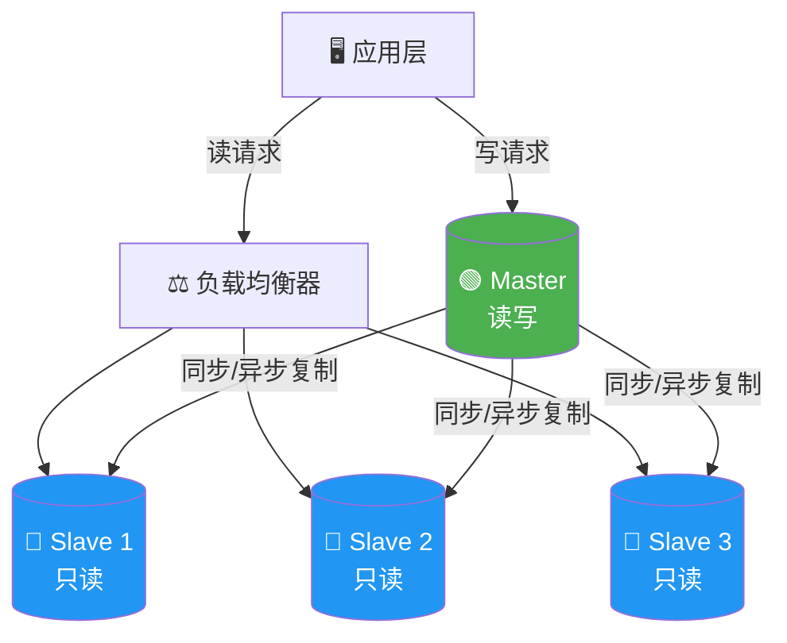

### 🔄 复制方式

| 方式 | 特点 | 适用场景 |
|------|------|---------|
| **同步复制** | Master 等待所有 Slave 确认后才返回 | 数据一致性要求高 |
| **异步复制** | Master 写入后立即返回，Slave 后台追赶 | 性能优先，容忍短暂不一致 |
| **半同步复制** | 至少一个 Slave 确认后返回 | 折中方案 |

### ✅ 优点

- **读性能提升**：多个 Slave 分担读请求，适合读多写少场景（如新闻网站）
- **高可用性**：Master 宕机时，可以将 Slave 提升为新 Master
- **备份无压力**：在 Slave 上执行备份，不影响 Master 性能

### ❌ 缺点

- **复制延迟**：Slave 的数据可能比 Master 旧（最终一致性）
- **写入瓶颈**：所有写操作集中在 Master，无法水平扩展写入
- **故障切换复杂**：Master 故障时，提升 Slave 可能导致数据丢失

---

## 4.3 主主复制（Master-Master Replication）

### 📖 核心思想：两个老师同时上课

> 🎓 **类比**：两个教室的老师同时在各自的黑板上写内容，并定期互相抄写对方的内容。问题是——如果两个老师对同一道题写了不同答案怎么办？

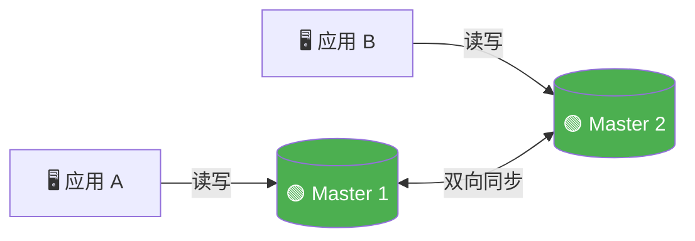

### ⚔️ 冲突解决策略

当两个 Master 同时修改同一条数据时，需要冲突解决：

| 策略 | 做法 | 适用场景 |
|------|------|---------|
| **最后写入胜出 (LWW)** | 时间戳最新的修改生效 | 简单场景 |
| **应用层解决** | 将冲突暴露给应用层，由业务逻辑决定 | 复杂业务 |
| **合并策略** | 自动合并不冲突的字段 | 协同编辑 |
| **分区写入** | 不同 Master 写不同数据分区，避免冲突 | 地理分布 |

### 📊 主从 vs 主主 对比

| 特性 | 主从复制 | 主主复制 |
|------|---------|---------|
| 写入节点 | 1 个 | 多个 |
| 读扩展 | ✅ 容易 | ✅ 容易 |
| 写扩展 | ❌ 受限 | ⚠️ 有限提升 |
| 一致性 | 较好 | 冲突风险 |
| 复杂度 | 低 | 高 |
| 故障切换 | 需要手动/自动 | 天然支持 |

---

## 4.4 联合（Federation）

### 📖 核心思想：公司各部门各管各的

> 🏢 **类比**：一家大公司不会把所有部门的资料都放在一个文件柜里。人事部门有自己的文件柜，财务部门有自己的文件柜，销售部门也有自己的文件柜。这就是**按功能拆分数据库**。

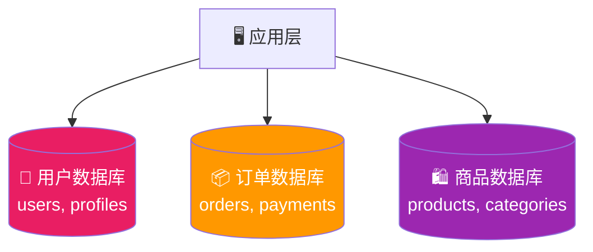

### ✅ 优点

- **独立扩展**：每个功能数据库可以根据负载独立扩展
- **缓存命中率高**：数据集更小，缓存更有效
- **故障隔离**：订单数据库宕机不影响用户登录
- **写入并行**：不同数据库可以同时写入

### ❌ 缺点

- **跨库 JOIN 困难**：查询"用户的所有订单及商品详情"需要应用层拼装
- **分布式事务复杂**："下单扣库存"涉及多个数据库
- **运维成本增加**：多个数据库实例需要分别维护
- **Schema 不适合所有场景**：某些业务天然耦合，难以拆分

---

## 4.5 分片（Sharding）

### 📖 核心思想：拆分电话簿

> 📞 **类比**：一本巨大的电话簿太厚了，我们把它拆成 26 本——A 开头的名字放第一本，B 开头的放第二本……每本都更薄，查找更快。这就是**数据分片**。

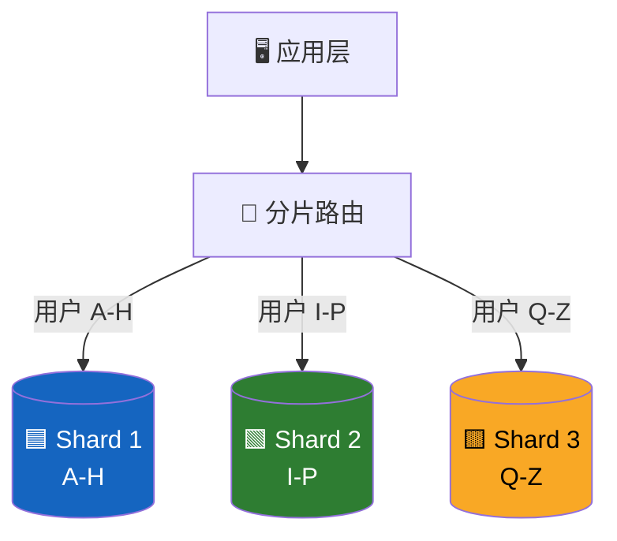

### 🎯 分片策略

#### 1️⃣ 哈希分片（Hash-Based）

```python
def get_shard(user_id: int, num_shards: int) -> int:
    """根据用户 ID 的哈希值决定分片"""
    return hash(user_id) % num_shards

# 示例
for uid in [1001, 1002, 1003, 1004, 1005]:
    shard = get_shard(uid, num_shards=3)
    print(f"用户 {uid} → Shard {shard}")
```

**优点**：数据分布均匀  
**缺点**：增加分片时需要大量数据迁移（Rehash）

#### 2️⃣ 范围分片（Range-Based）

```python
def get_shard_by_range(user_id: int) -> str:
    """按 ID 范围分片"""
    if user_id < 1_000_000:
        return "shard_1"
    elif user_id < 2_000_000:
        return "shard_2"
    else:
        return "shard_3"
```

**优点**：范围查询高效  
**缺点**：容易产生热点（如新用户都在最后一个分片）

#### 3️⃣ 地理分片（Geographic）

```python
SHARD_MAP = {
    "CN": "shard_asia",
    "JP": "shard_asia",
    "US": "shard_americas",
    "BR": "shard_americas",
    "DE": "shard_europe",
    "FR": "shard_europe",
}

def get_shard_by_region(country_code: str) -> str:
    """按用户所在地区分片"""
    return SHARD_MAP.get(country_code, "shard_default")
```

### 🔄 一致性哈希（Consistent Hashing）

普通哈希分片在增减节点时需要大量数据迁移。一致性哈希把节点和数据都映射到一个**哈希环**上，只需要迁移相邻节点的数据。

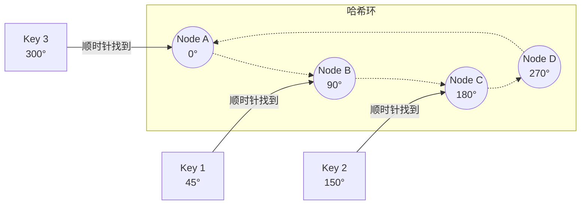

> 💡 **工作原理**：每个 Key 沿哈希环顺时针查找，遇到的第一个 Node 就是它的归属。当新增 Node E 在 180°–270° 之间时，只有原本属于 Node D 的一部分数据需要迁移到 Node E。

```python
import hashlib
from bisect import bisect_right

class ConsistentHash:
    """一致性哈希的简化实现"""
    def __init__(self, nodes: list[str], replicas: int = 100):
        self.ring: list[tuple[int, str]] = []
        for node in nodes:
            for i in range(replicas):  # 虚拟节点
                key = f"{node}:{i}"
                h = int(hashlib.md5(key.encode()).hexdigest(), 16)
                self.ring.append((h, node))
        self.ring.sort()
        self.keys = [item[0] for item in self.ring]

    def get_node(self, data_key: str) -> str:
        h = int(hashlib.md5(data_key.encode()).hexdigest(), 16)
        idx = bisect_right(self.keys, h) % len(self.ring)
        return self.ring[idx][1]

# 使用示例
ch = ConsistentHash(["db-server-1", "db-server-2", "db-server-3"])
print(ch.get_node("user:1001"))  # → db-server-2
print(ch.get_node("user:1002"))  # → db-server-1
```

### ⚠️ 分片的挑战

| 挑战 | 说明 | 应对策略 |
|------|------|---------|
| **跨分片 JOIN** | 数据分散在不同分片，JOIN 操作复杂 | 反范式化、应用层聚合 |
| **数据再平衡** | 增加/减少分片时需要迁移数据 | 一致性哈希 |
| **热点问题** | 某些分片数据或流量远超其他 | 二次分片、热点检测 |
| **全局唯一 ID** | 各分片的自增 ID 可能冲突 | Snowflake ID、UUID |
| **分布式事务** | 跨分片事务难以保证 ACID | Saga 模式、2PC |

---

## 4.6 反范式化（Denormalization）

### 📖 核心思想：空间换时间

> 📦 **类比**：范式化就像把所有物品分门别类存放——衣服在衣柜、书在书架、工具在工具箱。很整齐，但拿一套"出门装备"要跑三个地方。反范式化就是提前把明天要穿的衣服、要带的书、要用的工具放在门口的背包里——有冗余，但出门时一抓就走。

### ⚖️ 范式化 vs 反范式化

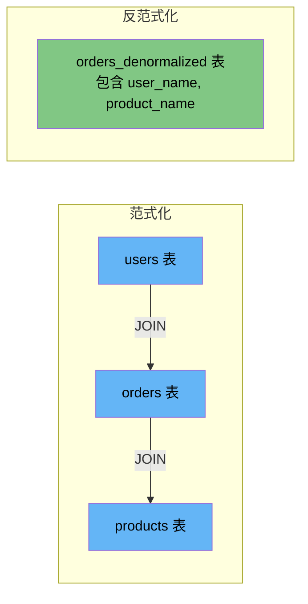

```sql
-- 📝 范式化查询：需要多表 JOIN
SELECT o.id, u.name, p.title, o.amount
FROM orders o
JOIN users u ON o.user_id = u.id
JOIN products p ON o.product_id = p.id
WHERE o.created_at > '2024-01-01';

-- 📝 反范式化查询：直接查单表
SELECT id, user_name, product_title, amount
FROM orders_denormalized
WHERE created_at > '2024-01-01';
```

### 📊 权衡对比

| 维度 | 范式化 | 反范式化 |
|------|--------|---------|
| 读性能 | ❌ 需要 JOIN，较慢 | ✅ 单表查询，更快 |
| 写性能 | ✅ 只更新一处 | ❌ 需要更新多处冗余数据 |
| 存储空间 | ✅ 无冗余，节省空间 | ❌ 数据冗余，占用更多空间 |
| 数据一致性 | ✅ 天然一致 | ⚠️ 冗余数据可能不一致 |
| 适用场景 | 写多读少、数据一致性优先 | 读多写少、查询性能优先 |

### 🤔 什么时候反范式化？

- ✅ 读写比例高（如 100:1），查询瓶颈在 JOIN 操作
- ✅ 报表系统、数据分析场景
- ✅ 某些 JOIN 查询是高频热点路径
- ❌ 写操作频繁且数据变化大
- ❌ 数据一致性要求极高（金融场景）

---

## 4.7 SQL 调优

### 🔍 索引设计：给书加目录

> 📚 **类比**：索引就像一本书的目录。没有目录，你得一页一页翻找内容（全表扫描）。有了目录，直接翻到对应页码（索引查找）。

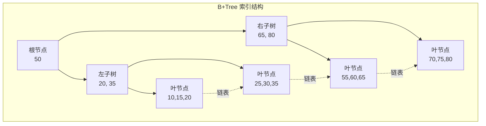

### 📐 索引最佳实践

```sql
-- ✅ 好的索引设计
-- 1. 高选择性列优先
CREATE INDEX idx_email ON users(email);  -- email 几乎唯一

-- 2. 复合索引遵循最左前缀原则
CREATE INDEX idx_composite ON orders(user_id, created_at, status);
-- 支持: WHERE user_id = 1
-- 支持: WHERE user_id = 1 AND created_at > '2024-01-01'
-- 不支持: WHERE created_at > '2024-01-01' (跳过了 user_id)

-- 3. 覆盖索引避免回表
CREATE INDEX idx_covering ON orders(user_id, amount);
SELECT amount FROM orders WHERE user_id = 1;  -- 无需回表

-- ❌ 避免的做法
-- 1. 在低选择性列上建索引
CREATE INDEX idx_gender ON users(gender);  -- 只有 M/F，意义不大

-- 2. 索引过多导致写入变慢
-- 每个索引在 INSERT/UPDATE 时都需要维护

-- 3. 在索引列上使用函数
SELECT * FROM users WHERE YEAR(created_at) = 2024;  -- ❌ 无法命中索引
SELECT * FROM users WHERE created_at >= '2024-01-01'
                      AND created_at < '2025-01-01';  -- ✅ 命中索引
```

### ⚡ 查询优化技巧

```sql
-- 1. 使用 EXPLAIN 分析执行计划
EXPLAIN SELECT * FROM orders WHERE user_id = 100;

-- 2. 避免 SELECT *
SELECT id, name, email FROM users WHERE id = 1;  -- ✅
SELECT * FROM users WHERE id = 1;                 -- ❌

-- 3. 分页优化：避免大 OFFSET
SELECT * FROM orders ORDER BY id LIMIT 10 OFFSET 100000;  -- ❌ 慢
SELECT * FROM orders WHERE id > 100000 ORDER BY id LIMIT 10;  -- ✅ 快

-- 4. 批量操作代替逐行操作
INSERT INTO logs (msg) VALUES ('a'), ('b'), ('c');  -- ✅ 批量
-- 而不是三次 INSERT INTO logs (msg) VALUES ('a');    -- ❌ 逐行
```

### 🔗 连接池（Connection Pooling）

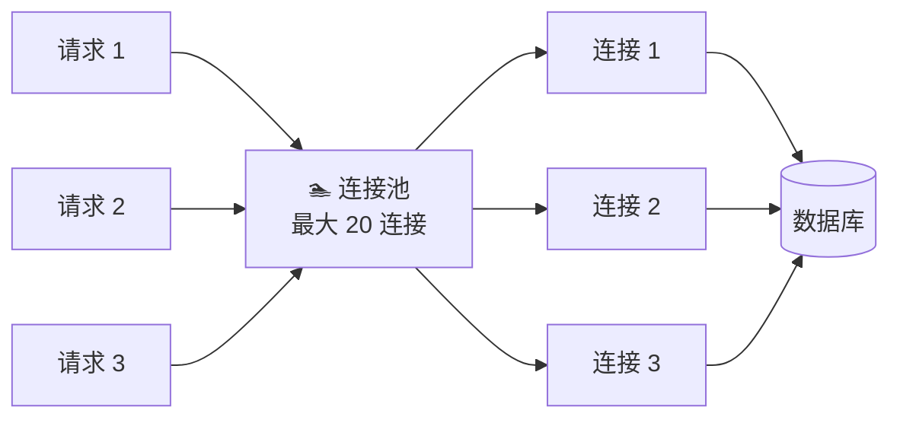

> 💡 **为什么需要连接池？** 数据库连接的创建和销毁开销很大（TCP 握手 + 认证）。连接池预先创建一批连接，应用按需借用和归还，大幅减少连接开销。

---

## 4.8 NoSQL 数据库

### 📖 NoSQL = Not Only SQL

NoSQL 数据库为特定场景做了针对性优化，放弃了部分关系型数据库的通用能力，换取更高的性能和可扩展性。

### 🗂️ NoSQL 四大类型

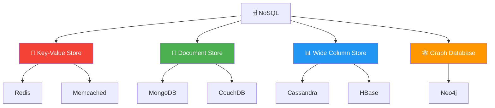

#### 🔑 1. Key-Value Store（键值存储）

> 🎒 **类比**：像一个巨大的字典 / 储物柜——给一个编号（Key），存取一个物品（Value）。

**代表**：Redis、Memcached

**适用场景**：缓存、会话管理、排行榜、计数器

```python
import redis

r = redis.Redis(host='localhost', port=6379)

# 基础操作
r.set("user:1001:name", "张三")
r.get("user:1001:name")  # → b"张三"

# 带过期时间的缓存
r.setex("session:abc123", 3600, "user_data_json")

# 原子计数器
r.incr("page:home:views")  # 页面浏览量 +1
```

#### 📄 2. Document Store（文档存储）

> 📁 **类比**：像一个文件夹系统，每个文件（Document）都是一份 JSON，文件的结构可以各不相同。

**代表**：MongoDB、CouchDB

**适用场景**：内容管理系统、用户配置、事件日志

```python
# MongoDB 示例
from pymongo import MongoClient

db = MongoClient().myapp

# 灵活的 Schema
db.users.insert_one({
    "name": "张三",
    "age": 28,
    "address": {             # 嵌套文档
        "city": "北京",
        "district": "海淀区"
    },
    "hobbies": ["编程", "阅读"],  # 数组
    "vip_level": 3           # 不同用户可以有不同字段
})

# 灵活查询
db.users.find({"address.city": "北京", "age": {"$gte": 25}})
```

#### 📊 3. Wide Column Store（宽列存储）

> 📋 **类比**：像一个超级灵活的表格——每一行可以有不同的列，而且按列族（Column Family）组织数据。

**代表**：Cassandra、HBase、BigTable

**适用场景**：时序数据、IoT 数据、大规模分析

```
# Cassandra 数据模型示例
# Row Key       | Column Family: info        | Column Family: metrics
# ------------- | -------------------------- | -----------------------
# sensor:001    | type=温度, location=北京     | temp=25.3, humidity=60
# sensor:002    | type=湿度, location=上海     | humidity=75
# sensor:003    | type=温度                    | temp=30.1, temp_max=35.0
```

> 💡 每行的列可以不同，适合稀疏数据。数据按列族物理存储在一起，同一列族的查询非常快。

#### 🕸️ 4. Graph Database（图数据库）

> 🗺️ **类比**：就像一张社交关系网——每个人是一个节点（Node），人与人之间的关系是边（Edge）。适合处理"朋友的朋友"这类查询。

**代表**：Neo4j、Amazon Neptune

**适用场景**：社交网络、推荐系统、知识图谱、欺诈检测

```
// Cypher 查询语言（Neo4j）
// 查找张三的朋友的朋友
MATCH (p:Person {name: "张三"})-[:FRIEND]->()-[:FRIEND]->(fof)
WHERE fof <> p
RETURN DISTINCT fof.name

// 查找两人之间的最短路径
MATCH path = shortestPath(
    (a:Person {name: "张三"})-[:FRIEND*]-(b:Person {name: "李四"})
)
RETURN path
```

### ⚖️ BASE vs ACID

NoSQL 通常遵循 BASE 模型，而非 ACID：

| 特性 | ACID | BASE |
|------|------|------|
| 全称 | Atomicity, Consistency, Isolation, Durability | Basically Available, Soft-state, Eventually consistent |
| 理念 | 强一致性优先 | 可用性优先 |
| 一致性 | 即时一致 | 最终一致 |
| 适用 | 金融、交易 | 社交、日志、缓存 |
| 扩展性 | 垂直扩展为主 | 水平扩展为主 |

> 💡 **CAP 定理提醒**：分布式系统中，一致性（C）、可用性（A）、分区容错性（P）三者最多满足两个。大多数 NoSQL 选择了 AP（可用性 + 分区容错），放弃了强一致性。

---

## 4.9 SQL vs NoSQL：如何选择？

### 🧭 决策流程图

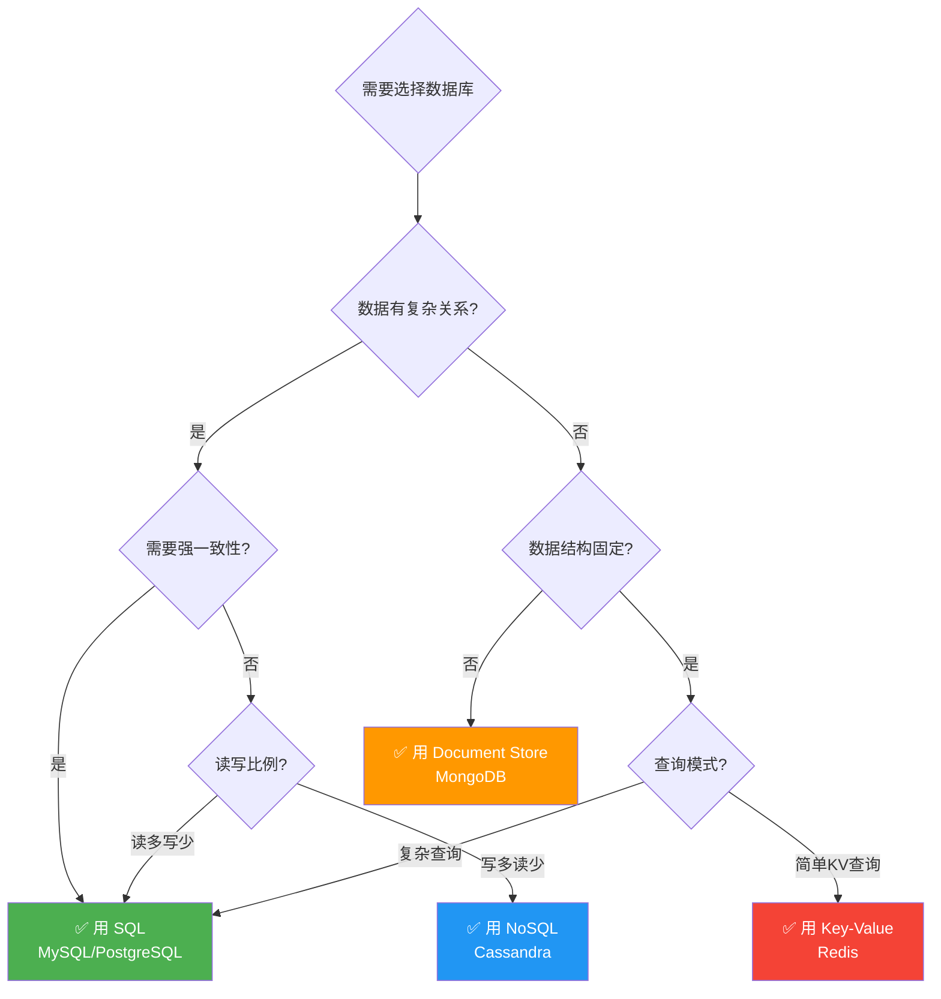

### 📊 全面对比

| 维度 | SQL (关系型) | NoSQL (非关系型) |
|------|-------------|-----------------|
| 数据模型 | 表、行、列 | 文档、键值、列族、图 |
| Schema | 固定 Schema | 灵活/无 Schema |
| 扩展方式 | 垂直扩展（加硬件） | 水平扩展（加节点） |
| 事务 | 完整 ACID | 通常是 BASE |
| 一致性 | 强一致性 | 最终一致性 |
| JOIN | ✅ 原生支持 | ❌ 通常不支持 |
| 查询语言 | SQL（标准化） | 各有各的 API |
| 适合 | 结构化数据、复杂查询 | 大规模、灵活结构、高吞吐 |

### 🏗️ 实战场景选型

| 场景 | 推荐方案 | 原因 |
|------|---------|------|
| 电商订单系统 | MySQL / PostgreSQL | 需要事务保障、复杂关联 |
| 用户会话缓存 | Redis | 高速读写、自动过期 |
| 内容管理系统 | MongoDB | 文档结构灵活 |
| 社交关系图谱 | Neo4j | 关系查询是核心需求 |
| IoT 时序数据 | Cassandra / InfluxDB | 超高写入吞吐、时序查询 |
| 实时排行榜 | Redis (Sorted Set) | 原子操作、O(logN) 性能 |
| 日志分析平台 | Elasticsearch | 全文搜索、聚合分析 |

---

## 4.10 本章小结

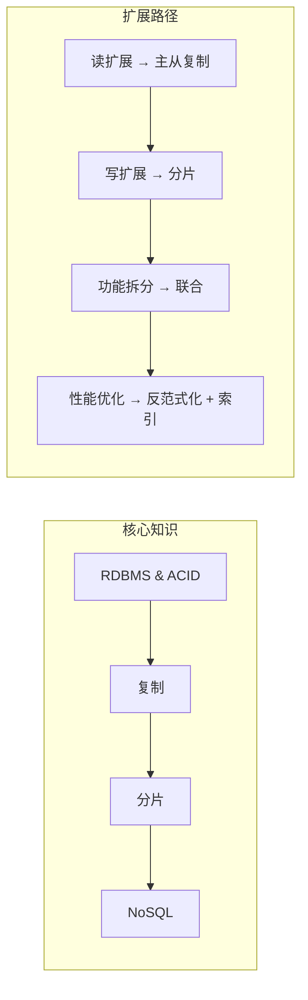

### 📋 关键要点回顾

| 主题 | 核心要点 |
|------|---------|
| **RDBMS** | ACID 保证数据一致性，适合复杂查询和事务场景 |
| **主从复制** | 读扩展利器，注意复制延迟问题 |
| **主主复制** | 提供写高可用，但需解决冲突 |
| **联合** | 按功能拆库，降低单库压力 |
| **分片** | 水平扩展的核心手段，一致性哈希解决 Rehash 问题 |
| **反范式化** | 空间换时间，减少 JOIN 提升读性能 |
| **SQL 调优** | 索引是基本功，EXPLAIN 是好伙伴 |
| **NoSQL** | 四大类型各有所长，按场景选型 |

### ✏️ 练习题

1. **思考题**：一个日活 1000 万的社交平台，用户的 Feed 流（关注的人的动态）应该用什么数据库？为什么？

2. **设计题**：设计一个 URL 短链接服务（如 bit.ly）的数据库方案。考虑：
   - 如何生成唯一短码？
   - 如何分片？
   - 需要哪些索引？

3. **分析题**：以下查询为什么慢？如何优化？
   ```sql
   SELECT * FROM orders
   WHERE DATE(created_at) = '2024-06-15'
   ORDER BY amount DESC
   LIMIT 10;
   ```

4. **对比题**：Redis 和 Memcached 都是 Key-Value 存储，它们的核心区别是什么？在什么场景下你会选择其中一个？

5. **实战题**：你负责一个电商系统，目前所有数据都在一个 MySQL 实例中，QPS 已经达到瓶颈。请描述你的扩展计划（按优先级排序）。

---

> 📖 **延伸阅读**
> - [Designing Data-Intensive Applications](https://dataintensive.net/) - Martin Kleppmann
> - [CAP Theorem](https://en.wikipedia.org/wiki/CAP_theorem)
> - [Consistent Hashing](https://en.wikipedia.org/wiki/Consistent_hashing)

> ⬅️ [上一章：缓存设计](../03-cache/README.md) | [下一章：异步与消息队列](../05-async/README.md) ➡️
