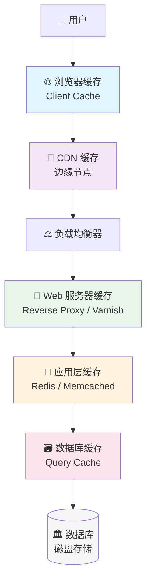
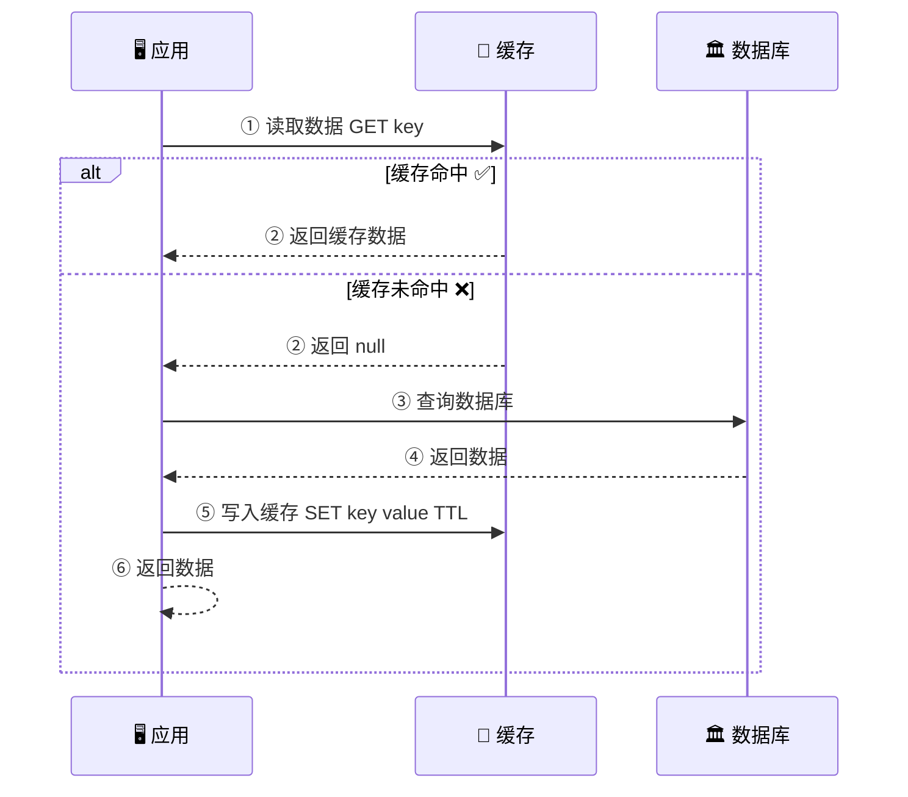
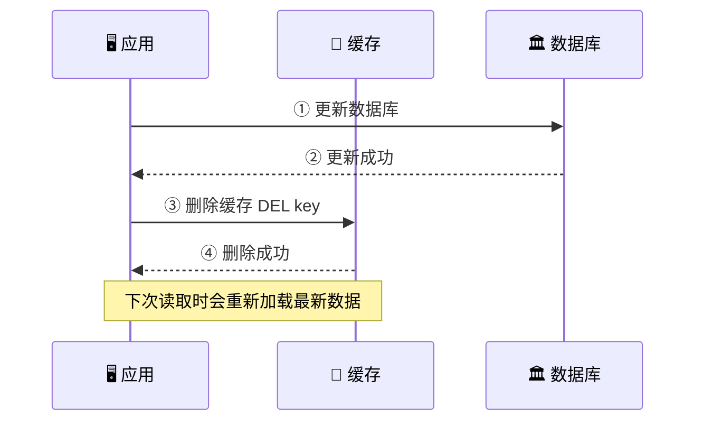
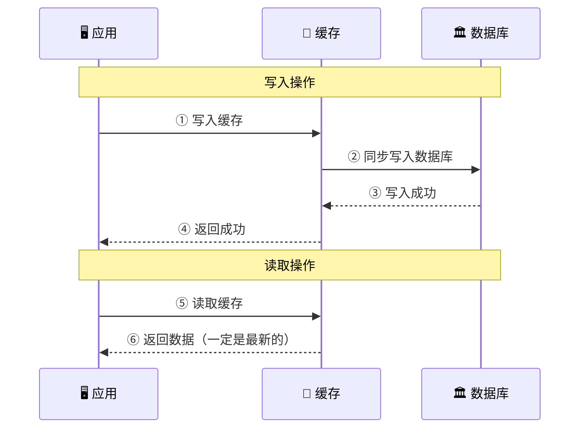
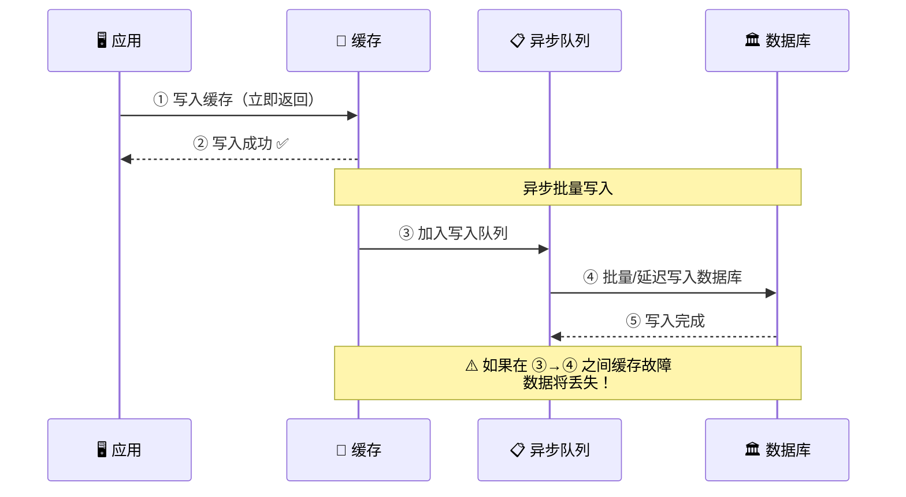
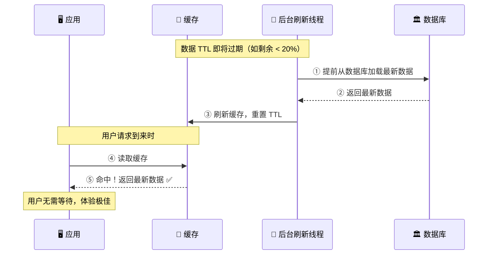
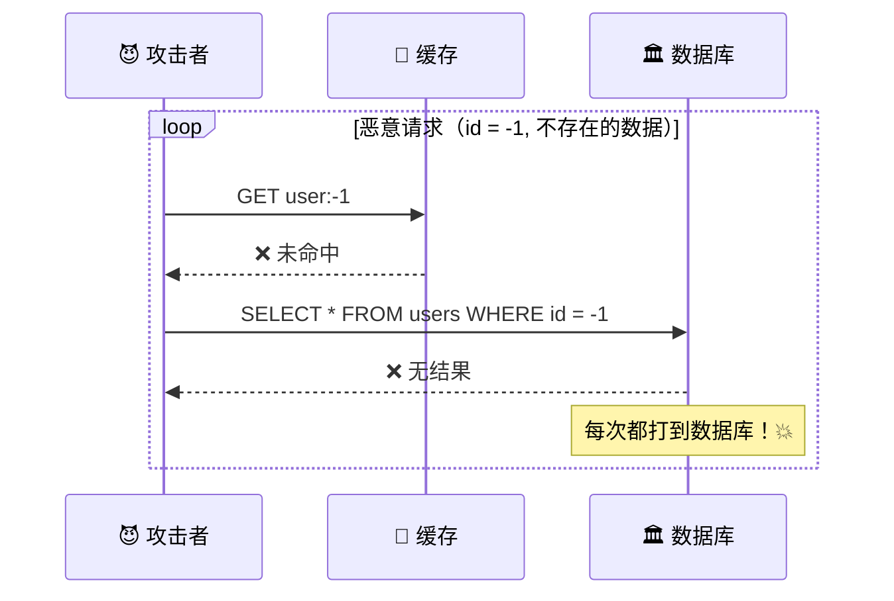
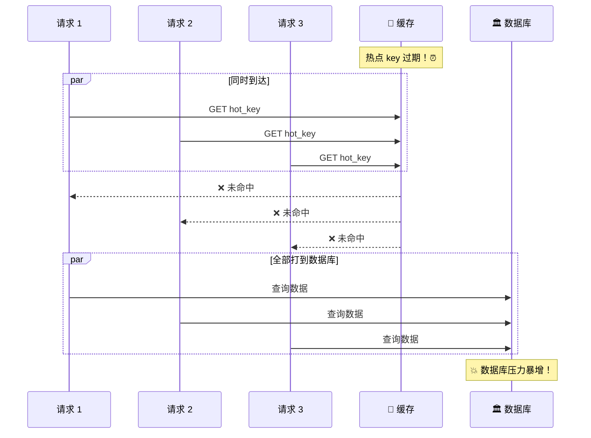
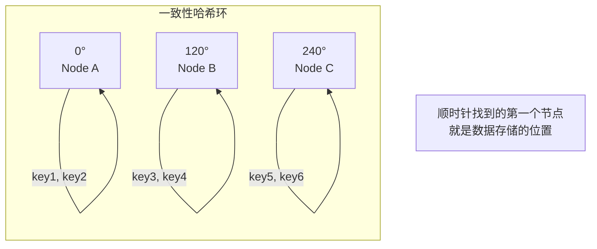
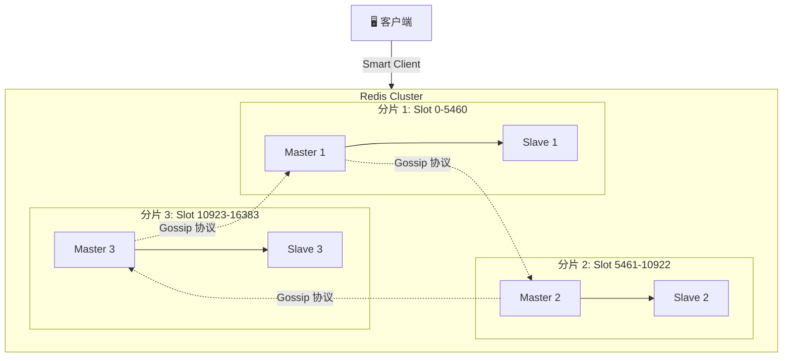

# ⚡ 第五章：缓存策略

> **"计算机科学中只有两件难事：缓存失效和命名。"** —— Phil Karlton

缓存是系统设计中最常用、最有效的性能优化手段之一。本章将深入探讨各种缓存策略，帮助你理解何时用缓存、怎么用缓存、以及如何避免缓存带来的问题。

---

## 5.1 什么是缓存？为什么需要缓存？

### 🗄️ 生活中的缓存

> **类比：办公桌 vs 档案柜**
>
> 想象你在办公室工作：
> - 📂 **档案柜**（数据库）：存放所有文件，容量大，但每次拿文件都要走过去翻找
> - 🖥️ **办公桌**（缓存）：只放你最近常用的文件，一伸手就能拿到
>
> 你不会把所有文件都堆在桌上（内存有限），但会把最常用的放在手边。这就是缓存的本质！

### 📊 Pareto 原则（80/20 法则）

在大多数系统中：

- **80% 的请求** 只访问 **20% 的数据**
- **80% 的流量** 来自 **20% 的热点内容**

```
请求分布示意：

热门数据 (20%)    ████████████████████████████████ 80% 的请求
其余数据 (80%)    ████████                         20% 的请求
```

这意味着我们只需要缓存少量热点数据，就能大幅提升系统性能！

### 🚀 缓存的核心价值

| 指标 | 无缓存 | 有缓存 | 提升 |
|------|--------|--------|------|
| 数据库查询延迟 | 5-50ms | - | - |
| 缓存读取延迟 | - | 0.1-1ms | ⬆️ 10-100x |
| 数据库 QPS 承载 | ~5,000 | - | - |
| Redis QPS 承载 | - | ~100,000 | ⬆️ 20x |
| 页面加载时间 | 2-5s | 0.2-0.5s | ⬆️ 10x |

---

## 5.2 缓存的层级

在一个完整的系统中，缓存存在于多个层级，每一层都在为性能保驾护航。

### 🏗️ 缓存层级全景图



### 各层级详解

#### 1️⃣ 客户端缓存（Client Cache）

浏览器本地缓存，通过 HTTP 头控制：

```
# HTTP 缓存头示例
Cache-Control: max-age=3600          # 缓存 1 小时
Cache-Control: no-cache              # 每次需验证
ETag: "33a64df551425fcc55e4d42a148795d9f25f89d4"
Last-Modified: Thu, 01 Dec 2023 16:00:00 GMT
```

#### 2️⃣ CDN 缓存

将静态资源缓存在离用户最近的边缘节点：

- 图片、CSS、JS 文件
- 视频流媒体内容
- 静态 HTML 页面

#### 3️⃣ Web 服务器缓存（反向代理缓存）

Nginx / Varnish 等反向代理可以缓存后端响应：

```nginx
# Nginx 缓存配置示例
proxy_cache_path /data/cache levels=1:2
                 keys_zone=my_cache:10m
                 max_size=1g
                 inactive=60m;

location /api/ {
    proxy_cache my_cache;
    proxy_cache_valid 200 10m;
    proxy_cache_valid 404 1m;
}
```

#### 4️⃣ 应用层缓存（最常讨论的缓存）

Redis 和 Memcached 是最常用的应用层缓存：

| 特性 | Redis | Memcached |
|------|-------|-----------|
| 数据结构 | String/Hash/List/Set/ZSet | 仅 Key-Value |
| 持久化 | ✅ RDB + AOF | ❌ |
| 集群模式 | ✅ Redis Cluster | ✅ 客户端分片 |
| 单线程模型 | ✅ (I/O 多线程 6.0+) | ✅ 多线程 |
| 内存管理 | jemalloc | slab allocation |
| 适用场景 | 复杂数据结构、持久化 | 简单 KV、极致性能 |

#### 5️⃣ 数据库缓存（Query Cache）

数据库内置的查询缓存（注意：MySQL 8.0 已移除 Query Cache）：

- InnoDB Buffer Pool（缓存数据页）
- 查询结果缓存
- 索引缓存

---

## 5.3 缓存更新策略

> 🎯 **本节是重点中的重点！** 面试中最常考的缓存知识。

### 策略一：Cache-Aside（旁路缓存 / 懒加载）

> **类比：查电话号码** 📞
>
> 要找老张的电话号码：
> 1. 先看手边的小本子（缓存）—— 有就直接用
> 2. 小本子没有 → 打电话问 114（数据库）
> 3. 拿到号码后，顺手写到小本子上（写入缓存）
>
> 下次再找老张，直接看小本子就行了！

#### 读取流程



#### 写入流程



#### Python 代码实现

```python
import redis
import json

r = redis.Redis(host='localhost', port=6379, db=0)

class CacheAside:
    """Cache-Aside 模式实现"""

    def __init__(self, cache_client, db_client, default_ttl=3600):
        self.cache = cache_client
        self.db = db_client
        self.ttl = default_ttl

    def get(self, key: str):
        """读取数据：先查缓存，未命中则查数据库"""
        # ① 先查缓存
        cached = self.cache.get(key)
        if cached is not None:
            print(f"✅ 缓存命中: {key}")
            return json.loads(cached)

        # ② 缓存未命中，查数据库
        print(f"❌ 缓存未命中: {key}，查询数据库...")
        data = self.db.query(f"SELECT * FROM users WHERE id = %s", key)

        if data is not None:
            # ③ 将数据写入缓存
            self.cache.setex(key, self.ttl, json.dumps(data))
            print(f"📝 数据已写入缓存: {key}")

        return data

    def update(self, key: str, value: dict):
        """更新数据：先更新数据库，再删除缓存"""
        # ① 先更新数据库
        self.db.update(f"UPDATE users SET ... WHERE id = %s", key, value)

        # ② 再删除缓存（而非更新缓存）
        self.cache.delete(key)
        print(f"🗑️ 缓存已删除: {key}")
```

#### ⚠️ 为什么是删除缓存而不是更新缓存？

> 想象两个请求同时修改同一条数据：
> - 请求 A 更新数据库为值 1，然后更新缓存为值 1
> - 请求 B 更新数据库为值 2，然后更新缓存为值 2
>
> 如果执行顺序变成：A 更新 DB → B 更新 DB → B 更新缓存 → A 更新缓存
> 缓存中就是旧值 1，但数据库是新值 2 —— **数据不一致！**
>
> 删除缓存则不会有这个问题，因为下次读取会从数据库重新加载。

#### 优缺点

| ✅ 优点 | ❌ 缺点 |
|---------|---------|
| 实现简单，最常用 | 首次请求必然 cache miss |
| 只缓存实际被请求的数据 | 数据库和缓存间有短暂不一致窗口 |
| 缓存故障不影响功能（降级到 DB） | 需要应用层处理缓存逻辑 |

---

### 策略二：Write-Through（直写模式）

> **类比：同时更新通讯录** 📒
>
> 你同时维护手机通讯录和纸质通讯录：
> - 每次新增/修改联系人时，**同时**更新手机和纸质通讯录
> - 查找时直接看手机通讯录（缓存），一定是最新的
>
> 慢一点，但数据永远一致！

#### 工作流程



#### Python 代码实现

```python
class WriteThrough:
    """Write-Through 模式实现"""

    def __init__(self, cache_client, db_client, default_ttl=3600):
        self.cache = cache_client
        self.db = db_client
        self.ttl = default_ttl

    def get(self, key: str):
        """读取：直接从缓存读取"""
        cached = self.cache.get(key)
        if cached is not None:
            return json.loads(cached)
        # 缓存未命中时从 DB 加载
        data = self.db.query(key)
        if data:
            self.cache.setex(key, self.ttl, json.dumps(data))
        return data

    def put(self, key: str, value: dict):
        """写入：同时写缓存和数据库（同步）"""
        serialized = json.dumps(value)

        # ① 写入缓存
        self.cache.setex(key, self.ttl, serialized)

        # ② 同步写入数据库（必须在同一事务中）
        self.db.update(key, value)

        print(f"✅ 缓存和数据库同步更新完成: {key}")
        return True
```

#### 优缺点

| ✅ 优点 | ❌ 缺点 |
|---------|---------|
| 数据一致性强 | 写入延迟高（每次写要写两个地方） |
| 缓存数据始终最新 | 大部分数据可能从未被读取却占了缓存空间 |
| 实现相对简单 | 如果缓存不可用，写入会失败 |

---

### 策略三：Write-Behind / Write-Back（回写模式）

> **类比：先记笔记，下班再归档** 📝
>
> 开会时你先把要点写在便利贴上（缓存），等忙完了再统一整理到正式文档中（数据库）。
> 如果便利贴丢了（缓存故障），没整理的内容就永远丢了！
>
> 快是真快，但风险也真大。

#### 工作流程



#### 核心特点

```python
class WriteBehind:
    """Write-Behind 模式的简化实现"""

    def __init__(self, cache_client, db_client):
        self.cache = cache_client
        self.db = db_client
        self.write_queue = []       # 待写入队列
        self.batch_size = 100       # 批量大小
        self.flush_interval = 5     # 刷新间隔（秒）

    def put(self, key: str, value: dict):
        """写入：只写缓存，异步写数据库"""
        # ① 立即写入缓存
        self.cache.set(key, json.dumps(value))

        # ② 加入异步写入队列
        self.write_queue.append((key, value))

        # ③ 队列满则触发批量写入
        if len(self.write_queue) >= self.batch_size:
            self._flush_to_db()

        return True  # 立即返回，不等数据库

    def _flush_to_db(self):
        """批量写入数据库"""
        if not self.write_queue:
            return

        batch = self.write_queue[:]
        self.write_queue.clear()

        try:
            self.db.batch_insert(batch)
            print(f"✅ 批量写入 {len(batch)} 条数据到数据库")
        except Exception as e:
            # ⚠️ 写入失败需要重试机制
            print(f"❌ 批量写入失败: {e}")
            self.write_queue.extend(batch)  # 重新入队
```

#### 优缺点

| ✅ 优点 | ❌ 缺点 |
|---------|---------|
| 写入速度极快（只写缓存） | ⚠️ **缓存故障可能丢数据** |
| 批量写入减少数据库压力 | 实现复杂度高 |
| 适合写密集型场景 | 数据一致性最弱 |

---

### 策略四：Refresh-Ahead（预刷新模式）

> **类比：智能预判** 🔮
>
> 就像一个聪明的助理，在你的常用文件快要被归档之前，主动帮你续借，
> 这样你需要的时候文件一直在手边，永远不会出现"去档案室取文件"的等待。

#### 工作流程



#### 优缺点

| ✅ 优点 | ❌ 缺点 |
|---------|---------|
| 极低的读取延迟 | 预测不准会浪费资源 |
| 对用户几乎零等待 | 实现复杂度最高 |
| 适合热点数据 | 需要准确的访问模式分析 |

---

### 🔍 四种策略对比总结

| 策略 | 一致性 | 写入速度 | 读取速度 | 复杂度 | 适用场景 |
|------|--------|---------|---------|--------|---------|
| Cache-Aside | ⭐⭐⭐ | ⭐⭐⭐ | ⭐⭐ | ⭐ | 通用场景，最常用 |
| Write-Through | ⭐⭐⭐⭐⭐ | ⭐ | ⭐⭐⭐⭐ | ⭐⭐ | 数据一致性要求高 |
| Write-Behind | ⭐⭐ | ⭐⭐⭐⭐⭐ | ⭐⭐⭐⭐ | ⭐⭐⭐⭐ | 写密集型，可容忍丢数据 |
| Refresh-Ahead | ⭐⭐⭐⭐ | ⭐⭐⭐ | ⭐⭐⭐⭐⭐ | ⭐⭐⭐⭐⭐ | 热点数据，读密集型 |

---

## 5.4 缓存淘汰策略

当缓存空间满了，我们需要决定淘汰哪些数据。

### 📋 常见淘汰策略

#### 1. LRU（Least Recently Used）—— 最近最少使用

> **类比**：冰箱管理 🧊 —— 把最久没吃的食物先扔掉

```
访问顺序: A B C D E（缓存容量为 4）

Step 1: [A]              → 加入 A
Step 2: [B, A]           → 加入 B
Step 3: [C, B, A]        → 加入 C
Step 4: [D, C, B, A]     → 加入 D（已满）
Step 5: [E, D, C, B]     → 加入 E，淘汰最久未访问的 A
Step 6: 访问 B
        [B, E, D, C]     → B 移到最前面
```

```python
from collections import OrderedDict

class LRUCache:
    """基于 OrderedDict 实现 LRU Cache"""

    def __init__(self, capacity: int):
        self.capacity = capacity
        self.cache = OrderedDict()

    def get(self, key: str):
        if key not in self.cache:
            return None
        # 移动到末尾（表示最近使用）
        self.cache.move_to_end(key)
        return self.cache[key]

    def put(self, key: str, value):
        if key in self.cache:
            self.cache.move_to_end(key)
        self.cache[key] = value
        if len(self.cache) > self.capacity:
            # 淘汰最久未使用的（最前面的）
            evicted_key, _ = self.cache.popitem(last=False)
            print(f"🗑️ 淘汰: {evicted_key}")
```

#### 2. LFU（Least Frequently Used）—— 最不经常使用

> **类比**：图书馆管理 📚 —— 借阅次数最少的书先下架

```python
from collections import defaultdict

class LFUCache:
    """LFU Cache 简化实现"""

    def __init__(self, capacity: int):
        self.capacity = capacity
        self.cache = {}           # key -> value
        self.freq = {}            # key -> frequency
        self.freq_map = defaultdict(OrderedDict)  # freq -> keys
        self.min_freq = 0

    def get(self, key: str):
        if key not in self.cache:
            return None
        self._update_freq(key)
        return self.cache[key]

    def _update_freq(self, key):
        f = self.freq[key]
        self.freq[key] = f + 1
        del self.freq_map[f][key]
        if not self.freq_map[f]:
            del self.freq_map[f]
            if self.min_freq == f:
                self.min_freq = f + 1
        self.freq_map[f + 1][key] = None
```

#### 3. FIFO（First In, First Out）—— 先进先出

> **类比**：超市货架 🏪 —— 最早上架的商品先处理

最简单的策略：最先放入的最先被淘汰，不考虑访问频率。

#### 4. TTL（Time To Live）—— 定时过期

> **类比**：食品保质期 📅 —— 到期就扔

```python
import time

# Redis TTL 示例
r.setex("session:user123", 1800, "session_data")  # 30 分钟过期
r.setex("product:456", 3600, "product_data")       # 1 小时过期

# 检查剩余时间
ttl = r.ttl("session:user123")
print(f"剩余过期时间: {ttl} 秒")
```

### 📊 淘汰策略对比

| 策略 | 原理 | 优点 | 缺点 | 适用场景 |
|------|------|------|------|---------|
| LRU | 淘汰最久未访问的 | 实现简单，效果好 | 偶尔的批量扫描会污染缓存 | 通用场景 |
| LFU | 淘汰访问次数最少的 | 更精确反映热度 | 新数据难以积累频次 | 访问模式稳定 |
| FIFO | 淘汰最早进入的 | 最简单 | 不考虑访问模式 | 简单场景 |
| TTL | 到期自动删除 | 数据新鲜度有保障 | 需要合理设置过期时间 | 有时效性的数据 |

> 💡 **实践建议**：Redis 默认使用 **近似 LRU** 算法（`maxmemory-policy allkeys-lru`），在大多数场景下表现优秀。

---

## 5.5 缓存常见问题与解决方案

### 问题一：缓存穿透（Cache Penetration）🕳️

> **什么是缓存穿透？**
>
> 查询一个**根本不存在**的数据，缓存中没有，数据库中也没有。
> 每次请求都会穿透缓存直达数据库——攻击者可以利用这一点发起大量请求压垮数据库。



#### ✅ 解决方案

**方案 A：缓存空值**

```python
def get_user(user_id: str):
    cached = cache.get(f"user:{user_id}")

    if cached is not None:
        if cached == "NULL":  # 缓存了空值标记
            return None
        return json.loads(cached)

    data = db.query_user(user_id)

    if data is None:
        # 缓存空值，设置较短的 TTL
        cache.setex(f"user:{user_id}", 300, "NULL")  # 5 分钟
        return None

    cache.setex(f"user:{user_id}", 3600, json.dumps(data))
    return data
```

**方案 B：Bloom Filter（布隆过滤器）**

```python
from pybloom_live import BloomFilter

# 初始化布隆过滤器，预估 100 万条数据，误判率 0.1%
bf = BloomFilter(capacity=1000000, error_rate=0.001)

# 预热：将所有存在的 key 加入布隆过滤器
for user_id in db.get_all_user_ids():
    bf.add(f"user:{user_id}")

def get_user_with_bloom(user_id: str):
    key = f"user:{user_id}"

    # ① 先查布隆过滤器
    if key not in bf:
        print(f"🚫 布隆过滤器拦截: {key} 一定不存在")
        return None  # 一定不存在，直接返回

    # ② 布隆过滤器说"可能存在"，继续正常查询
    return get_user(user_id)
```

```
布隆过滤器原理：

数据 → 多个 Hash 函数 → 设置对应 Bit 位

Bit 数组: [0, 1, 0, 1, 1, 0, 0, 1, 0, 1, 0, 0]

查询时：如果任何一个 Bit 位为 0 → 数据一定不存在 ✅
        如果所有 Bit 位为 1 → 数据可能存在（有误判率）
```

---

### 问题二：缓存击穿（Cache Breakdown）💥

> **什么是缓存击穿？**
>
> 某个**热点 key** 突然过期，大量并发请求同时涌入数据库。
> 就像一扇门突然打开，所有人同时涌进去。



#### ✅ 解决方案：互斥锁（Mutex Lock）

```python
import time

LOCK_TIMEOUT = 3  # 锁超时时间（秒）

def get_hot_data(key: str):
    """使用互斥锁解决缓存击穿"""
    data = cache.get(key)
    if data is not None:
        return json.loads(data)

    # 缓存未命中，尝试获取互斥锁
    lock_key = f"lock:{key}"

    if cache.set(lock_key, "1", ex=LOCK_TIMEOUT, nx=True):
        # 获取锁成功 🔒
        try:
            # 再次检查缓存（Double Check）
            data = cache.get(key)
            if data is not None:
                return json.loads(data)

            # 查询数据库
            data = db.query(key)
            cache.setex(key, 3600, json.dumps(data))
            return data
        finally:
            # 释放锁
            cache.delete(lock_key)
    else:
        # 获取锁失败，短暂等待后重试
        time.sleep(0.1)
        return get_hot_data(key)  # 递归重试
```

---

### 问题三：缓存雪崩（Cache Avalanche）❄️

> **什么是缓存雪崩？**
>
> **大量缓存同时过期**（或缓存服务宕机），导致请求全部直达数据库，
> 数据库瞬间过载崩溃——像雪崩一样连锁反应。

#### ✅ 解决方案

**方案 A：TTL 加随机值**

```python
import random

def set_with_random_ttl(key: str, value: str, base_ttl: int = 3600):
    """给 TTL 加上随机偏移，避免同时过期"""
    # 在基础 TTL 上加 0~300 秒的随机值
    random_offset = random.randint(0, 300)
    actual_ttl = base_ttl + random_offset

    cache.setex(key, actual_ttl, value)
    print(f"📝 设置缓存 {key}，TTL = {actual_ttl}s")
```

**方案 B：多级缓存架构**

```python
class MultiLevelCache:
    """多级缓存：本地缓存 + 分布式缓存"""

    def __init__(self):
        self.local_cache = {}  # L1: 本地缓存（进程内）
        self.redis_cache = redis.Redis()  # L2: Redis 分布式缓存

    def get(self, key: str):
        # L1 查找
        if key in self.local_cache:
            entry = self.local_cache[key]
            if entry['expire'] > time.time():
                return entry['value']

        # L2 查找
        data = self.redis_cache.get(key)
        if data is not None:
            self.local_cache[key] = {
                'value': json.loads(data),
                'expire': time.time() + 60  # 本地缓存 1 分钟
            }
            return json.loads(data)

        return None
```

**方案 C：缓存高可用（Redis Sentinel / Cluster）**

确保缓存服务本身不会整体宕机。

### 🔄 Thundering Herd（惊群问题）

> 当缓存失效时，大量请求**同时**涌入尝试重建缓存。
> 与缓存击穿类似，但规模更大。

解决方案核心思路：**让只有一个请求去重建缓存，其他请求等待或使用旧数据。**

```python
def get_with_singleflight(key: str):
    """Singleflight 模式：合并并发请求"""
    data = cache.get(key)
    if data:
        return json.loads(data)

    # 使用 Redis 的 SETNX 保证只有一个请求去重建
    rebuild_lock = f"rebuild:{key}"
    if cache.set(rebuild_lock, "1", ex=10, nx=True):
        # 获胜者：重建缓存
        data = db.query(key)
        cache.setex(key, 3600, json.dumps(data))
        cache.delete(rebuild_lock)
        return data
    else:
        # 其他请求：短暂等待后读缓存
        time.sleep(0.05)
        data = cache.get(key)
        return json.loads(data) if data else None
```

### 🗺️ 问题总结对比

| 问题 | 原因 | 核心解决思路 |
|------|------|-------------|
| 缓存穿透 | 查询不存在的数据 | 布隆过滤器 / 缓存空值 |
| 缓存击穿 | 热点 key 过期 | 互斥锁 / 永不过期 + 异步刷新 |
| 缓存雪崩 | 大量 key 同时过期 | 随机 TTL / 多级缓存 / 高可用 |
| 惊群问题 | 并发重建缓存 | Singleflight / 分布式锁 |

---

## 5.6 分布式缓存

当单机缓存容量不够时，我们需要分布式缓存方案。

### 🔑 Consistent Hashing（一致性哈希）

> **问题**：3 台缓存服务器，如何决定某个 key 存在哪台？
>
> 简单取模 `hash(key) % 3` 的问题：增减服务器时，几乎所有 key 都要迁移！
>
> **一致性哈希**解决了这个问题——增减节点只影响相邻的一小部分数据。



```python
import hashlib
from bisect import bisect_right

class ConsistentHash:
    """一致性哈希的简化实现"""

    def __init__(self, nodes=None, replicas=150):
        self.replicas = replicas  # 每个节点的虚拟节点数
        self.ring = {}           # 哈希环
        self.sorted_keys = []    # 排序后的哈希值

        if nodes:
            for node in nodes:
                self.add_node(node)

    def _hash(self, key: str) -> int:
        return int(hashlib.md5(key.encode()).hexdigest(), 16)

    def add_node(self, node: str):
        """添加节点（含虚拟节点）"""
        for i in range(self.replicas):
            virtual_key = f"{node}:vn{i}"
            hash_val = self._hash(virtual_key)
            self.ring[hash_val] = node
            self.sorted_keys.append(hash_val)
        self.sorted_keys.sort()
        print(f"✅ 添加节点: {node}（{self.replicas} 个虚拟节点）")

    def remove_node(self, node: str):
        """移除节点"""
        for i in range(self.replicas):
            virtual_key = f"{node}:vn{i}"
            hash_val = self._hash(virtual_key)
            del self.ring[hash_val]
            self.sorted_keys.remove(hash_val)
        print(f"🗑️ 移除节点: {node}")

    def get_node(self, key: str) -> str:
        """根据 key 获取对应的缓存节点"""
        if not self.ring:
            return None
        hash_val = self._hash(key)
        # 顺时针查找第一个节点
        idx = bisect_right(self.sorted_keys, hash_val)
        if idx == len(self.sorted_keys):
            idx = 0  # 环绕
        return self.ring[self.sorted_keys[idx]]

# 使用示例
ch = ConsistentHash(["redis-1", "redis-2", "redis-3"])
print(ch.get_node("user:1001"))  # → redis-2
print(ch.get_node("user:1002"))  # → redis-1
print(ch.get_node("order:555"))  # → redis-3
```

### 🏗️ Redis Cluster 架构



Redis Cluster 的关键设计：

```python
# Redis Cluster 使用 16384 个 hash slot
# 计算 key 对应的 slot
def key_hash_slot(key: str) -> int:
    """计算 key 的 hash slot (CRC16 算法)"""
    # 支持 hash tag: {user}.name 只对 {user} 部分计算
    start = key.find('{')
    if start != -1:
        end = key.find('}', start + 1)
        if end != -1 and end != start + 1:
            key = key[start + 1:end]

    # CRC16 对 16384 取模
    crc = crc16(key.encode())
    return crc % 16384

# 示例
print(key_hash_slot("user:1001"))     # → 某个 slot
print(key_hash_slot("{user}:name"))   # → 和 {user}:age 相同的 slot
print(key_hash_slot("{user}:age"))    # → 保证在同一分片
```

---

## 5.7 本章小结

### 🧠 核心知识点回顾

```
缓存策略知识图谱：

缓存策略
├── 为什么需要缓存
│   ├── Pareto 原则（80/20）
│   └── 减少延迟、降低数据库压力
├── 缓存层级
│   ├── 客户端缓存
│   ├── CDN 缓存
│   ├── Web 服务器缓存
│   ├── 应用层缓存（Redis / Memcached）
│   └── 数据库缓存
├── 更新策略 ⭐
│   ├── Cache-Aside（最常用）
│   ├── Write-Through（强一致）
│   ├── Write-Behind（高性能写入）
│   └── Refresh-Ahead（预刷新）
├── 淘汰策略
│   ├── LRU（最近最少使用）
│   ├── LFU（最不经常使用）
│   ├── FIFO（先进先出）
│   └── TTL（定时过期）
├── 常见问题
│   ├── 缓存穿透 → 布隆过滤器
│   ├── 缓存击穿 → 互斥锁
│   ├── 缓存雪崩 → 随机 TTL
│   └── 惊群问题 → Singleflight
└── 分布式缓存
    ├── 一致性哈希
    └── Redis Cluster
```

### 🎯 面试高频问题

1. **Cache-Aside 为什么是先更新数据库再删除缓存？** 而不是先删除缓存再更新数据库？
2. **如何保证缓存和数据库的一致性？** 最终一致 vs 强一致有哪些方案？
3. **Redis 缓存穿透、击穿、雪崩的区别和解决方案？**
4. **为什么用一致性哈希？** 简单取模有什么问题？
5. **Redis 和 Memcached 的区别？** 各自适用场景？

### ✏️ 练习题

#### 练习 1：实现带 TTL 的 LRU Cache

```python
# 要求：
# 1. 支持 get(key) 和 put(key, value, ttl) 操作
# 2. LRU 淘汰 + TTL 自动过期
# 3. 时间复杂度 O(1)

class TTLLRUCache:
    def __init__(self, capacity: int):
        # 你的实现...
        pass

    def get(self, key: str):
        # 提示：检查是否过期，如果过期要删除
        pass

    def put(self, key: str, value, ttl: int):
        # 提示：存储 value 和过期时间戳
        pass
```

#### 练习 2：设计一个缓存预热方案

> 场景：电商平台大促前，需要提前预热商品缓存。
> 设计一个方案，包括预热哪些数据、怎么预热、预热顺序等。

#### 练习 3：分析缓存一致性

> 在 Cache-Aside 模式下，分析以下场景：
> 1. 请求 A 读取数据（cache miss）
> 2. 请求 B 更新同一条数据
> 3. 请求 A 将旧数据写入缓存
>
> 这个场景下会出现什么问题？如何解决？

---

> 📖 **下一章预告**：我们将学习消息队列与异步处理——如何使用消息队列解耦系统、削峰填谷、保证最终一致性。

> 💡 **记住**：缓存不是银弹。它带来性能提升的同时，也引入了数据一致性的复杂度。
> 好的工程师不仅知道何时使用缓存，更知道何时**不**使用缓存。
