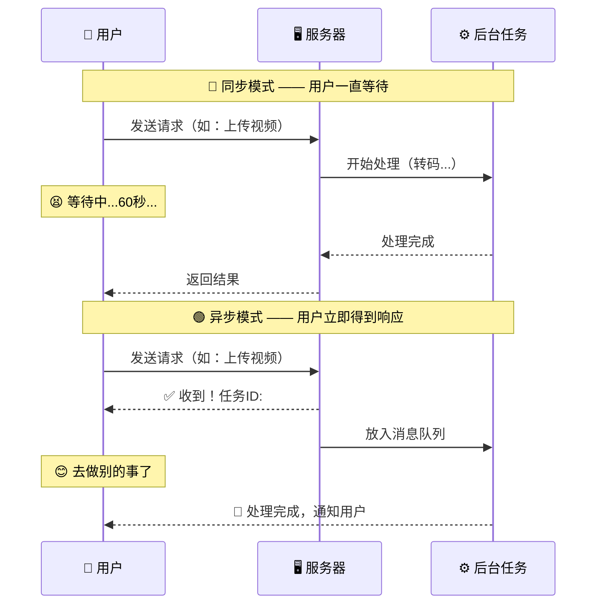
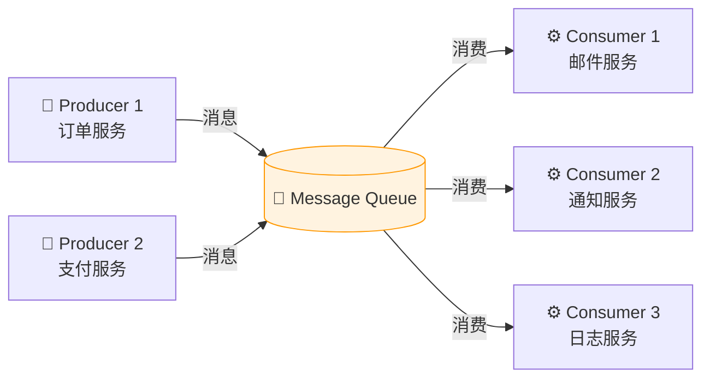
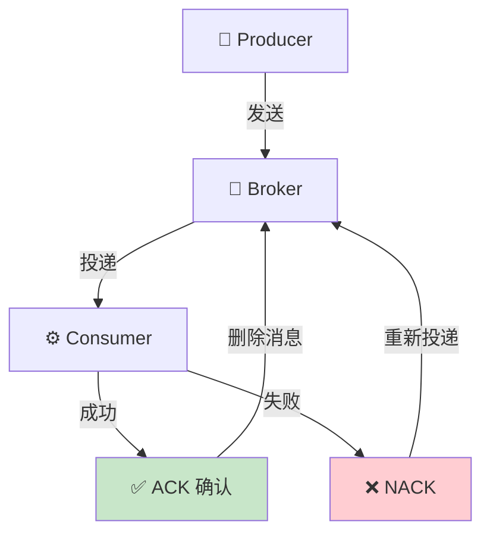
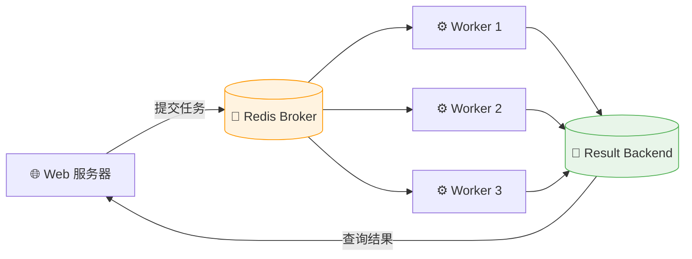
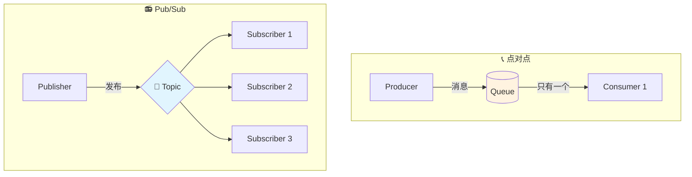
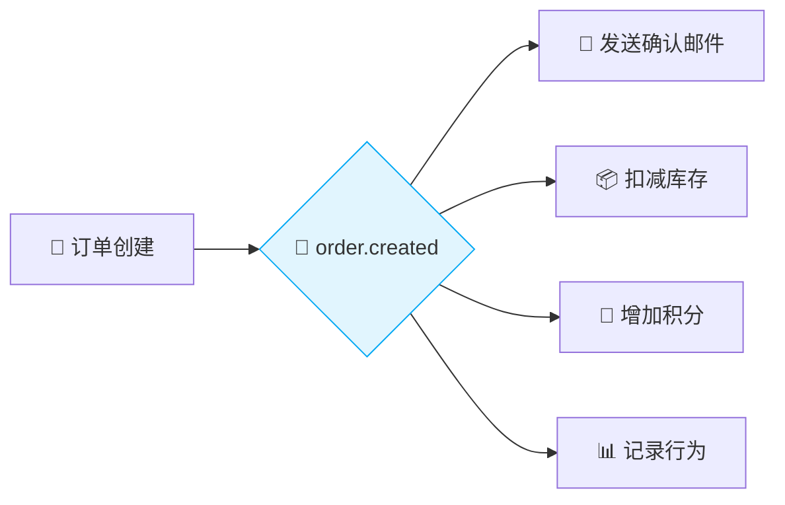
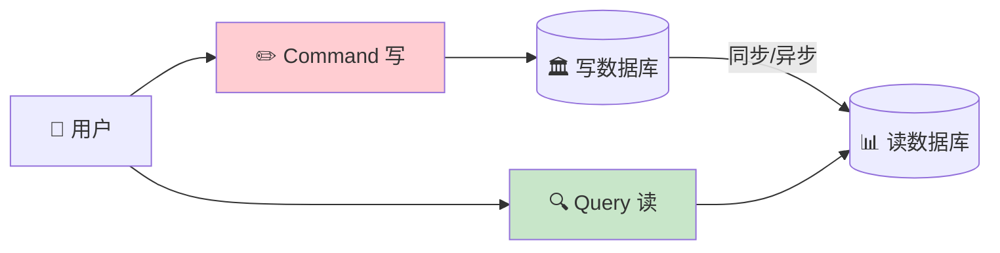
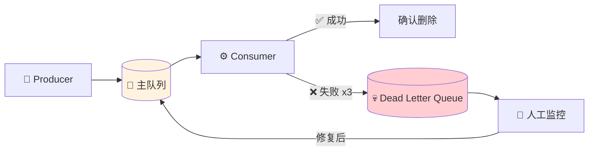
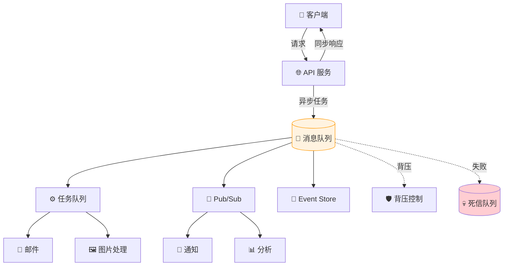

# 📨 第六章：异步处理与消息队列

> **"不要让用户等你干完所有事，先告诉他'收到了'，然后慢慢做。"** —— 异步设计的核心哲学

在高并发系统中，不是每件事都需要"立刻做完"。异步处理与消息队列让你的服务更快响应、更稳运行、更易扩展。

---

## 📑 本章目录

- [6.1 为什么需要异步处理？](#61-为什么需要异步处理)
- [6.2 消息队列（Message Queue）](#62-消息队列message-queue)
- [6.3 任务队列（Task Queue）](#63-任务队列task-queue)
- [6.4 发布-订阅模式（Pub/Sub）](#64-发布-订阅模式pubsub)
- [6.5 事件驱动架构](#65-事件驱动架构)
- [6.6 背压（Back Pressure）](#66-背压back-pressure)
- [6.7 实用模式](#67-实用模式)
- [6.8 本章小结](#68-本章小结)

---

## 6.1 为什么需要异步处理？

### 🍔 生活中的异步

> **类比：快餐店点餐**
>
> - 🚶 **同步模式**：你在柜台点餐，站在那里等厨师做好直接交给你。后面的人只能排队。
> - 📟 **异步模式**：你点完餐，店员给你一个取餐号/呼叫器，你可以去找座位、刷手机。餐好了呼叫器响了再去取。
>
> 异步的核心：**先给回执，后台处理，完成通知**。

### ⚡ 同步 vs 异步对比



| 指标 | 同步处理 | 异步处理 | 差异 |
|------|----------|----------|------|
| 用户等待时间 | 30-120s | < 1s | ⬆️ 30-120x |
| 服务器吞吐量 | ~100 req/s | ~5,000 req/s | ⬆️ 50x |
| 系统耦合度 | 高（直接调用） | 低（消息解耦） | ✅ |
| 故障隔离 | 差（级联失败） | 好（独立失败） | ✅ |
| 数据一致性 | 强一致 | 最终一致 | ⚠️ |

### 🤔 什么时候该用异步？

**✅ 适合异步：** 📧 发送邮件/短信、🖼️ 图片压缩/视频转码、📊 生成报表、💳 订单后续处理、📈 日志收集

**❌ 不适合异步：** 🔐 用户登录验证、💰 余额查询、🛒 库存扣减（需要强一致性）

---

## 6.2 消息队列（Message Queue）

### 📮 什么是消息队列？

> **类比：邮局和信箱**
>
> - 📝 你（Producer）写好信，投到 **邮筒**（Queue）里
> - 📮 邮局（Broker）负责存储和转发
> - 📬 朋友（Consumer）从 **信箱** 里取信
>
> 你不需要知道朋友在不在家，邮局会帮你暂存。这就是消息队列的"解耦"能力！



### 🏪 主流消息队列对比

| 特性 | Redis | RabbitMQ | Amazon SQS | Kafka |
|------|-------|----------|------------|-------|
| 吞吐量 | ~10万/s | ~1万/s | ~3千/s | ~100万/s |
| 延迟 | 亚毫秒 | 微秒级 | 毫秒级 | 毫秒级 |
| 持久化 | 可选 | ✅ | ✅ | ✅ |
| 消息回溯 | ❌ | ❌ | ❌ | ✅ |
| 适用场景 | 轻量任务 | 企业应用 | 云原生 | 大数据/流处理 |

### 💻 Redis 消息队列示例

```python
import redis
import json
import time

r = redis.Redis(host='localhost', port=6379, db=0)

# ============ Producer ============
def send_email_task(to: str, subject: str, body: str):
    """将发送邮件的任务放入队列"""
    message = {
        "task": "send_email",
        "data": {"to": to, "subject": subject, "body": body},
        "created_at": time.time(),
    }
    r.lpush("email_queue", json.dumps(message))
    print(f"📤 邮件任务已入队: -> {to}")

# ============ Consumer ============
def email_worker():
    """持续从队列中取出任务并执行"""
    print("⚙️ 邮件消费者启动，等待任务...")
    while True:
        # BRPOP：阻塞式取出（FIFO 顺序）
        _, raw_message = r.brpop("email_queue")
        message = json.loads(raw_message)
        data = message["data"]
        print(f"📧 正在发送邮件: -> {data['to']}")
        time.sleep(2)  # 模拟发送耗时
        print(f"✅ 发送成功: {data['subject']}")
```

### 📦 消息投递保证

| 投递语义 | 含义 | 可能问题 | 适用场景 |
|----------|------|----------|----------|
| 🔹 At-Most-Once | 最多投递一次 | 可能丢失 | 日志、监控 |
| 🔸 At-Least-Once | 至少投递一次 | 可能重复 | 邮件通知、大多数业务 |
| 🔴 Exactly-Once | 恰好投递一次 | 实现复杂 | 金融交易、支付 |

> 💡 **实践建议**：大多数系统使用 **At-Least-Once + 幂等处理**，这是成本和可靠性的最佳平衡。



---

## 6.3 任务队列（Task Queue）

### 🔧 消息队列 vs 任务队列

| 特性 | 消息队列 | 任务队列 |
|------|----------|----------|
| 核心目标 | 传递消息 | 执行任务 |
| 结果追踪 | 一般不追踪 | 支持结果查询 |
| 重试机制 | 需手动实现 | 内置支持 |
| 典型实现 | RabbitMQ, Kafka | Celery, Sidekiq |

### 🌿 Celery 任务队列示例

```python
# tasks.py
from celery import Celery

app = Celery('my_tasks', broker='redis://localhost:6379/0',
             backend='redis://localhost:6379/1')

@app.task(bind=True, max_retries=3)
def process_image(self, image_url: str, size: tuple):
    """图片处理任务：下载 → 缩放 → 上传"""
    try:
        image = download_image(image_url)
        resized = resize_image(image, size)
        cdn_url = upload_to_cdn(resized)
        return {"status": "success", "cdn_url": cdn_url}
    except Exception as exc:
        # 指数退避重试：1s, 2s, 4s
        raise self.retry(exc=exc, countdown=2 ** self.request.retries)

@app.task
def send_welcome_email(user_id: int):
    """发送欢迎邮件"""
    user = get_user(user_id)
    send_email(user.email, "欢迎加入！", render_template("welcome.html", user=user))
```

```python
# 在 Web 服务中调用
from tasks import process_image, send_welcome_email

# 异步调用：立即返回，不阻塞
result = process_image.delay("https://example.com/photo.jpg", (800, 600))
print(f"📋 任务ID: {result.id}")
print(f"📊 状态: {result.status}")  # PENDING / STARTED / SUCCESS / FAILURE
```

### 🏗️ Worker Pool 架构



> 💡 **用户注册优化示例**：只有"写入数据库"需要同步，发欢迎邮件、生成头像、加积分等全部丢进任务队列，响应时间从 **3秒** 降到 **200毫秒**！

---

## 6.4 发布-订阅模式（Pub/Sub）

### 📢 点对点 vs 发布-订阅

> - 📞 **点对点（Queue）**：打电话——只有一个人接听
> - 📻 **发布-订阅（Pub/Sub）**：广播电台——所有调到这个频道的人都能听到



### 🌐 Fan-Out 模式

一条消息触发多个下游操作：



> 💡 新增下游服务时只需"订阅"该 Topic，**不需要修改任何已有代码**！

### 💻 Redis Pub/Sub 示例

```python
import redis, json, threading

r = redis.Redis(host='localhost', port=6379, db=0)

def publish_order_event(order_id: str, amount: float):
    event = {"event_type": "order.created",
             "data": {"order_id": order_id, "amount": amount}}
    r.publish("order_events", json.dumps(event))

def email_subscriber():
    pubsub = r.pubsub()
    pubsub.subscribe("order_events")
    for msg in pubsub.listen():
        if msg["type"] == "message":
            event = json.loads(msg["data"])
            print(f"📧 发送确认邮件: 订单 {event['data']['order_id']}")

threading.Thread(target=email_subscriber, daemon=True).start()
publish_order_event("ORD-001", 299.00)
```

---

## 6.5 事件驱动架构

### 🏗️ Event Sourcing（事件溯源）

> **类比：银行流水 vs 余额**
>
> - 💰 传统方式：只记录"余额 = ¥1000"
> - 📜 事件溯源：记录每笔流水——存 ¥500，花 ¥200，收 ¥700 = ¥1000

```python
class BankAccount:
    def __init__(self, account_id: str):
        self.account_id = account_id
        self.balance = 0
        self.events = []

    def apply_event(self, event: dict):
        if event["type"] == "deposited":
            self.balance += event["amount"]
        elif event["type"] == "withdrawn":
            self.balance -= event["amount"]
        self.events.append(event)

    def deposit(self, amount: float):
        self.apply_event({"type": "deposited", "amount": amount})

    def withdraw(self, amount: float):
        if amount > self.balance:
            raise ValueError("余额不足")
        self.apply_event({"type": "withdrawn", "amount": amount})

    def replay(self):
        """从事件日志重建状态"""
        self.balance = 0
        for e in self.events:
            if e["type"] == "deposited":
                self.balance += e["amount"]
            elif e["type"] == "withdrawn":
                self.balance -= e["amount"]
```

### 📐 CQRS（Command Query Responsibility Segregation）

将"写操作"和"读操作"分离到不同的模型：



| 优势 | 说明 |
|------|------|
| 🚀 独立扩展 | 读多写少？只扩展读模型 |
| 📊 优化查询 | 读模型可用预计算的物化视图 |
| 🔒 安全隔离 | 写和读走不同权限模型 |

⚠️ 注意：增加复杂度，读写间存在短暂不一致（最终一致性），适合读写比例差异大的场景。

---

## 6.6 背压（Back Pressure）

### 🚰 什么是背压？

> **类比：水管系统** 🚿
>
> 水龙头开到最大（Producer 很快），水桶接水（Consumer 处理）。水流太快桶就溢出（系统崩溃）。**背压**就是"告诉上游慢一点"——就像水桶快满时关小水龙头。

> **类比：高速公路** 🛣️
>
> 入口红绿灯（Ramp Metering）在拥堵时延长红灯，控制上高速的车辆数，防止瘫痪。

### ⚠️ 没有背压会怎样？

```
Producer: 1000 msg/s    Consumer: 200 msg/s

t=0s   队列: [           ] 0 条      ✅
t=10s  队列: [████       ] 8,000 条   ⚠️
t=60s  队列: [███████████] 48,000 条  🔴
t=61s  💥 OOM → 服务崩溃
```

### 🛡️ 背压策略

```python
import redis, json, time

r = redis.Redis(host='localhost', port=6379, db=0)
MAX_QUEUE_SIZE = 10000
WARNING_THRESHOLD = 8000

def produce_with_backpressure(message: dict) -> bool:
    queue_size = r.llen("task_queue")
    if queue_size >= MAX_QUEUE_SIZE:
        return False  # 硬限制：队列满了直接拒绝
    if queue_size >= WARNING_THRESHOLD:
        # 软限制：接近上限时降速
        delay = (queue_size - WARNING_THRESHOLD) / (MAX_QUEUE_SIZE - WARNING_THRESHOLD) * 2
        time.sleep(delay)
    r.lpush("task_queue", json.dumps(message))
    return True
```

| 策略 | 做法 | 优点 | 缺点 |
|------|------|------|------|
| 🚫 丢弃 | 队列满时丢弃新消息 | 简单 | 数据丢失 |
| ⏸️ 阻塞 | 队列满时阻塞 Producer | 不丢数据 | 上游可能超时 |
| 📉 降速 | 动态调整速率 | 平滑降级 | 实现复杂 |
| 🔄 动态扩容 | 自动增加 Consumer | 弹性应对峰值 | 扩容有延迟 |

---

## 6.7 实用模式

### 🔁 重试与指数退避（Exponential Backoff）

下游服务临时不可用时，逐渐增大重试间隔：

```python
import time
import random

def retry_with_backoff(func, max_retries=5, base_delay=1.0):
    for attempt in range(max_retries):
        try:
            return func()
        except Exception as e:
            if attempt == max_retries - 1:
                raise
            # 指数退避 + 随机抖动（避免惊群效应）
            delay = base_delay * (2 ** attempt) + random.uniform(0, 1)
            print(f"⚠️ 第 {attempt + 1} 次失败，{delay:.1f}s 后重试")
            time.sleep(delay)
```

> 💡 **为什么加随机抖动？** 100 个客户端同时失败，都在 1 秒后重试会再次打爆服务器。随机抖动分散重试请求，避免"惊群效应"（Thundering Herd）。

### 💀 死信队列（Dead Letter Queue）

消息多次处理失败后，送入"坏消息收容所"：



```python
import redis, json

r = redis.Redis(host='localhost', port=6379, db=0)
MAX_RETRIES = 3

def process_with_dlq():
    while True:
        _, raw = r.brpop("orders")
        message = json.loads(raw)
        retry_count = message.get("_retry_count", 0)
        try:
            process_order(message)
        except Exception as e:
            retry_count += 1
            message["_retry_count"] = retry_count
            if retry_count >= MAX_RETRIES:
                message["_error"] = str(e)
                r.lpush("orders_dlq", json.dumps(message))
            else:
                r.lpush("orders", json.dumps(message))
```

### 🔑 幂等性（Idempotency）

> **类比：电梯按钮** 🛗 —— 按 5 楼，不管按 1 次还是 10 次，电梯只去 5 楼一次。

```python
import redis

r = redis.Redis(host='localhost', port=6379, db=0)

def process_payment_idempotent(msg: dict):
    key = f"processed:{msg['payment_id']}"
    if r.exists(key):
        return  # 已处理，跳过
    charge_credit_card(msg['user_id'], msg['amount'])
    r.setex(key, 86400, "done")  # 标记已处理，24小时过期
```

| 模式 | 解决的问题 | 核心思路 |
|------|-----------|----------|
| 🔁 指数退避重试 | 临时故障恢复 | 逐渐增大间隔，避免雪崩 |
| 💀 死信队列 | 无法处理的坏消息 | 隔离问题消息，人工介入 |
| 🔑 幂等处理 | 消息重复消费 | 用唯一 ID 去重 |

---

## 6.8 本章小结

### 🗺️ 异步处理全景图



### 📝 核心知识点

| 概念 | 一句话总结 |
|------|-----------|
| 异步处理 | 先回复"收到"，后台慢慢做 |
| 消息队列 | 系统间的"邮局"，解耦 Producer 和 Consumer |
| 任务队列 | 把"要做的活"分配给 Worker 执行 |
| Pub/Sub | 一条消息广播给所有订阅者 |
| Event Sourcing | 记录每次变更，不只存最终状态 |
| CQRS | 读写分离，各自优化 |
| 背压 | 下游忙不过来时告诉上游"慢一点" |
| 幂等性 | 同一操作执行多次，结果一样 |

### 🏋️ 练习题

1. **消息队列选型**：电商系统处理订单创建后的下游任务（发邮件、扣库存、加积分），你会选点对点队列还是 Pub/Sub？为什么？

2. **背压设计**：日志产生速率 5000 条/秒，Elasticsearch 写入只有 2000 条/秒。你会如何设计背压策略？

3. **幂等性实现**：设计支付接口的幂等方案，确保重复请求只扣款一次，写出关键代码。

4. **系统设计**：设计短视频平台的视频处理系统——用户上传后需转码、截图、审核、通知。画出异步处理架构图，标注消息队列类型和背压策略。

---

> ⬅️ [上一章：缓存策略](../05-cache/README.md) | [下一章：通信协议](../07-communication/README.md) ➡️
