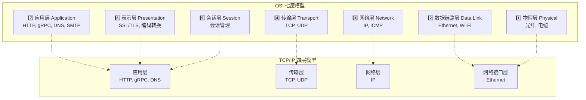
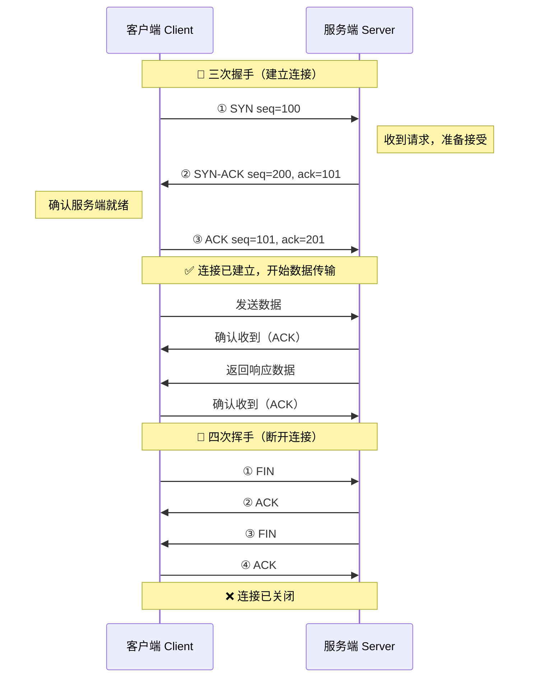
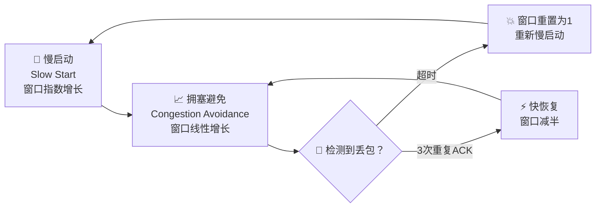
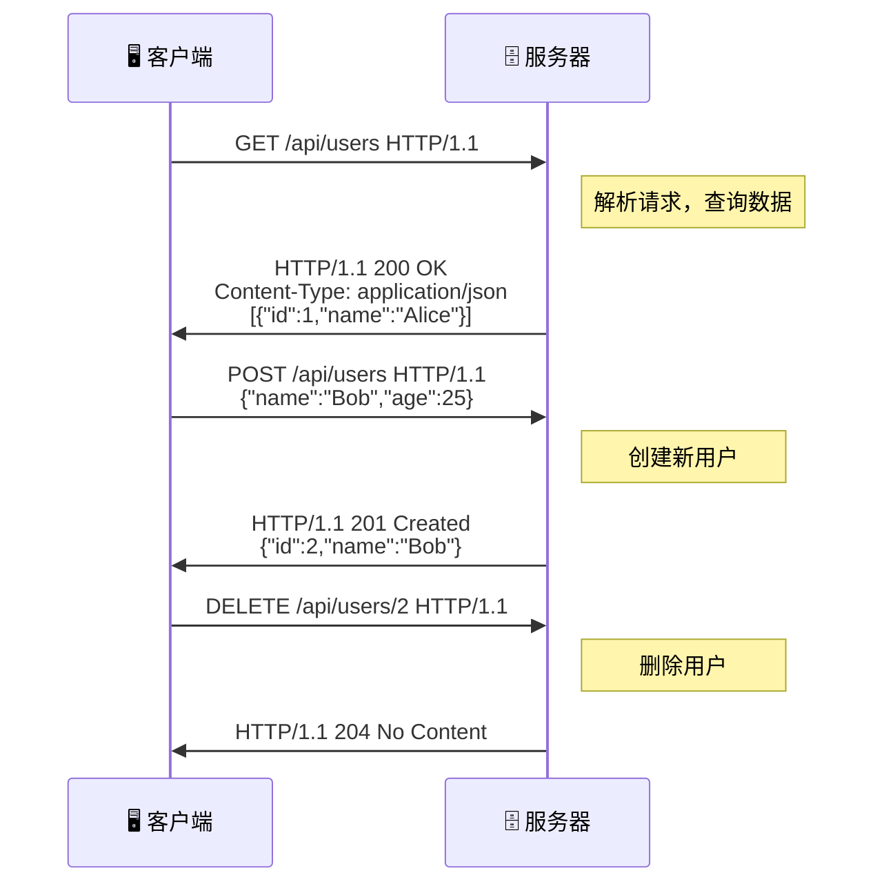
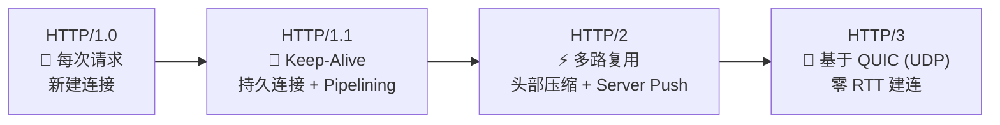
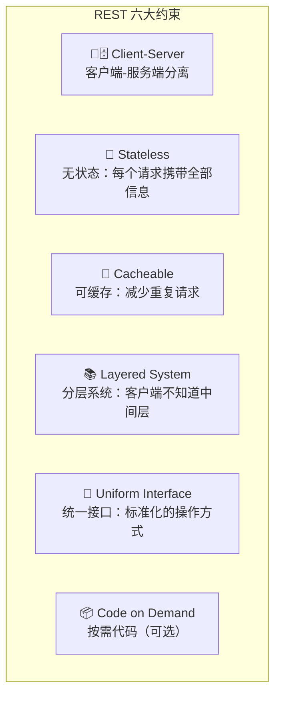
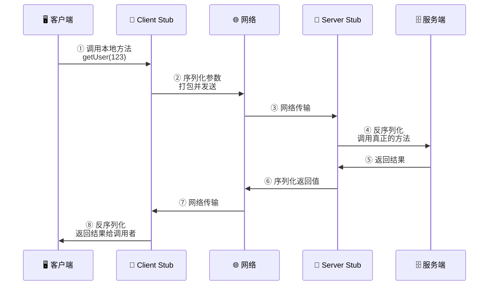
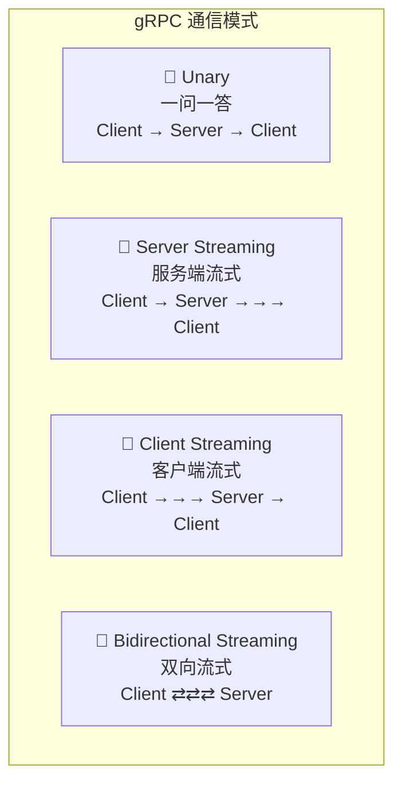
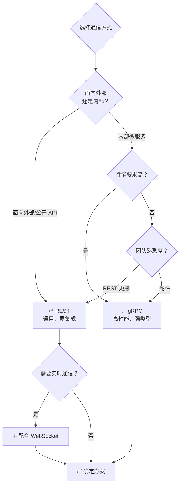
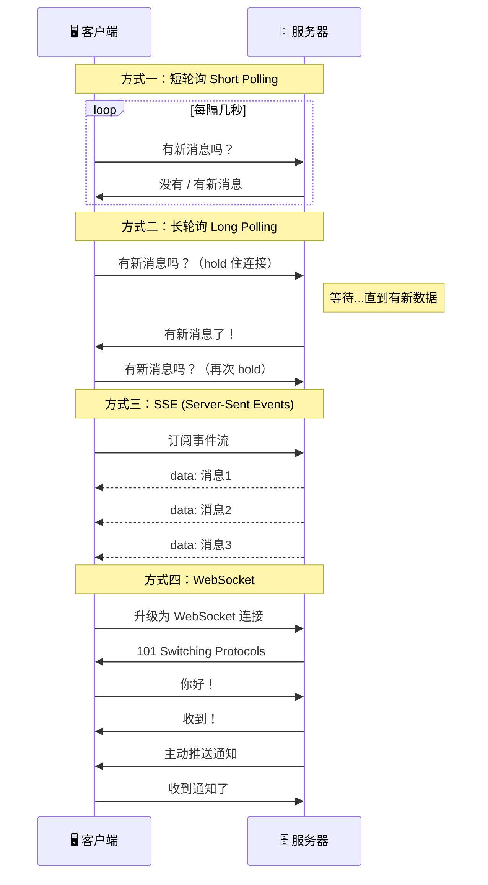

# 🔌 第七章：通信协议

> *"分布式系统的本质，就是不同机器上的程序如何高效地'对话'。"*

在分布式系统中，服务之间的通信协议决定了系统的性能、可靠性和可扩展性。选择合适的通信方式，就像选择合适的交通工具——短途骑车、长途飞机，没有银弹，只有最适合场景的方案。

---

## 7.1 网络协议概览

### 📚 OSI 七层模型 vs TCP/IP 四层模型



> 💡 **类比**：网络协议栈就像寄快递——你写好信（应用层）→ 装信封写地址（传输层）→ 选择邮递路线（网络层）→ 实际运输（物理层）。

### 🗺️ 协议全景图

| 层级 | 协议 | 用途 |
|------|------|------|
| 应用层 | HTTP/HTTPS | Web 通信 |
| 应用层 | gRPC | 微服务间高性能通信 |
| 应用层 | WebSocket | 实时双向通信 |
| 应用层 | DNS | 域名解析 |
| 传输层 | TCP | 可靠传输 |
| 传输层 | UDP | 低延迟传输 |
| 网络层 | IP | 数据包路由 |

---

## 7.2 TCP 协议

### 📞 三次握手 —— 像打电话一样建立连接

> **类比**：TCP 三次握手就像打电话：
> 1. 📱 你拨号 → 电话响了（SYN）
> 2. 📱 对方接起来说"喂？"（SYN-ACK）
> 3. 📱 你回应"你好，我是小明"（ACK）
>
> 只有三步都完成，双方才确认通信链路是通畅的。



### 🎯 TCP 核心特性

| 特性 | 说明 | 实现机制 |
|------|------|----------|
| **可靠性** | 保证数据不丢失 | 确认应答 + 超时重传 |
| **有序性** | 数据按发送顺序到达 | 序列号（Sequence Number） |
| **流量控制** | 防止接收方被淹没 | 滑动窗口（Sliding Window） |
| **拥塞控制** | 防止网络被压垮 | 慢启动 + 拥塞避免 + 快重传 |
| **全双工** | 双方可同时发送和接收 | 独立的发送/接收缓冲区 |

### 🚦 拥塞控制示意



### ✅ 何时使用 TCP

- 📧 电子邮件（SMTP）
- 🌐 网页浏览（HTTP/HTTPS）
- 📁 文件传输（FTP）
- 🗄️ 数据库连接
- 💳 金融交易——数据绝对不能丢！

---

## 7.3 UDP 协议

### 📮 发了就忘 —— 像寄明信片

> **类比**：UDP 就像寄明信片——你把明信片扔进邮筒就走了。至于明信片到没到、什么时候到、是不是被风吹跑了……你完全不管。快？是真的快！靠谱？那就不好说了。

### 🆚 TCP vs UDP 对比

| 特性 | TCP 🐢 | UDP 🐇 |
|------|---------|---------|
| 连接方式 | 面向连接（先握手） | 无连接（直接发） |
| 可靠性 | ✅ 保证送达 | ❌ 不保证送达 |
| 有序性 | ✅ 按序到达 | ❌ 可能乱序 |
| 速度 | 较慢（有开销） | 较快（无开销） |
| 头部大小 | 20 字节 | 8 字节 |
| 流量控制 | ✅ 有 | ❌ 无 |
| 使用场景 | 网页、邮件、文件传输 | 游戏、视频、DNS |
| 类比 | 📞 打电话 | 📮 寄明信片 |

### ✅ 何时使用 UDP

- 🎮 **在线游戏**：丢一帧没关系，延迟才是大敌
- 📹 **视频直播**：偶尔花屏好过画面卡顿
- 📞 **VoIP 语音通话**：实时性 > 完整性
- 🔍 **DNS 查询**：一问一答，快速搞定
- 📡 **IoT 传感器数据**：大量小包，允许少量丢失

---

## 7.4 HTTP 协议

### 📨 请求/响应模型

> **类比**：HTTP 就像去餐厅点餐——你告诉服务员要什么（Request），服务员端菜给你（Response）。每次点餐都是独立的，服务员不记得你上次点了什么（无状态）。



### 📝 HTTP 方法速查

| 方法 | 用途 | 幂等？ | 安全？ | 示例 |
|------|------|--------|--------|------|
| `GET` | 获取资源 | ✅ | ✅ | `GET /users/1` |
| `POST` | 创建资源 | ❌ | ❌ | `POST /users` |
| `PUT` | 完整替换资源 | ✅ | ❌ | `PUT /users/1` |
| `PATCH` | 部分更新资源 | ❌ | ❌ | `PATCH /users/1` |
| `DELETE` | 删除资源 | ✅ | ❌ | `DELETE /users/1` |
| `HEAD` | 获取响应头 | ✅ | ✅ | `HEAD /users/1` |
| `OPTIONS` | 查询支持的方法 | ✅ | ✅ | `OPTIONS /users` |

> 💡 **幂等性**：同样的请求执行多次，效果和执行一次相同。`PUT` 更新用户名为 "Alice"，执行 100 次结果还是 "Alice"。

### 📊 HTTP 状态码

| 范围 | 含义 | 常见示例 |
|------|------|----------|
| `1xx` | 信息提示 | `101 Switching Protocols` |
| `2xx` | ✅ 成功 | `200 OK`、`201 Created`、`204 No Content` |
| `3xx` | 🔄 重定向 | `301 Moved`、`304 Not Modified` |
| `4xx` | ❌ 客户端错误 | `400 Bad Request`、`401 Unauthorized`、`404 Not Found`、`429 Too Many Requests` |
| `5xx` | 💥 服务端错误 | `500 Internal Error`、`502 Bad Gateway`、`503 Service Unavailable` |

### 🚀 HTTP 版本演进



| 特性 | HTTP/1.1 | HTTP/2 | HTTP/3 |
|------|----------|--------|--------|
| 传输层 | TCP | TCP | QUIC (UDP) |
| 多路复用 | ❌ | ✅ | ✅ |
| 头部压缩 | ❌ | ✅ HPACK | ✅ QPACK |
| 服务端推送 | ❌ | ✅ | ✅ |
| 队头阻塞 | ✅ 存在 | 部分解决 | ✅ 完全解决 |
| 连接建立 | 1-2 RTT | 1-2 RTT | 0-1 RTT |

---

## 7.5 REST 架构风格

### 🏛️ REST 核心原则

> **类比**：REST 就像图书馆——每本书有唯一编号（URI），你可以借（GET）、还（PUT）、捐赠新书（POST）、报废旧书（DELETE）。图书馆不记得你上次借了什么（无状态），但书目信息可以缓存。



### 🎨 RESTful API 设计最佳实践

#### 资源命名规范

```
✅ 好的设计：
GET    /api/v1/users              # 获取用户列表
GET    /api/v1/users/123          # 获取特定用户
POST   /api/v1/users              # 创建用户
PUT    /api/v1/users/123          # 更新用户
DELETE /api/v1/users/123          # 删除用户
GET    /api/v1/users/123/orders   # 获取用户的订单列表

❌ 差的设计：
GET    /api/getUser?id=123        # 动词不该出现在 URL 中
POST   /api/createUser            # 动词应该用 HTTP 方法表达
GET    /api/user_list             # 用复数名词表示集合
DELETE /api/deleteUser/123        # 冗余的动词
```

#### 版本管理策略

```
# 方式一：URL 路径版本（最常见）
GET /api/v1/users
GET /api/v2/users

# 方式二：请求头版本
GET /api/users
Accept: application/vnd.myapp.v2+json

# 方式三：查询参数版本
GET /api/users?version=2
```

### 🐍 Python REST API 示例

```python
from flask import Flask, jsonify, request, abort

app = Flask(__name__)

# 模拟数据库
users = {
    1: {"id": 1, "name": "Alice", "email": "alice@example.com"},
    2: {"id": 2, "name": "Bob", "email": "bob@example.com"},
}
next_id = 3


@app.route("/api/v1/users", methods=["GET"])
def get_users():
    """获取用户列表，支持分页"""
    page = request.args.get("page", 1, type=int)
    per_page = request.args.get("per_page", 10, type=int)
    user_list = list(users.values())

    start = (page - 1) * per_page
    end = start + per_page
    paginated = user_list[start:end]

    return jsonify({
        "data": paginated,
        "pagination": {
            "page": page,
            "per_page": per_page,
            "total": len(user_list),
        },
        # HATEOAS: 提供相关链接
        "_links": {
            "self": f"/api/v1/users?page={page}",
            "next": f"/api/v1/users?page={page + 1}" if end < len(user_list) else None,
        },
    })


@app.route("/api/v1/users/<int:user_id>", methods=["GET"])
def get_user(user_id):
    """获取单个用户"""
    user = users.get(user_id)
    if not user:
        abort(404, description="User not found")
    return jsonify({"data": user})


@app.route("/api/v1/users", methods=["POST"])
def create_user():
    """创建新用户"""
    global next_id
    data = request.get_json()

    if not data or "name" not in data:
        abort(400, description="Name is required")

    user = {"id": next_id, "name": data["name"], "email": data.get("email", "")}
    users[next_id] = user
    next_id += 1

    return jsonify({"data": user}), 201


@app.route("/api/v1/users/<int:user_id>", methods=["PUT"])
def update_user(user_id):
    """更新用户（完整替换）"""
    if user_id not in users:
        abort(404, description="User not found")

    data = request.get_json()
    users[user_id] = {"id": user_id, "name": data["name"], "email": data.get("email", "")}
    return jsonify({"data": users[user_id]})


@app.route("/api/v1/users/<int:user_id>", methods=["DELETE"])
def delete_user(user_id):
    """删除用户"""
    if user_id not in users:
        abort(404, description="User not found")

    del users[user_id]
    return "", 204
```

### 🔗 HATEOAS —— 超媒体驱动

> HATEOAS（Hypermedia As The Engine Of Application State）让 API 返回中包含相关操作的链接，客户端无需硬编码 URL。

```json
{
  "data": {
    "id": 1,
    "name": "Alice",
    "email": "alice@example.com"
  },
  "_links": {
    "self": "/api/v1/users/1",
    "orders": "/api/v1/users/1/orders",
    "update": {"href": "/api/v1/users/1", "method": "PUT"},
    "delete": {"href": "/api/v1/users/1", "method": "DELETE"}
  }
}
```

---

## 7.6 RPC 远程过程调用

### 📞 像调用本地函数一样调用远程服务

> **类比**：RPC 就像打电话给你的同事让他帮你查资料——你只需要说"帮我查一下用户 123 的信息"，不需要关心同事是用电脑查的还是翻档案查的，也不需要关心他在哪栋楼。对你来说，和调用本地函数感觉一样。



### 🛠️ 主流 RPC 框架

| 框架 | 开发商 | 序列化 | 传输协议 | 语言支持 |
|------|--------|--------|----------|----------|
| **gRPC** | Google | Protocol Buffers | HTTP/2 | 多语言 |
| **Thrift** | Facebook→Apache | Thrift Binary | TCP | 多语言 |
| **Dubbo** | Alibaba | Hessian/JSON | TCP | 主要 Java |
| **JSON-RPC** | 社区 | JSON | HTTP/TCP | 多语言 |
| **tRPC** | 社区 | JSON | HTTP | TypeScript |

### 📄 gRPC + Protocol Buffers 示例

**① 定义服务接口（user.proto）**

```protobuf
syntax = "proto3";

package user;

// 用户服务定义
service UserService {
  // 获取单个用户
  rpc GetUser (GetUserRequest) returns (User);

  // 获取用户列表（服务端流式）
  rpc ListUsers (ListUsersRequest) returns (stream User);

  // 创建用户
  rpc CreateUser (CreateUserRequest) returns (User);

  // 批量导入用户（客户端流式）
  rpc ImportUsers (stream CreateUserRequest) returns (ImportSummary);

  // 实时聊天（双向流式）
  rpc Chat (stream ChatMessage) returns (stream ChatMessage);
}

message GetUserRequest {
  int64 id = 1;
}

message User {
  int64 id = 1;
  string name = 2;
  string email = 3;
  repeated string roles = 4;
}

message ListUsersRequest {
  int32 page = 1;
  int32 per_page = 2;
}

message CreateUserRequest {
  string name = 1;
  string email = 2;
}

message ImportSummary {
  int32 total = 1;
  int32 success = 2;
  int32 failed = 3;
}

message ChatMessage {
  string sender = 1;
  string content = 2;
  int64 timestamp = 3;
}
```

**② Python gRPC 服务端**

```python
import grpc
from concurrent import futures
import user_pb2
import user_pb2_grpc


class UserServicer(user_pb2_grpc.UserServiceServicer):
    """gRPC 用户服务实现"""

    def __init__(self):
        self.users = {
            1: user_pb2.User(id=1, name="Alice", email="alice@example.com"),
            2: user_pb2.User(id=2, name="Bob", email="bob@example.com"),
        }

    def GetUser(self, request, context):
        user = self.users.get(request.id)
        if not user:
            context.abort(grpc.StatusCode.NOT_FOUND, "User not found")
        return user

    def ListUsers(self, request, context):
        """服务端流式：逐个返回用户"""
        for user in self.users.values():
            yield user


def serve():
    server = grpc.server(futures.ThreadPoolExecutor(max_workers=10))
    user_pb2_grpc.add_UserServiceServicer_to_server(UserServicer(), server)
    server.add_insecure_port("[::]:50051")
    server.start()
    print("gRPC server running on port 50051")
    server.wait_for_termination()
```

### 🔄 gRPC 四种通信模式



---

## 7.7 RPC vs REST

### 📊 全面对比

| 维度 | REST 🌐 | RPC 📞 |
|------|----------|--------|
| **核心思想** | 以资源为中心 | 以操作为中心 |
| **通信协议** | HTTP | HTTP/2, TCP 等 |
| **数据格式** | JSON（文本） | Protobuf（二进制） |
| **接口定义** | OpenAPI/Swagger | .proto / IDL 文件 |
| **类型安全** | 弱类型 | ✅ 强类型 |
| **性能** | 中等 | 🚀 高 |
| **浏览器支持** | ✅ 原生支持 | ❌ 需要 gRPC-Web |
| **可读性** | ✅ 人类可读 | ❌ 二进制不可读 |
| **流式传输** | 不原生支持 | ✅ 四种流模式 |
| **代码生成** | 可选 | ✅ 自动生成 |
| **学习曲线** | 低 | 中等 |
| **调试难度** | 简单（curl 即可） | 需要专门工具 |

### 🎯 如何选择？



### 🏢 真实案例

| 公司 | 外部 API | 内部通信 |
|------|----------|----------|
| **Google** | REST (Maps, YouTube API) | gRPC |
| **Netflix** | REST (Public API) | gRPC + GraphQL |
| **Twitter/X** | REST + GraphQL | gRPC + Thrift |
| **阿里巴巴** | REST (开放平台) | Dubbo |
| **字节跳动** | REST | Kitex (自研 RPC) |

---

## 7.8 实时通信

### 📡 实时通信方式对比

在 Web 应用中，有多种方式实现"服务器向客户端推送数据"：



### 📊 实时通信方式对比表

| 特性 | 短轮询 | 长轮询 | SSE | WebSocket |
|------|--------|--------|-----|-----------|
| 方向 | 客户端→服务器 | 客户端→服务器 | 服务器→客户端 | 双向 ✅ |
| 实时性 | ⭐ | ⭐⭐ | ⭐⭐⭐ | ⭐⭐⭐⭐ |
| 服务器压力 | 🔴 高 | 🟡 中 | 🟢 低 | 🟢 低 |
| 实现复杂度 | 简单 | 中等 | 简单 | 较复杂 |
| 协议 | HTTP | HTTP | HTTP | ws:// / wss:// |
| 断线重连 | 需自己实现 | 需自己实现 | ✅ 内建 | 需自己实现 |
| 二进制数据 | ❌ | ❌ | ❌ | ✅ |

### 🔌 WebSocket 示例

```python
import asyncio
import websockets
import json

# ========== 服务端 ==========
connected_clients = set()


async def chat_handler(websocket):
    """WebSocket 聊天室服务端"""
    connected_clients.add(websocket)
    client_addr = websocket.remote_address
    print(f"新连接: {client_addr}")

    try:
        async for raw_message in websocket:
            data = json.loads(raw_message)
            print(f"收到消息: {data}")

            broadcast_msg = json.dumps({
                "sender": data.get("sender", "anonymous"),
                "content": data["content"],
                "type": "message",
            })

            # 广播给所有连接的客户端
            tasks = [client.send(broadcast_msg) for client in connected_clients]
            await asyncio.gather(*tasks, return_exceptions=True)
    finally:
        connected_clients.discard(websocket)
        print(f"断开连接: {client_addr}")


async def main():
    async with websockets.serve(chat_handler, "localhost", 8765):
        print("WebSocket 聊天室运行在 ws://localhost:8765")
        await asyncio.Future()  # 永不结束


# asyncio.run(main())
```

```javascript
// ========== 客户端 (JavaScript) ==========
const ws = new WebSocket("ws://localhost:8765");

ws.onopen = () => {
  console.log("✅ 已连接到聊天室");
  ws.send(JSON.stringify({
    sender: "Alice",
    content: "大家好！"
  }));
};

ws.onmessage = (event) => {
  const data = JSON.parse(event.data);
  console.log(`${data.sender}: ${data.content}`);
};

ws.onclose = () => {
  console.log("❌ 连接已关闭，尝试重连...");
  // 实现重连逻辑
  setTimeout(() => { /* reconnect */ }, 3000);
};

ws.onerror = (error) => {
  console.error("WebSocket 错误:", error);
};
```

### 🌀 GraphQL（简介）

GraphQL 解决了 REST 的两大痛点：

| 问题 | REST 的表现 | GraphQL 的方案 |
|------|------------|---------------|
| **过度获取** | `GET /users/1` 返回 20 个字段，你只要 2 个 | 精确指定需要的字段 |
| **获取不足** | 获取用户+订单+地址需要 3 次请求 | 一次查询获取所有关联数据 |

```graphql
# GraphQL 查询示例：一次获取用户信息和最近订单
query {
  user(id: 1) {
    name
    email
    orders(last: 5) {
      id
      total
      items {
        name
        price
      }
    }
  }
}
```

**何时考虑 GraphQL：**
- 📱 移动端应用（带宽敏感，需要精确获取数据）
- 🧩 前端需要灵活组合多个资源
- 📊 数据关系复杂、嵌套层级深
- 🔄 API 需要频繁迭代但不想发新版本

**何时不建议 GraphQL：**
- 简单的 CRUD API
- 内部微服务通信（gRPC 更合适）
- 文件上传/下载场景

---

## 7.9 本章小结

### 🧭 协议选择速查表

| 场景 | 推荐协议 | 理由 |
|------|----------|------|
| 公开 API | REST + HTTP/2 | 通用、生态好 |
| 微服务内部通信 | gRPC | 高性能、强类型 |
| 实时聊天/通知 | WebSocket | 全双工、低延迟 |
| 移动端 BFF | GraphQL | 灵活查询、节省带宽 |
| 游戏/直播 | UDP + 自定义协议 | 极致低延迟 |
| 服务端推送（简单） | SSE | 简单、自动重连 |
| IoT 设备 | MQTT (基于 TCP) | 轻量、支持离线消息 |

### 🗝️ 核心要点回顾

```
✅ TCP 可靠有序，UDP 快速轻量——根据场景选择
✅ HTTP 是 Web 通信基石，理解方法和状态码至关重要
✅ REST 以资源为中心，适合公开 API
✅ gRPC 以操作为中心，适合内部微服务
✅ WebSocket 是实时双向通信的首选
✅ GraphQL 解决 REST 过度/不足获取问题
✅ 没有银弹——根据业务需求组合使用
```

### 📝 练习题

1. **场景设计**：你正在设计一个在线协作文档系统（类似 Google Docs），需要实时同步多个用户的编辑操作。你会选择哪种通信协议？为什么？

2. **API 设计**：为一个电商平台设计 RESTful API，需要支持：商品浏览、购物车管理、订单创建和支付。列出主要的 endpoints 及其 HTTP 方法。

3. **性能对比**：假设你的微服务系统有 100 个服务，每秒产生 10 万次内部调用。使用 REST (JSON) 和 gRPC (Protobuf) 分别估算序列化/反序列化的 CPU 开销差异。

4. **协议升级**：你的系统目前使用 HTTP/1.1 短轮询实现消息推送，每秒有 1000 个客户端轮询。请设计一个方案将其迁移为 WebSocket，并说明迁移过程中如何保证兼容性。

5. **混合架构**：画出一个架构图，展示如何在同一个系统中同时使用 REST（外部 API）、gRPC（内部通信）和 WebSocket（实时推送）。

---

> 📖 **延伸阅读**
> - [gRPC 官方文档](https://grpc.io/docs/)
> - [HTTP/3 RFC 9114](https://www.rfc-editor.org/rfc/rfc9114)
> - [WebSocket RFC 6455](https://www.rfc-editor.org/rfc/rfc6455)
> - [REST 论文 (Roy Fielding)](https://www.ics.uci.edu/~fielding/pubs/dissertation/rest_arch_style.htm)
> - [GraphQL 官方规范](https://spec.graphql.org/)

---

[⬅️ 上一章：异步处理与消息队列](../06-async/README.md) | [➡️ 下一章：安全性](../08-security/README.md)
