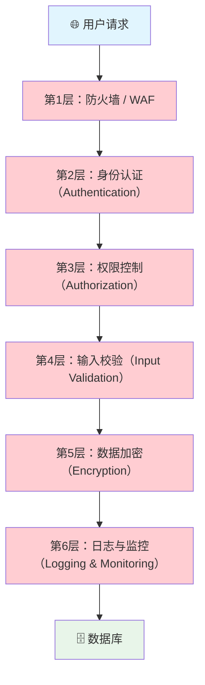
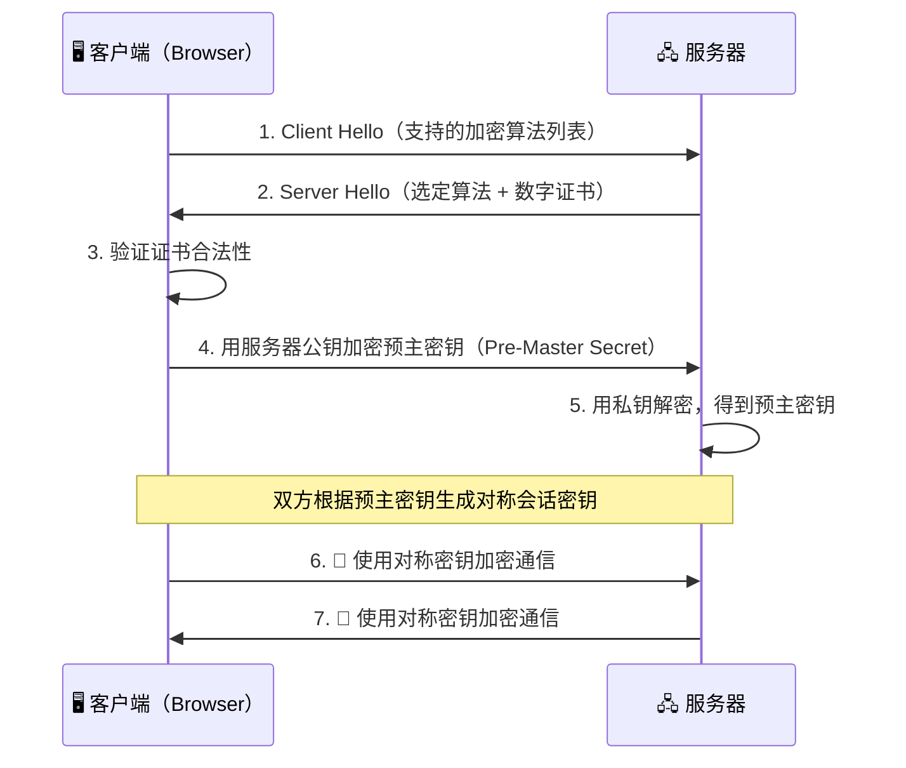
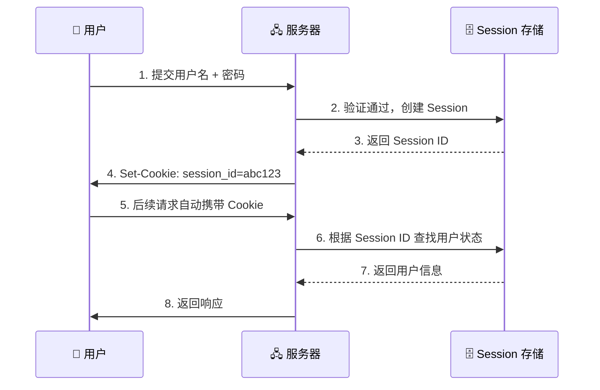
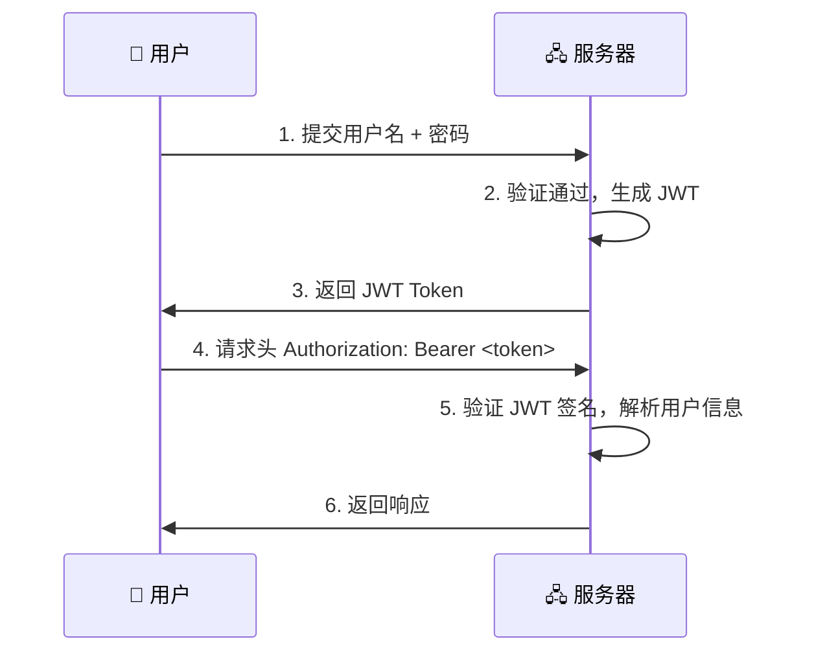
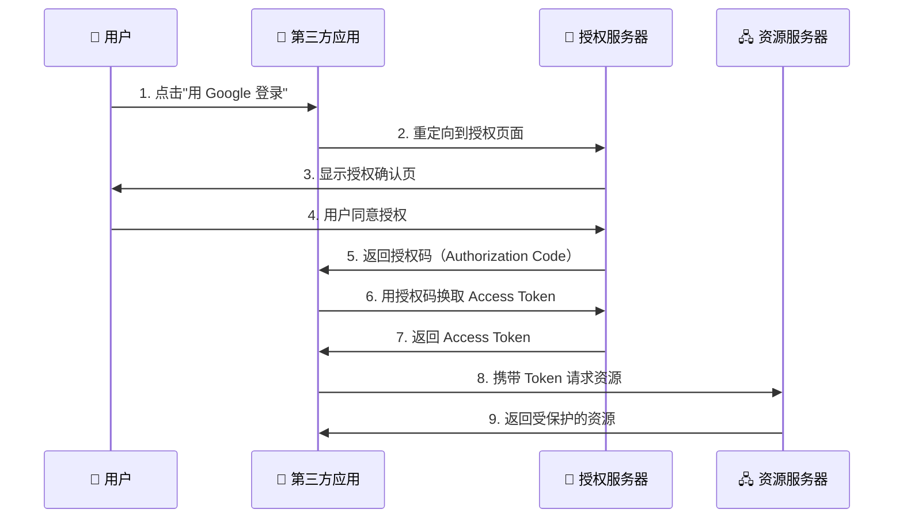
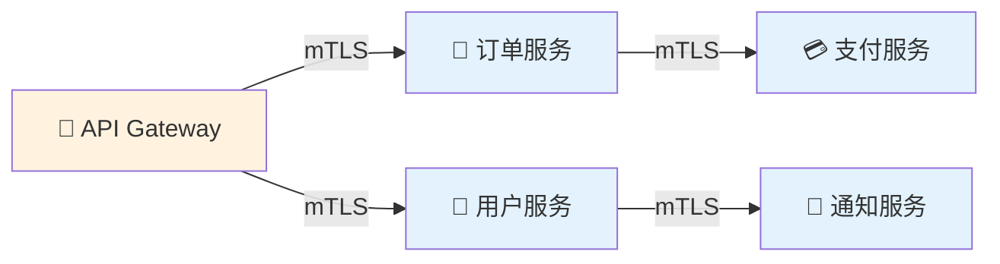
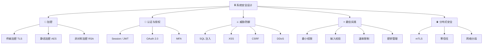

# 🔒 第八章：安全设计（Security Design）

> "安全不是产品，而是一个过程。" —— Bruce Schneier

在系统设计中，安全是最容易被忽视、却最不能被忽视的一环。本章将带你从零开始理解系统安全的核心概念与实践。

---

## 8.1 安全设计概览

### 🤔 为什么安全很重要？

想象你建了一栋漂亮的房子，但没有装门锁——再好的设计也会被轻易入侵。

系统安全同理：

| 没有安全设计 | 有安全设计 |
|---|---|
| 用户数据泄露 💀 | 数据加密保护 🔐 |
| 服务被恶意攻击瘫痪 | 防御机制自动拦截 🛡️ |
| 法律合规风险 | 满足 GDPR、等保要求 ✅ |
| 用户信任崩塌 | 品牌信誉有保障 💪 |

### 🏰 纵深防御原则（Defense in Depth）

> **类比：中世纪城堡** 🏰
>
> 一座城堡不会只靠一堵墙来防御。它有护城河、外墙、内墙、塔楼、卫兵……
> 即使攻破了一层，还有下一层在等着。

系统安全也是一样——我们需要**多层防御**：



### 🚨 安全不是事后补救

很多团队在项目上线后才开始考虑安全，这就好比房子建好了再想装防盗门——成本高、效果差。

**正确的做法**：在系统设计阶段就把安全纳入考虑（Security by Design）。

---

## 8.2 加密（Encryption）

### 🔑 对称加密 vs 非对称加密

| 特性 | 对称加密（Symmetric） | 非对称加密（Asymmetric） |
|---|---|---|
| 密钥数量 | 1 把（加解密相同） | 2 把（公钥 + 私钥） |
| 速度 | 快 ⚡ | 慢 🐢 |
| 典型算法 | AES, DES | RSA, ECC |
| 类比 | 一把钥匙开一把锁 🔐 | 信箱：任何人可投信（公钥），只有主人能取信（私钥）📬 |
| 适用场景 | 大量数据加密 | 密钥交换、数字签名 |

### 🔒 传输中加密（Encryption in Transit）

数据在网络中传输时，如果是明文，就像寄一张明信片——任何经手的人都能看到内容。

**TLS/SSL** 就是给数据穿上一件"隐形衣"，让中间人无法窃取。



> 💡 **关键点**：TLS 先用非对称加密交换密钥，再用对称加密传输数据——兼顾安全与性能。

### 💾 静态加密（Encryption at Rest）

数据存储在磁盘、数据库中时，也需要加密保护。即使硬盘被盗，没有密钥也无法读取数据。

```python
# 使用 AES 加密存储敏感数据
from cryptography.fernet import Fernet

# 生成密钥（需安全保存，不能硬编码！）
key = Fernet.generate_key()
cipher = Fernet(key)

# 加密
plaintext = b"user_password_123"
encrypted = cipher.encrypt(plaintext)
print(f"加密后: {encrypted}")

# 解密
decrypted = cipher.decrypt(encrypted)
print(f"解密后: {decrypted.decode()}")
```

---

## 8.3 认证与授权（Authentication & Authorization）

### 🪪 认证 vs 授权

> **类比**：
> - **认证（Authentication）** = 门口保安检查你的**身份证** 🪪 ——"你是谁？"
> - **授权（Authorization）** = 检查你的**门禁卡**能进哪些房间 🚪 ——"你能做什么？"

| 维度 | 认证（AuthN） | 授权（AuthZ） |
|---|---|---|
| 回答的问题 | 你是谁？ | 你能做什么？ |
| 发生时机 | 先 | 后 |
| 常见方式 | 用户名/密码、MFA | RBAC、ABAC、ACL |
| 类比 | 登录系统 | 权限菜单 |

### 🍪 Session-Based 认证



**优点**：服务端可随时使 Session 失效
**缺点**：有状态，不利于水平扩展（需共享 Session 存储）

### 🎫 Token-Based 认证（JWT）

JWT（JSON Web Token）是一种无状态的认证方式：

```
Header.Payload.Signature
eyJhbGciOi...   // Header:  算法信息
eyJ1c2VyIi...   // Payload: 用户数据（不要放密码！）
SflKxwRJSM...   // Signature: 防篡改签名
```



| 对比 | Session | JWT |
|---|---|---|
| 状态 | 有状态（服务端存储） | 无状态（客户端存储） |
| 扩展性 | 需共享存储 ❌ | 天然支持分布式 ✅ |
| 撤销 | 容易（删除 Session） | 困难（需黑名单） |
| 大小 | 小（仅 ID） | 较大（含 Payload） |

### 🔗 OAuth 2.0 授权流程

> **类比**：你让一个第三方 App 访问你的 Google 相册，但不想把 Google 密码给它。
> OAuth 就像是给它一把"临时钥匙"，只能开特定的门，且有时间限制。



### 🔐 多因素认证（MFA）

| 因素类型 | 说明 | 示例 |
|---|---|---|
| 你知道的（Knowledge） | 密码、PIN | `password123` |
| 你拥有的（Possession） | 手机、硬件密钥 | 短信验证码、YubiKey |
| 你是谁（Inherence） | 生物特征 | 指纹、面部识别 |

> 💡 **最佳实践**：至少组合两种因素。仅靠密码就像只有一道门锁。

---

## 8.4 常见安全威胁与防御

### 💉 SQL 注入（SQL Injection）

攻击者通过构造恶意输入，操控数据库查询。

**❌ 危险代码（字符串拼接）：**

```python
# 危险！用户输入直接拼接到 SQL 中
username = request.get("username")
query = f"SELECT * FROM users WHERE username = '{username}'"
# 如果用户输入: ' OR '1'='1
# 查询变成: SELECT * FROM users WHERE username = '' OR '1'='1'
# 结果: 返回所有用户数据！💀
```

**✅ 安全代码（参数化查询）：**

```python
# 安全！使用参数化查询
cursor.execute(
    "SELECT * FROM users WHERE username = %s",
    (username,)
)
# 数据库驱动会正确转义用户输入，防止注入
```

### 🕸️ XSS（跨站脚本攻击）

攻击者在网页中注入恶意脚本，窃取用户信息。

**❌ 危险代码：**

```html
<!-- 用户评论直接渲染到页面 -->
<div>用户评论: ${userComment}</div>
<!-- 如果 userComment = <script>document.cookie</script> -->
<!-- 恶意脚本就会在其他用户浏览器中执行！ -->
```

**✅ 安全代码：**

```javascript
// 对用户输入进行 HTML 转义
function escapeHtml(text) {
  const map = {
    '&': '&amp;',
    '<': '&lt;',
    '>': '&gt;',
    '"': '&quot;',
    "'": '&#039;'
  };
  return text.replace(/[&<>"']/g, m => map[m]);
}

// 使用转义后的内容
div.innerHTML = `用户评论: ${escapeHtml(userComment)}`;
```

> 💡 **最佳实践**：使用成熟的模板引擎（React、Vue 等默认自动转义）+ 设置 CSP（Content Security Policy）响应头。

### 🎭 CSRF（跨站请求伪造）

攻击者诱导用户在已登录的网站上执行非本意的操作。

> **类比**：你登录了银行网站没退出，然后点了一个恶意链接——那个链接偷偷以你的身份向银行发了一个转账请求。

**防御方式：**

```python
# 方式1: CSRF Token
# 服务端生成随机 Token，嵌入表单
<form action="/transfer" method="POST">
    <input type="hidden" name="csrf_token" value="random_token_abc123">
    <input type="text" name="amount" value="100">
    <button type="submit">转账</button>
</form>

# 服务端验证 Token 是否匹配
```

```python
# 方式2: SameSite Cookie 属性
Set-Cookie: session_id=abc123; SameSite=Strict; Secure; HttpOnly
# SameSite=Strict: 跨站请求不携带该 Cookie
# Secure: 仅 HTTPS 传输
# HttpOnly: JavaScript 无法读取
```

### 🌊 DDoS 攻击（分布式拒绝服务）

> **类比**：一万个人同时挤进一家小餐馆——正常顾客根本进不去。

**缓解策略：**

| 策略 | 说明 |
|---|---|
| CDN 分流 | 通过 Cloudflare 等 CDN 吸收流量 |
| Rate Limiting | 限制单 IP 请求频率 |
| 自动扩容 | 云服务弹性伸缩应对流量峰值 |
| 流量清洗 | ISP 层面过滤异常流量 |
| 黑洞路由 | 极端情况下丢弃所有流向目标的流量 |

### 🕵️ 中间人攻击（Man-in-the-Middle）

攻击者在通信双方之间"偷听"或篡改消息。

**防御方式：**
- ✅ 强制使用 HTTPS（HSTS）
- ✅ 证书固定（Certificate Pinning）
- ✅ 使用 TLS 1.3（更安全的握手协议）

---

## 8.5 安全最佳实践

### 📏 最小权限原则（Principle of Least Privilege）

> 每个用户、服务、进程只应拥有完成其工作所需的**最小权限**。

```yaml
# ❌ 反面示例：给所有服务 admin 权限
service_account:
  role: admin
  access: "*"

# ✅ 正面示例：精确控制权限
service_account:
  role: read-only
  access:
    - "GET /api/users"
    - "GET /api/orders"
```

### 🧹 输入验证与清理（Input Validation & Sanitization）

**永远不要信任用户输入！**

```python
import re

def validate_email(email: str) -> bool:
    """验证邮箱格式"""
    pattern = r'^[a-zA-Z0-9._%+-]+@[a-zA-Z0-9.-]+\.[a-zA-Z]{2,}$'
    return bool(re.match(pattern, email))

def sanitize_input(text: str) -> str:
    """清理用户输入，移除危险字符"""
    # 移除 HTML 标签
    clean = re.sub(r'<[^>]+>', '', text)
    # 限制长度
    return clean[:500]
```

### ⏱️ Rate Limiting（速率限制）

```python
# 使用 Token Bucket 算法实现速率限制
from collections import defaultdict
import time

class RateLimiter:
    def __init__(self, max_requests: int, window_seconds: int):
        self.max_requests = max_requests
        self.window = window_seconds
        self.requests = defaultdict(list)

    def is_allowed(self, client_id: str) -> bool:
        now = time.time()
        # 清理过期记录
        self.requests[client_id] = [
            t for t in self.requests[client_id]
            if now - t < self.window
        ]
        if len(self.requests[client_id]) >= self.max_requests:
            return False
        self.requests[client_id].append(now)
        return True

# 使用示例：每分钟最多 100 次请求
limiter = RateLimiter(max_requests=100, window_seconds=60)

if not limiter.is_allowed(client_ip):
    return "429 Too Many Requests"
```

### 📝 日志与监控（Logging & Monitoring）

```python
import logging

# 配置安全日志
security_logger = logging.getLogger("security")

def log_login_attempt(username: str, success: bool, ip: str):
    """记录登录尝试"""
    if success:
        security_logger.info(f"登录成功 | user={username} | ip={ip}")
    else:
        security_logger.warning(f"登录失败 | user={username} | ip={ip}")
        # 连续失败则触发告警
        check_brute_force(username, ip)
```

> ⚠️ **注意**：日志中**不要记录**密码、Token 等敏感信息！

### 🗝️ 密钥管理（Secrets Management）

```python
# ❌ 错误做法：硬编码密钥
DB_PASSWORD = "super_secret_123"
API_KEY = "sk-abcdef123456"

# ✅ 正确做法：从环境变量或密钥管理服务读取
import os
DB_PASSWORD = os.environ.get("DB_PASSWORD")
API_KEY = os.environ.get("API_KEY")

# ✅ 更好的做法：使用专业密钥管理服务
# AWS Secrets Manager / HashiCorp Vault / Azure Key Vault
```

### 🌐 CORS（跨源资源共享）

```python
# 配置 CORS 允许特定域名访问
from flask import Flask
from flask_cors import CORS

app = Flask(__name__)

# ❌ 危险：允许所有来源
# CORS(app, origins="*")

# ✅ 安全：只允许特定域名
CORS(app, origins=[
    "https://www.myapp.com",
    "https://admin.myapp.com"
])
```

---

## 8.6 分布式系统中的安全

### 🔗 服务间认证（Service-to-Service Authentication）

在微服务架构中，服务之间也需要互相验证身份。



常见方案：

| 方案 | 说明 | 适用场景 |
|---|---|---|
| mTLS（双向 TLS） | 服务双方互相验证证书 | 高安全要求 |
| Service Token | 每个服务持有独立 Token | 内部微服务 |
| Service Mesh | 如 Istio，自动处理服务间安全 | 大规模集群 |

### 🏗️ 网络分段（Network Segmentation）

> **类比**：医院里不同区域有不同的门禁权限——手术室不是谁都能进。

```
┌─────────────────────────────────────────────┐
│                  VPC                        │
│  ┌──────────────┐  ┌──────────────────────┐ │
│  │  公共子网     │  │     私有子网          │ │
│  │  (Public)     │  │    (Private)         │ │
│  │              │  │                      │ │
│  │  🌐 负载均衡  │  │  🖧 应用服务器        │ │
│  │  🛡️ WAF      │  │  🗄️ 数据库           │ │
│  │              │  │  📦 缓存              │ │
│  └──────────────┘  └──────────────────────┘ │
│        ↕ 仅允许 80/443      ↕ 仅内部通信    │
└─────────────────────────────────────────────┘
```

**原则**：
- 数据库**永远不**直接暴露在公网
- 使用安全组（Security Groups）严格控制端口访问
- 不同环境（开发/测试/生产）网络隔离

### 🚫 零信任架构（Zero Trust Architecture）

> **传统模型**："城堡与护城河" —— 内网默认可信
> **零信任模型**："永不信任，始终验证" —— 无论内外网，每次访问都需验证

核心原则：

| 原则 | 说明 |
|---|---|
| 验证每个请求 | 不因为在内网就跳过认证 |
| 最小权限 | 每次只授予所需的最小权限 |
| 假设已被入侵 | 设计系统时假设攻击者已在内部 |
| 微分段 | 将网络切分为小的安全区域 |
| 持续监控 | 实时检测异常行为 |

---

## 8.7 本章小结

### 📋 安全设计检查清单

```
✅ 所有通信使用 HTTPS（TLS 1.2+）
✅ 敏感数据存储加密（AES-256）
✅ 使用参数化查询防止 SQL 注入
✅ 对用户输入进行验证和转义
✅ 实现 CSRF Token 保护
✅ 设置合理的 CORS 策略
✅ 实现速率限制（Rate Limiting）
✅ 密码使用 bcrypt/argon2 哈希存储
✅ 敏感配置使用密钥管理服务
✅ 实现完善的安全日志与告警
✅ 服务间通信使用 mTLS
✅ 数据库不暴露公网
✅ 实施最小权限原则
✅ 启用多因素认证（MFA）
```

### 🗺️ 安全知识地图



### 🧠 练习题

**练习 1：识别漏洞**

以下代码有什么安全问题？如何修复？

```python
@app.route("/search")
def search():
    keyword = request.args.get("q")
    results = db.execute(f"SELECT * FROM products WHERE name LIKE '%{keyword}%'")
    return render_template("results.html", results=results, keyword=keyword)
```

<details>
<summary>💡 点击查看答案</summary>

**问题 1**：SQL 注入——`keyword` 直接拼接到 SQL 语句中。
**修复**：使用参数化查询。

**问题 2**：XSS——`keyword` 可能包含恶意脚本，且直接传给模板渲染。
**修复**：确保模板引擎自动转义输出（Jinja2 默认开启），或手动转义。

```python
@app.route("/search")
def search():
    keyword = request.args.get("q", "")
    results = db.execute(
        "SELECT * FROM products WHERE name LIKE %s",
        (f"%{keyword}%",)
    )
    return render_template("results.html", results=results, keyword=keyword)
```

</details>

**练习 2：设计安全方案**

你正在设计一个在线支付系统的安全架构，请回答：

1. 用户密码应该如何存储？
2. 支付请求如何防止 CSRF 攻击？
3. 如何防止 API 被暴力调用？
4. 微服务之间如何安全通信？

<details>
<summary>💡 点击查看答案</summary>

1. **密码存储**：使用 bcrypt 或 argon2 进行加盐哈希，绝不存储明文。
2. **防 CSRF**：每个支付表单包含一次性 CSRF Token，服务端验证；Cookie 设置 `SameSite=Strict`。
3. **防暴力调用**：实施 Rate Limiting（如每分钟 10 次支付请求），结合 IP 黑名单与行为分析。
4. **服务间通信**：使用 mTLS 双向认证 + Service Mesh（如 Istio），所有内部通信加密。

</details>

**练习 3：画出安全架构图**

尝试为一个电商系统画出安全架构图，包含以下组件：
- 用户端 → API Gateway → 微服务
- 每层需要哪些安全措施？
- 数据如何加密？
- 如何实现认证与授权？

---

> 📖 **推荐阅读**：
> - [OWASP Top 10](https://owasp.org/www-project-top-ten/) — Web 应用最常见的安全风险
> - [JWT.io](https://jwt.io/) — JWT 在线调试工具
> - [Let's Encrypt](https://letsencrypt.org/) — 免费 TLS 证书
> - 《Web Application Security》 by Andrew Hoffman

---

[⬅️ 上一章：消息队列](../07-message-queues/README.md) | [➡️ 下一章：真实案例分析](../09-real-world/README.md)
