# 🏛️ 第九章：系统设计实战案例

> **"纸上得来终觉浅，绝知此事要躬行。"** —— 学完理论后，让我们用真实案例把知识串起来！

本章将带你走进 **7 个经典系统设计题目**，每个案例都遵循第一章介绍的 **四步法**：

| 步骤 | 内容 | 目标 |
|------|------|------|
| Step 1 | 用例与约束 | 明确需求边界 |
| Step 2 | 高层设计 | 画出架构图 |
| Step 3 | 核心组件深入 | 详解关键模块 |
| Step 4 | 扩展优化 | 解决瓶颈问题 |

> 📌 本章案例均参考自本仓库 `solutions/system_design/` 目录下的完整解答。

---

## 9.1 设计方法论回顾

在深入案例之前，快速回顾我们的 **四步设计法**：

```
🎯 Step 1: 需求分析 → "我们要解决什么问题？"
🏗️ Step 2: 高层设计 → "大的架构长什么样？"
🔬 Step 3: 组件深入 → "每个模块怎么实现？"
📈 Step 4: 扩展优化 → "如何应对 10x 流量增长？"
```

> 💡 **类比**：这就像盖房子——先确认需求（几室几厅），再画蓝图（整体布局），接着施工（砌墙装修），最后优化（加固抗震）。

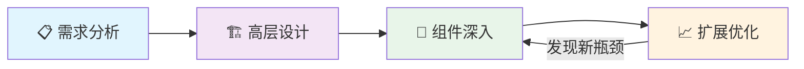

---

## 9.2 设计短链接服务（Pastebin / URL Shortener）

> 📖 完整方案见 `solutions/system_design/pastebin/`

### Step 1：用例与约束 📋

**核心用例**：
- 用户输入一段文本或长 URL，系统生成一个短链接
- 用户访问短链接，重定向到原始内容
- 链接可设置过期时间
- 提供访问统计 Analytics

**规模估算**：

| 指标 | 数值 |
|------|------|
| 月活用户 | 10M |
| 每月写入（新建粘贴） | 10M |
| 每月读取 | 100M |
| 读写比 | 10:1 |
| 单条数据大小 | ~1.27 KB |
| 3 年存储量 | ~450 GB |

### Step 2：高层设计 🏗️

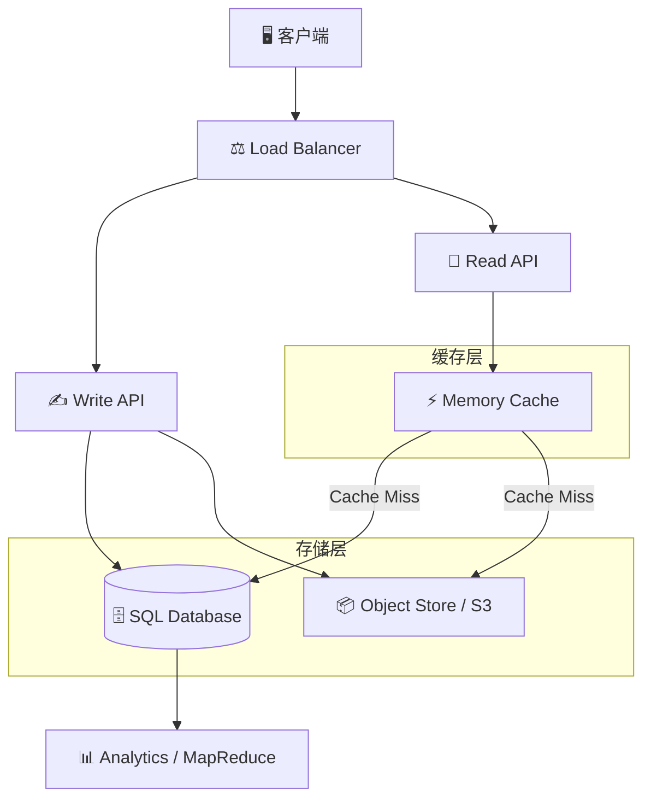

### Step 3：核心组件深入 🔬

#### 短链接生成算法

核心思路：**MD5 哈希 → 取前 7 个字符 → Base62 编码**

```python
import hashlib
import base64

class URLShortener:
    """短链接生成器"""
    
    BASE62 = "0123456789abcdefghijklmnopqrstuvwxyzABCDEFGHIJKLMNOPQRSTUVWXYZ"
    
    def generate_short_url(self, long_url: str, user_id: str = "") -> str:
        """
        生成短链接
        1. 将 URL + 用户 ID + 时间戳 拼接
        2. 计算 MD5 哈希
        3. 取前 7 个字符进行 Base62 编码
        """
        raw = f"{long_url}{user_id}{self._get_timestamp()}"
        md5_hash = hashlib.md5(raw.encode()).hexdigest()
        # 取前 43 bits（约 7 个 Base62 字符）
        hash_int = int(md5_hash[:11], 16)
        return self._to_base62(hash_int)[:7]
    
    def _to_base62(self, num: int) -> str:
        if num == 0:
            return self.BASE62[0]
        result = []
        while num > 0:
            result.append(self.BASE62[num % 62])
            num //= 62
        return ''.join(reversed(result))
    
    def _get_timestamp(self) -> str:
        import time
        return str(int(time.time()))


# 使用示例
shortener = URLShortener()
short = shortener.generate_short_url("https://example.com/very/long/url")
print(f"短链接: https://short.ly/{short}")
# 输出: 短链接: https://short.ly/a3Bc7Kx
```

> 💡 **为什么用 Base62？** 62 个字符（0-9, a-z, A-Z）可以表示 62^7 ≈ **3.5 万亿** 个不同的短链接，足够用了！

#### 数据库 Schema

```sql
-- 粘贴/短链接表
CREATE TABLE pastes (
    short_url   VARCHAR(7) PRIMARY KEY,   -- Base62 短码
    original_url TEXT NOT NULL,            -- 原始 URL
    content     TEXT,                      -- 粘贴内容（Pastebin 场景）
    user_id     INT,                       -- 创建者
    expire_at   TIMESTAMP,                -- 过期时间
    created_at  TIMESTAMP DEFAULT NOW(),
    INDEX idx_user (user_id),
    INDEX idx_expire (expire_at)
);
```

#### Read/Write API 设计

| API | 方法 | 路径 | 说明 |
|-----|------|------|------|
| 创建短链 | POST | `/api/v1/paste` | 输入长 URL，返回短码 |
| 读取 | GET | `/:short_url` | 302 重定向到原始 URL |
| 删除 | DELETE | `/api/v1/paste/:short_url` | 删除短链 |
| 统计 | GET | `/api/v1/stats/:short_url` | 返回访问统计 |

### Step 4：扩展优化 📈

| 瓶颈 | 解决方案 |
|------|---------|
| 数据库写入压力 | 主从复制 + 写入分片（按 short_url 哈希） |
| 读取延迟 | Redis 缓存热门链接（LRU 淘汰） |
| 全球访问慢 | CDN 缓存 + 多地域部署 |
| 过期清理 | 后台 Cron Job 定期清扫过期记录 |
| 哈希冲突 | 先查库是否存在，冲突则追加随机盐重新生成 |

> 🔑 **关键收获**：短链接服务是**读多写少**的经典场景，缓存层的设计对性能至关重要。

---

## 9.3 设计 Twitter 时间线与搜索

> 📖 完整方案见 `solutions/system_design/twitter/`

### Step 1：用例与约束 📋

**核心用例**：
- 用户发推文（Post Tweet）
- 查看个人时间线（User Timeline）
- 查看首页时间线（Home Timeline）—— 看关注的人的推文
- 搜索推文

**规模估算**：

| 指标 | 数值 |
|------|------|
| 月活用户 | 100M |
| 每日推文 | 500M |
| 每条推文的平均 fanout | 200 followers |
| 首页时间线 QPS | ~60K/s |
| 搜索 QPS | ~16K/s |

### Step 2：高层设计 🏗️

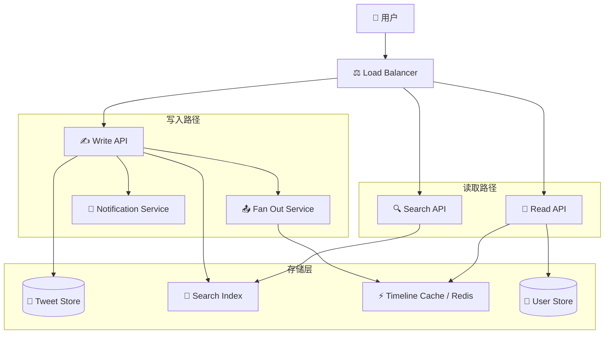

### Step 3：核心组件深入 🔬

#### Fan-out on Write vs Fan-out on Read

这是 Twitter 设计中最关键的**架构决策**：

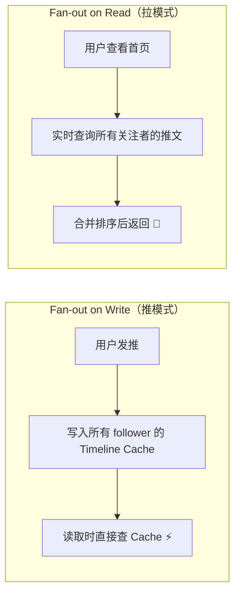

| 策略 | 优点 | 缺点 | 适用场景 |
|------|------|------|---------|
| Fan-out on Write | 读取极快（O(1)） | 大 V 用户写入慢（百万 follower） | 普通用户 |
| Fan-out on Read | 写入快 | 读取慢（需要聚合） | 大 V 用户（>100K followers） |

> 💡 **Twitter 的实际做法**：混合策略！普通用户用推模式，大 V 用户用拉模式。

#### Timeline Cache 结构

```python
# Redis 中的 Timeline 存储结构
# Key: user:<user_id>:timeline
# Value: Sorted Set（按时间排序的推文 ID 列表）

import redis
import json
import time

class TimelineService:
    def __init__(self):
        self.cache = redis.Redis()
        self.MAX_TIMELINE_SIZE = 800  # 每人最多缓存 800 条
    
    def fan_out_tweet(self, tweet_id: str, author_id: str, follower_ids: list):
        """将推文推送到所有 follower 的时间线"""
        timestamp = time.time()
        pipeline = self.cache.pipeline()
        
        for follower_id in follower_ids:
            timeline_key = f"user:{follower_id}:timeline"
            # 添加推文到 Sorted Set（score = 时间戳）
            pipeline.zadd(timeline_key, {tweet_id: timestamp})
            # 只保留最近 800 条
            pipeline.zremrangebyrank(timeline_key, 0, -(self.MAX_TIMELINE_SIZE + 1))
        
        pipeline.execute()
    
    def get_home_timeline(self, user_id: str, page: int = 1, size: int = 20):
        """获取用户首页时间线"""
        timeline_key = f"user:{user_id}:timeline"
        start = (page - 1) * size
        end = start + size - 1
        
        # 按时间倒序获取推文 ID
        tweet_ids = self.cache.zrevrange(timeline_key, start, end)
        return tweet_ids
```

#### 搜索 Index 设计

搜索引擎核心是 **倒排索引（Inverted Index）**：

```
"设计" → [tweet_001, tweet_042, tweet_889]
"系统" → [tweet_001, tweet_123, tweet_456]
"面试" → [tweet_042, tweet_789]
```

搜索 "系统设计" → 对 "系统" 和 "设计" 的结果求**交集** → `[tweet_001]`

### Step 4：扩展优化 📈

| 瓶颈 | 解决方案 |
|------|---------|
| 大 V fanout 慢 | 混合策略：大 V 用拉模式，普通用户用推模式 |
| Timeline Cache 内存 | 只缓存活跃用户的 Timeline |
| 搜索延迟 | 搜索集群分片 + scatter-gather 查询 |
| 推文存储 | 按用户 ID 分片，冷数据归档到对象存储 |
| 全球延迟 | 多数据中心部署 + CDN 加速静态资源 |

> 🔑 **关键收获**：Fan-out 策略的选择是整个系统的**最核心决策**，没有银弹，混合方案往往是最优解。

---

## 9.4 设计 Web 爬虫

> 📖 完整方案见 `solutions/system_design/web_crawler/`

### Step 1：用例与约束 📋

**核心用例**：
- 爬取网页内容并存储
- 去重（避免重复爬取相同页面）
- 遵守 robots.txt 和限速规则
- 保持数据新鲜度（定期重新爬取）

**规模估算**：

| 指标 | 数值 |
|------|------|
| 需爬取链接总量 | 1B |
| 每月爬取页面 | 4B |
| 平均页面大小 | 500 KB |
| 每秒请求 | ~1,600 writes/s |
| 3 年存储 | ~72 PB |

### Step 2：高层设计 🏗️

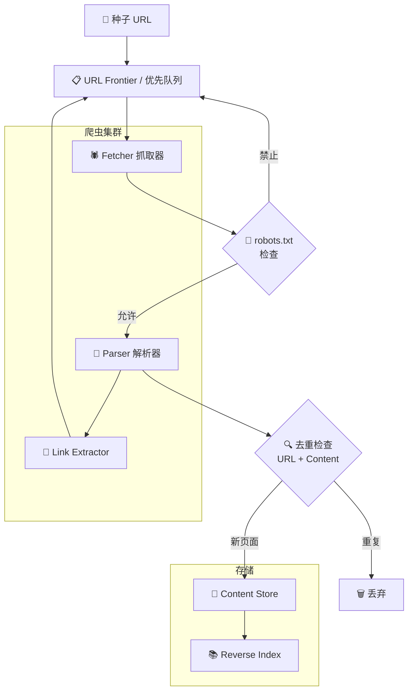

### Step 3：核心组件深入 🔬

#### URL Frontier（爬取队列）

URL Frontier 不是简单的 FIFO 队列，它需要处理**优先级**和**礼貌性**：

```python
import heapq
import time
from collections import defaultdict
from urllib.parse import urlparse

class URLFrontier:
    """URL 爬取队列——兼顾优先级和礼貌性"""
    
    def __init__(self, crawl_delay: float = 1.0):
        self.priority_queue = []              # 优先级队列
        self.domain_last_access = {}          # 域名上次访问时间
        self.crawl_delay = crawl_delay        # 同域名爬取间隔(秒)
        self.seen_urls = set()                # 已见 URL 集合
    
    def add_url(self, url: str, priority: int = 5):
        """添加 URL 到队列（去重）"""
        if url not in self.seen_urls:
            self.seen_urls.add(url)
            heapq.heappush(self.priority_queue, (priority, time.time(), url))
    
    def get_next_url(self) -> str:
        """获取下一个可爬取的 URL（遵守礼貌性）"""
        delayed = []
        result = None
        
        while self.priority_queue:
            priority, timestamp, url = heapq.heappop(self.priority_queue)
            domain = urlparse(url).netloc
            
            last_access = self.domain_last_access.get(domain, 0)
            if time.time() - last_access >= self.crawl_delay:
                self.domain_last_access[domain] = time.time()
                result = url
                break
            else:
                delayed.append((priority, timestamp, url))
        
        # 将延迟的 URL 放回队列
        for item in delayed:
            heapq.heappush(self.priority_queue, item)
        
        return result
```

#### 去重策略

```
内容去重方式：
┌──────────────────────────────────────────┐
│  1. URL 去重：Set / Bloom Filter         │
│     - 精确去重用 Set                     │
│     - 海量 URL 用 Bloom Filter（节省内存）│
│                                          │
│  2. 内容去重：SimHash / MinHash          │
│     - 计算页面内容的指纹                  │
│     - 相似度超过阈值则判定为重复          │
└──────────────────────────────────────────┘
```

#### 礼貌爬取规则

| 规则 | 说明 |
|------|------|
| robots.txt | 爬取前先检查网站的 robots.txt 文件 |
| Crawl-Delay | 遵守同域名的爬取间隔 |
| Rate Limiting | 同一域名每秒最多 N 个请求 |
| User-Agent | 使用合理的 User-Agent 标识 |

### Step 4：扩展优化 📈

#### 分布式爬取架构

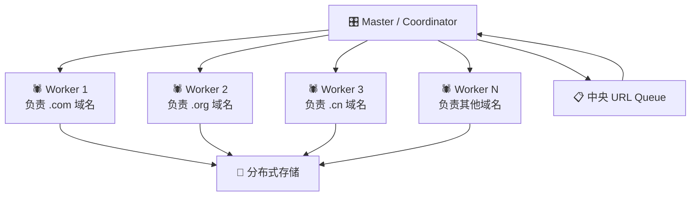

| 瓶颈 | 解决方案 |
|------|---------|
| 爬取速度 | 多 Worker 节点 + 按域名分片 |
| 存储量大 | 压缩存储 + 冷热分层 |
| URL 去重内存 | Bloom Filter（10 亿 URL 仅需 ~1.2 GB） |
| 爬虫陷阱 | 设置最大深度 + URL 正则过滤 |
| 页面更新 | 根据更新频率动态调整重爬周期 |

> 🔑 **关键收获**：Web 爬虫的核心难点不是"怎么爬"，而是"怎么**不**爬"——去重、限速和防陷阱是真正的工程挑战。

---

## 9.5 设计个人记账系统（Mint）

> 📖 完整方案见 `solutions/system_design/mint/`

### Step 1：用例与约束 📋

**核心用例**：
- 连接用户的银行账户，自动同步交易数据
- 交易自动分类（餐饮、交通、购物等）
- 设置和追踪预算
- 预算超支提醒

**规模估算**：

| 指标 | 数值 |
|------|------|
| 用户数 | 10M |
| 月交易量 | 5B |
| 关联金融账户 | 30M |
| 写入 QPS | ~2,000/s |
| 读取 QPS | ~200/s |
| 读写比 | 1:10（**写多读少**） |

> ⚠️ 注意：和大多数系统不同，Mint 是**写多读少**的！因为需要不断从银行同步交易数据。

### Step 2：高层设计 🏗️

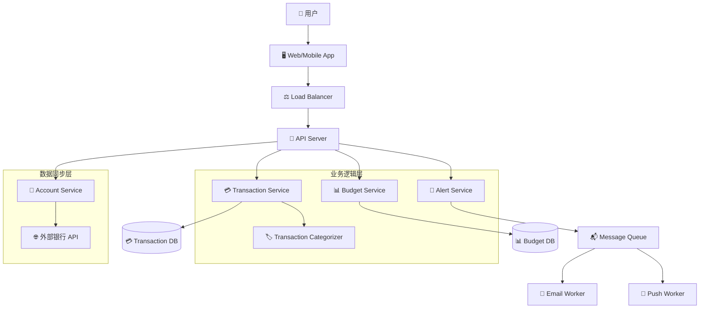

### Step 3：核心组件深入 🔬

#### 交易数据同步 Pipeline

```
外部银行 → Account Service → Message Queue → Transaction Worker → DB
              ↑                                      ↓
         定时触发(每日)                        Transaction Categorizer
                                                     ↓
                                              Budget Checker
                                                     ↓
                                              Alert Service（超预算提醒）
```

#### 交易分类器

```python
class TransactionCategorizer:
    """交易自动分类器"""
    
    # 基于商户名称的规则匹配 + 用户自定义规则
    MERCHANT_RULES = {
        "starbucks": "餐饮-咖啡",
        "uber": "交通-打车",
        "amazon": "购物-电商",
        "netflix": "娱乐-订阅",
    }
    
    def categorize(self, transaction: dict) -> str:
        merchant = transaction.get("merchant", "").lower()
        
        # 1. 先查用户自定义规则
        user_rules = self._get_user_rules(transaction["user_id"])
        for rule in user_rules:
            if rule["keyword"] in merchant:
                return rule["category"]
        
        # 2. 再用全局规则匹配
        for keyword, category in self.MERCHANT_RULES.items():
            if keyword in merchant:
                return category
        
        # 3. 无法匹配则标记为"未分类"
        return "未分类"
    
    def _get_user_rules(self, user_id: str) -> list:
        # 从缓存或数据库获取用户自定义规则
        return []
```

### Step 4：扩展优化 📈

| 瓶颈 | 解决方案 |
|------|---------|
| 交易写入压力 | 按 user_id 分片 + 批量写入 |
| 银行 API 限流 | 排队顺序同步 + 错峰调度 |
| 分类准确率 | 机器学习模型替代规则引擎 |
| 数据一致性 | 幂等设计（同一交易不重复入库） |

> 🔑 **关键收获**：Mint 是少见的**写密集型**系统，数据管道设计和批量处理是核心挑战。

---

## 9.6 设计社交图谱（Social Graph）

> 📖 完整方案见 `solutions/system_design/social_graph/`

### Step 1：用例与约束 📋

**核心用例**：
- 存储用户之间的好友关系
- 查找两个用户之间的最短路径（六度分隔）
- 好友推荐（你可能认识的人）

**规模估算**：

| 指标 | 数值 |
|------|------|
| 用户数 | 100M |
| 平均好友数 | 50 |
| 每月好友搜索 | 1B |
| 搜索 QPS | ~400/s |

### Step 2：高层设计 🏗️

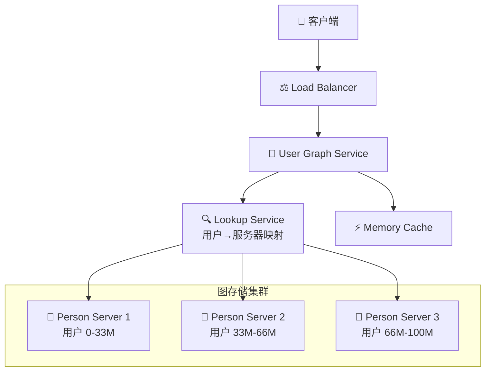

### Step 3：核心组件深入 🔬

#### 图数据结构

社交关系本质上是一个**无向图**：

```
Alice ←→ Bob ←→ Charlie
  ↕         ↕
David     Eve ←→ Frank
```

#### BFS 最短路径算法

```python
from collections import deque

class SocialGraphService:
    """社交图谱服务——查找最短路径"""
    
    def __init__(self, lookup_service):
        self.lookup = lookup_service
    
    def shortest_path(self, source_id: str, target_id: str, max_depth: int = 6):
        """
        BFS 查找两个用户之间的最短路径
        max_depth=6 基于"六度分隔理论"
        """
        if source_id == target_id:
            return [source_id]
        
        visited = {source_id}
        queue = deque([(source_id, [source_id])])
        
        while queue:
            current_id, path = queue.popleft()
            
            if len(path) > max_depth:
                return None  # 超过最大深度，放弃搜索
            
            # 从 Person Server 获取好友列表
            friends = self.lookup.get_friends(current_id)
            
            for friend_id in friends:
                if friend_id == target_id:
                    return path + [friend_id]
                
                if friend_id not in visited:
                    visited.add(friend_id)
                    queue.append((friend_id, path + [friend_id]))
        
        return None  # 无路径
    
    def bidirectional_bfs(self, source_id: str, target_id: str):
        """
        双向 BFS——从两端同时搜索，速度更快！
        时间复杂度从 O(k^d) 降到 O(k^(d/2))
        k=平均好友数, d=路径长度
        """
        if source_id == target_id:
            return [source_id]
        
        # 从 source 向外扩展
        front_visited = {source_id: [source_id]}
        # 从 target 向外扩展
        back_visited = {target_id: [target_id]}
        
        front_queue = deque([source_id])
        back_queue = deque([target_id])
        
        while front_queue and back_queue:
            # 从前端扩展一层
            result = self._expand_layer(
                front_queue, front_visited, back_visited
            )
            if result:
                return result
            
            # 从后端扩展一层
            result = self._expand_layer(
                back_queue, back_visited, front_visited
            )
            if result:
                return list(reversed(result))
        
        return None
    
    def _expand_layer(self, queue, visited, other_visited):
        """扩展一层 BFS"""
        layer_size = len(queue)
        for _ in range(layer_size):
            current = queue.popleft()
            friends = self.lookup.get_friends(current)
            for friend in friends:
                if friend in other_visited:
                    # 两端相遇！拼接路径
                    return visited[current] + [friend]
                if friend not in visited:
                    visited[friend] = visited[current] + [friend]
                    queue.append(friend)
        return None
```

> 💡 **类比**：单向 BFS 像是一个人在迷宫里走，双向 BFS 像两个人从两端同时走——相遇点就是答案，速度快得多！

### Step 4：扩展优化 📈

| 瓶颈 | 解决方案 |
|------|---------|
| 图数据太大，单机放不下 | 按 user_id 分片到多个 Person Server |
| 跨服务器查询慢 | 批量获取好友列表，减少 RPC 调用 |
| 热门用户查询多 | 缓存热门路径（名人的好友关系） |
| BFS 搜索爆炸 | 双向 BFS + 限制搜索深度 |

> 🔑 **关键收获**：社交图谱的核心是**图的分布式存储和遍历**，双向 BFS 是面试中的高分答案。

---

## 9.7 设计销售排行榜（Amazon Sales Rank）

> 📖 完整方案见 `solutions/system_design/sales_rank/`

### Step 1：用例与约束 📋

**核心用例**：
- 按品类展示商品销售排名（如"电子产品 Top 100"）
- 排名每小时更新一次
- 支持按时间维度查看（日、周、月排行）

**规模估算**：

| 指标 | 数值 |
|------|------|
| 商品数 | 10M |
| 品类数 | ~1,000 |
| 月交易量 | 1B |
| 写入 QPS（交易） | ~400/s |
| 读取 QPS（排行榜） | ~40,000/s |
| 读写比 | 100:1 |

### Step 2：高层设计 🏗️

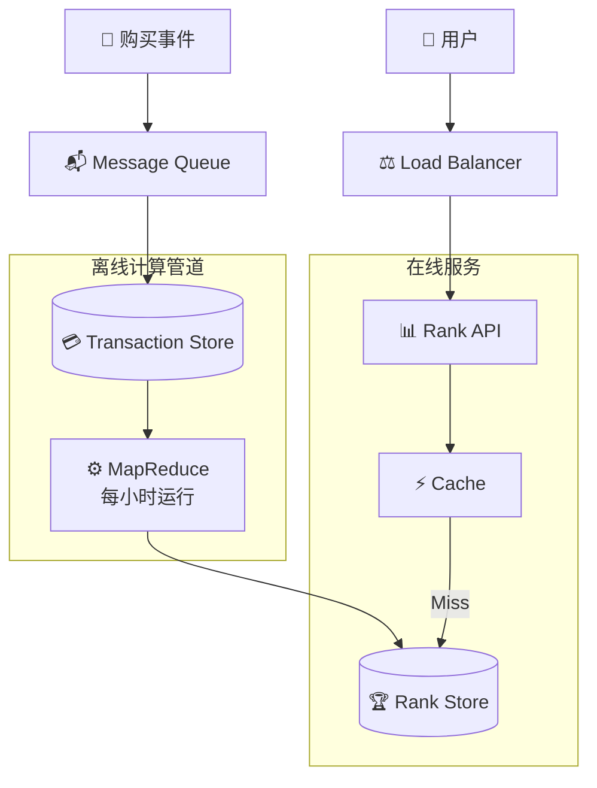

### Step 3：核心组件深入 🔬

#### MapReduce 排名计算

```python
# ======== Map 阶段 ========
def mapper(transaction):
    """
    输入: 一条交易记录
    输出: (category_product_key, count)
    """
    product_id = transaction["product_id"]
    category = transaction["category"]
    timestamp = transaction["timestamp"]
    
    # 按品类+商品 分组计数
    time_bucket = get_hour_bucket(timestamp)
    key = f"{category}:{product_id}:{time_bucket}"
    yield (key, 1)


# ======== Reduce 阶段 ========
def reducer(key, values):
    """
    输入: (category_product_key, [1, 1, 1, ...])
    输出: (key, total_sales)
    """
    total = sum(values)
    yield (key, total)


# ======== 排名排序 ========
def rank_by_category(reduce_results):
    """按品类排序生成排行榜"""
    from collections import defaultdict
    
    category_sales = defaultdict(list)
    
    for key, count in reduce_results:
        category, product_id, time_bucket = key.split(":")
        category_sales[category].append((count, product_id))
    
    rankings = {}
    for category, items in category_sales.items():
        # 按销量降序排序
        items.sort(reverse=True)
        rankings[category] = [
            {"rank": i + 1, "product_id": pid, "sales": cnt}
            for i, (cnt, pid) in enumerate(items)
        ]
    
    return rankings
```

#### 时间维度聚合

```
小时排行 → 直接从 MapReduce 输出获取
日排行   → 聚合 24 个小时桶
周排行   → 聚合 7 个日桶
月排行   → 聚合 30 个日桶
```

### Step 4：扩展优化 📈

| 瓶颈 | 解决方案 |
|------|---------|
| MapReduce 延迟 | 热门品类增加实时计算（流处理） |
| 排行榜读取压力 | 多层缓存（本地缓存 + Redis + CDN） |
| 交易写入高峰 | Message Queue 削峰 + 批量写入 |
| 存储增长 | 只保留近期数据，历史数据归档 |

> 🔑 **关键收获**：排行榜是典型的**读多写少 + 离线计算**场景，MapReduce/流处理 + 缓存是标配方案。

---

## 9.8 AWS 扩展实战

> 📖 完整方案见 `solutions/system_design/scaling_aws/`

这个案例展示了一个系统从 **1 个用户** 逐步扩展到 **数百万用户** 的完整旅程。

### 扩展阶梯

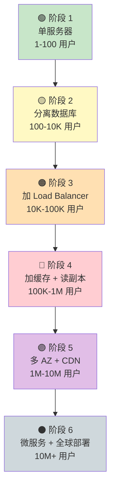

### 各阶段详解

#### 阶段 1：一切从单机开始 🟢

```
┌──────────────────────────┐
│    Single Server         │
│  ┌────────┐ ┌─────────┐  │
│  │ Web App│ │ Database │  │
│  └────────┘ └─────────┘  │
│        一台搞定           │
└──────────────────────────┘
```

适用：个人项目、MVP 原型，1-100 用户。

#### 阶段 2：Web 与数据库分离 🟡

```
用户 → Web Server (EC2) → Database (RDS)
```

**为什么要分离？** Web 和 DB 的资源需求不同——Web 需要 CPU，DB 需要内存和磁盘 I/O。

#### 阶段 3：垂直扩展 + 水平扩展 🟠

```
              ┌→ Web Server 1
用户 → LB ────┼→ Web Server 2
              └→ Web Server 3
                      ↓
               Database (RDS)
```

添加 **Load Balancer**，实现 Web 层的水平扩展。

#### 阶段 4：缓存 + 读副本 🔴

```
                        ┌→ Web Server 1
用户 → LB ──────────────┼→ Web Server 2
                        └→ Web Server 3
                              ↓
                        ┌─── Cache (Redis) ←── 读取走这里
                        ↓
                  ┌─ Master DB (写)
                  ├─ Read Replica 1 (读)
                  └─ Read Replica 2 (读)
```

#### 阶段 5：多可用区 + CDN 🟣

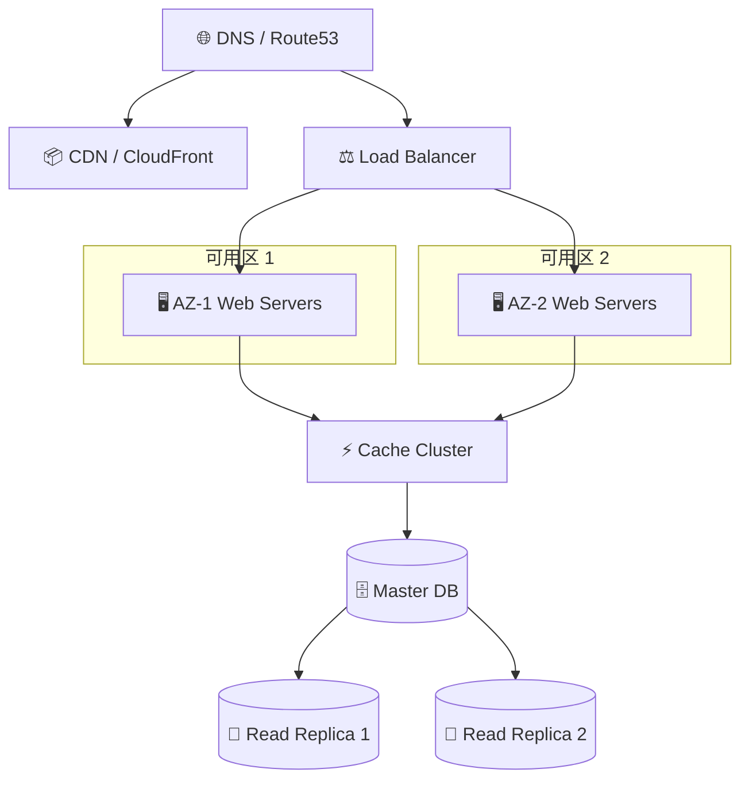

#### 阶段 6：微服务 + 全球部署 ⚫

最终形态的完整技术栈：

| 层次 | 技术选型 |
|------|---------|
| DNS | Route 53（带健康检查的 DNS 路由） |
| CDN | CloudFront |
| 负载均衡 | ALB / NLB |
| Web 层 | Auto Scaling Group + EC2 / ECS |
| 缓存 | ElastiCache (Redis) |
| 数据库 | RDS Multi-AZ + Read Replicas |
| 对象存储 | S3 |
| 消息队列 | SQS / SNS |
| 监控 | CloudWatch |

### 扩展决策路径

```
流量增长 → 先排查瓶颈在哪？
│
├── CPU 瓶颈 → 加更多 Web Server（水平扩展）
├── 数据库读瓶颈 → 加 Read Replica + 缓存
├── 数据库写瓶颈 → 数据库分片 / 换 NoSQL
├── 网络延迟 → 加 CDN + 多地域部署
└── 单点故障 → Multi-AZ + 故障转移
```

> 🔑 **关键收获**：扩展是一个**渐进的过程**——不要一开始就过度设计，根据实际瓶颈逐步优化。

---

## 9.9 更多设计题目

除了以上案例，本仓库还包含以下值得练习的系统：

| 题目 | 核心考点 | 参考路径 |
|------|---------|---------|
| 设计 Query Cache | 缓存策略、LRU 淘汰 | `solutions/system_design/query_cache/` |
| 设计在线聊天系统 | WebSocket、消息存储 | `solutions/object_oriented_design/online_chat/` |
| 设计停车场系统 | 面向对象建模 | `solutions/object_oriented_design/parking_lot/` |
| 设计 LRU 缓存 | 数据结构（HashMap + 双向链表） | `solutions/object_oriented_design/lru_cache/` |
| 设计呼叫中心 | 状态机、队列调度 | `solutions/object_oriented_design/call_center/` |

### 常见面试高频题补充清单

```
📋 短链接服务（URL Shortener）      ★★★★★  ← 本章 9.2 已覆盖
📋 消息系统（WhatsApp/WeChat）      ★★★★★
📋 新闻流（News Feed / Timeline）   ★★★★★  ← 本章 9.3 已覆盖
📋 搜索引擎（Google Search）        ★★★★☆
📋 视频平台（YouTube/TikTok）       ★★★★☆
📋 电商系统（Amazon/淘宝）          ★★★★☆
📋 打车服务（Uber/滴滴）            ★★★★☆
📋 分布式文件系统（Dropbox/GFS）    ★★★☆☆
📋 限流器（Rate Limiter）           ★★★☆☆
📋 键值存储（Key-Value Store）      ★★★☆☆
```

---

## 9.10 本章小结

### 📊 七大案例速查表

| 案例 | 核心挑战 | 关键技术 | 读写比 |
|------|---------|---------|--------|
| 🔗 短链接服务 | 哈希生成 + 高速读取 | MD5 + Base62, Cache | 10:1 读多 |
| 🐦 Twitter 时间线 | Fan-out 策略选择 | Redis Sorted Set, 混合推拉 | 读多 |
| 🕷️ Web 爬虫 | 去重 + 礼貌爬取 | Bloom Filter, URL Frontier | 写多 |
| 💰 Mint 记账 | 数据管道 + 分类 | ETL Pipeline, Message Queue | 10:1 写多 |
| 👥 社交图谱 | 分布式图遍历 | BFS/双向 BFS, 图分片 | 读多 |
| 🏆 销售排行榜 | 离线聚合 + 实时查询 | MapReduce, 多层缓存 | 100:1 读多 |
| ☁️ AWS 扩展 | 渐进式扩展 | 全栈 AWS 服务 | - |

### 🎯 通用设计原则

通过这些案例，我们可以总结出几条**通用设计原则**：

```
1. 📐 先估算规模 → 决定了技术选型和架构方向
2. 📊 分析读写比 → 读多用缓存，写多用队列
3. 🧩 识别核心问题 → 每个系统都有一个"灵魂决策"
4. 📈 渐进式扩展 → 不要过度设计，根据瓶颈优化
5. 💡 没有银弹    → 所有方案都是 trade-off
```

### 🗺️ 下一步

| 下一章 | 内容 |
|--------|------|
| [第十章：面向对象设计](../10-oop-design/README.md) | 从系统设计到代码设计——学习 OOP 建模方法 |

---

> 📌 **练习建议**：选择 2-3 个案例，限时 45 分钟，在白板上独立完成四步法设计。反复练习直到形成肌肉记忆！
