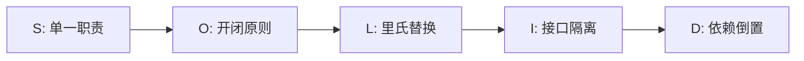
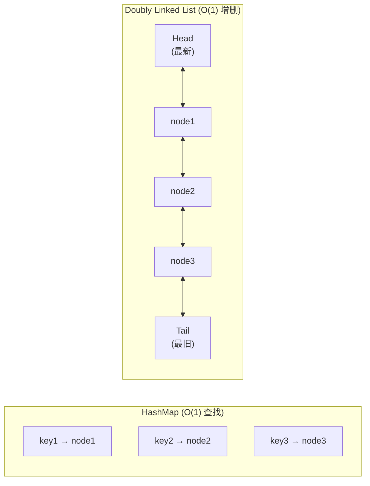
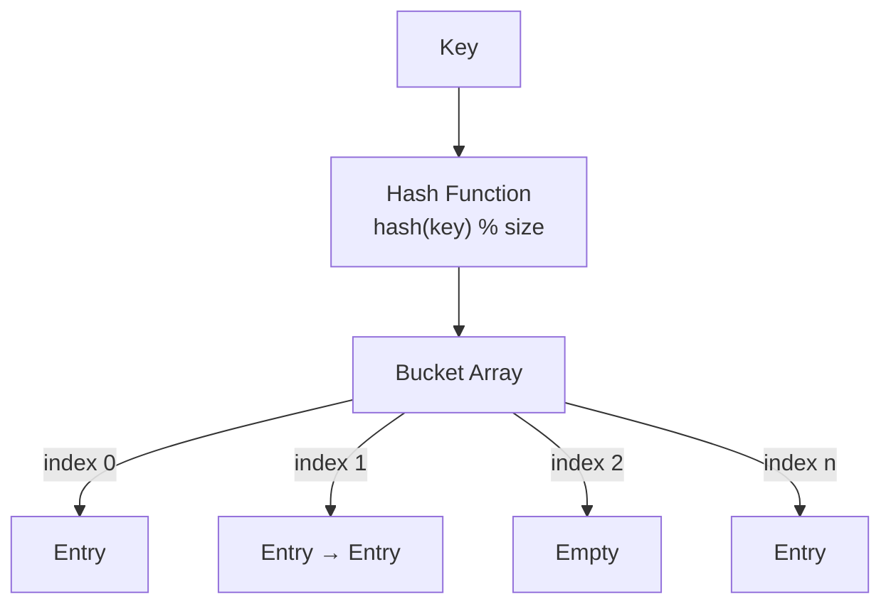
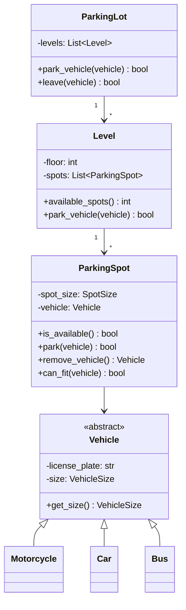
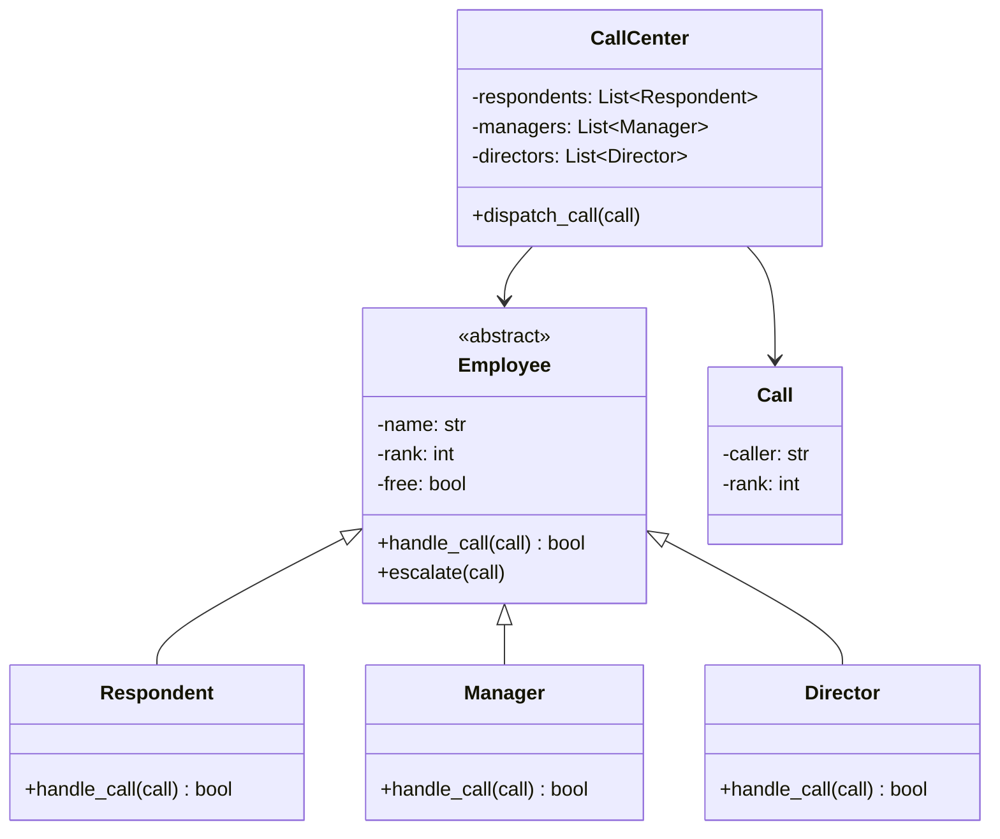
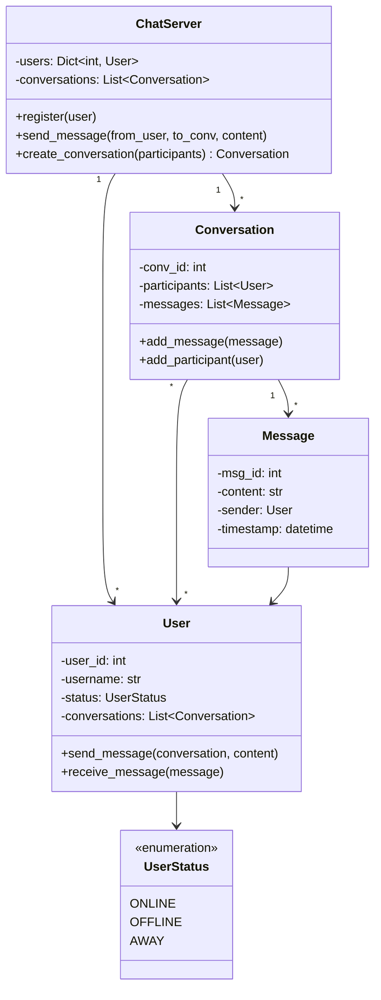
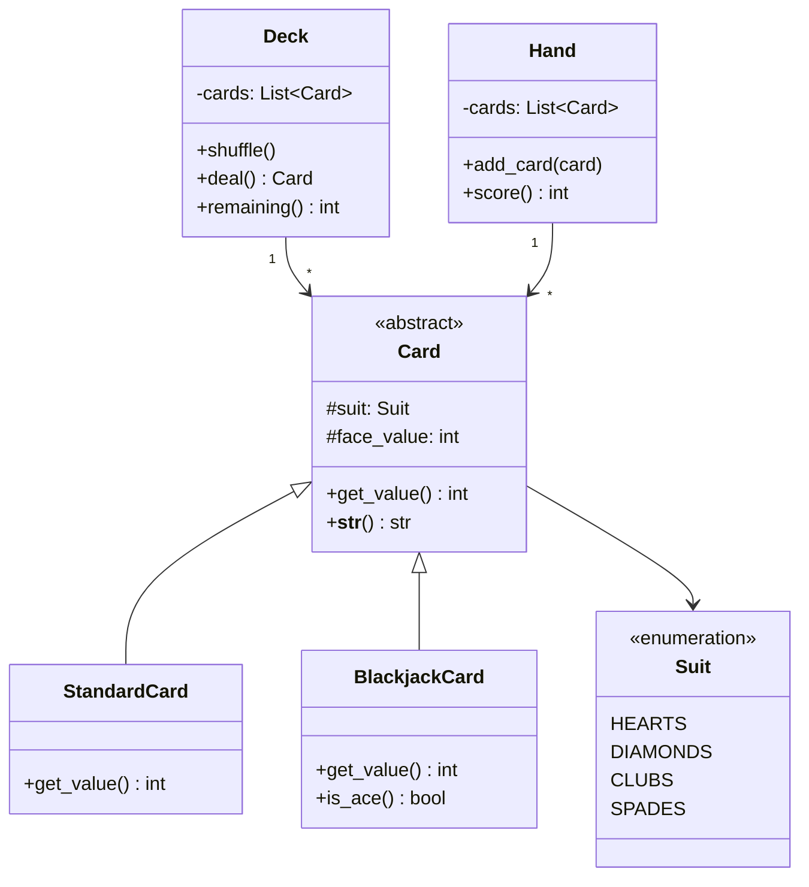

# 🧩 第十章：面向对象设计

> "好的面向对象设计，就像搭乐高积木——每块积木职责清晰，组合起来就能构建复杂系统。" 🧱

面向对象设计（Object-Oriented Design, OOD）是系统设计面试中的重要组成部分。本章将通过 SOLID 原则和多个经典案例，帮助你掌握 OOD 的核心思想。

---

## 10.1 面向对象设计原则

### 🏗️ SOLID 原则

SOLID 是面向对象设计的五大基本原则，就像建筑的五根支柱：



#### S — Single Responsibility Principle（单一职责原则）

> 🍳 **类比**：一个厨师只负责做菜，不应该同时兼任服务员和收银员。

一个类应该只有一个引起它变化的原因。

```python
# ❌ 错误示范：一个类做太多事
class Employee:
    def calculate_pay(self): ...
    def save_to_database(self): ...
    def generate_report(self): ...

# ✅ 正确示范：每个类只做一件事
class PayCalculator:
    def calculate_pay(self, employee): ...

class EmployeeRepository:
    def save(self, employee): ...

class ReportGenerator:
    def generate(self, employee): ...
```

#### O — Open/Closed Principle（开闭原则）

> 🔌 **类比**：电脑的 USB 接口——可以插入新设备（扩展），但不需要改造主板（修改）。

对扩展开放，对修改关闭。

```python
from abc import ABC, abstractmethod

class Shape(ABC):
    @abstractmethod
    def area(self) -> float: ...

class Circle(Shape):
    def __init__(self, radius: float):
        self.radius = radius
    def area(self) -> float:
        return 3.14159 * self.radius ** 2

class Rectangle(Shape):
    def __init__(self, width: float, height: float):
        self.width = width
        self.height = height
    def area(self) -> float:
        return self.width * self.height

# 新增形状无需修改已有代码
class Triangle(Shape):
    def __init__(self, base: float, height: float):
        self.base = base
        self.height = height
    def area(self) -> float:
        return 0.5 * self.base * self.height
```

#### L — Liskov Substitution Principle（里氏替换原则）

> 🐦 **类比**：如果程序期望一只"鸟"，那么用"麻雀"替换不会出问题；但用"企鹅"（不会飞）替换就可能出错。

子类必须能够替换其父类而不影响程序的正确性。

#### I — Interface Segregation Principle（接口隔离原则）

> 🎮 **类比**：游戏手柄不应该要求玩家必须使用所有按钮——简单游戏只用方向键和一个按钮就够了。

客户端不应该被迫依赖它不使用的接口。

#### D — Dependency Inversion Principle（依赖倒置原则）

> 🔋 **类比**：遥控器依赖"电池接口"，而不是某个具体品牌的电池。

高层模块不应该依赖低层模块，两者都应该依赖抽象。

### 🎨 常用设计模式概览

| 模式 | 类型 | 用途 | 类比 |
|------|------|------|------|
| Singleton | 创建型 | 全局唯一实例 | 一个国家只有一个总统 |
| Factory | 创建型 | 封装对象创建 | 汽车工厂按订单生产不同车型 |
| Observer | 行为型 | 事件通知 | 订阅微信公众号推送 |
| Strategy | 行为型 | 算法切换 | 导航 App 选择驾车/步行/公交路线 |
| Chain of Responsibility | 行为型 | 请求链式处理 | 员工请假逐级审批 |

---

## 10.2 设计 LRU 缓存

### 📋 什么是 LRU Cache？

LRU（Least Recently Used，最近最少使用）缓存是一种淘汰策略：当缓存满时，优先移除**最久未被使用**的数据。

> 🗄️ **类比**：你的书桌只能放 5 本书。每次看完一本书就放在最上面，桌子满了就把最下面那本放回书架。

### 🏗️ 数据结构：HashMap + Doubly Linked List



### 💻 Python 实现

```python
class DLinkedNode:
    """双向链表节点"""
    def __init__(self, key=0, value=0):
        self.key = key
        self.value = value
        self.prev = None
        self.next = None

class LRUCache:
    def __init__(self, capacity: int):
        self.cache = {}          # HashMap: key -> DLinkedNode
        self.capacity = capacity
        self.size = 0
        # 使用哨兵节点简化边界处理
        self.head = DLinkedNode()
        self.tail = DLinkedNode()
        self.head.next = self.tail
        self.tail.prev = self.head

    def get(self, key: int) -> int:
        if key not in self.cache:
            return -1
        node = self.cache[key]
        self._move_to_head(node)  # 标记为最近使用
        return node.value

    def put(self, key: int, value: int) -> None:
        if key in self.cache:
            node = self.cache[key]
            node.value = value
            self._move_to_head(node)
        else:
            node = DLinkedNode(key, value)
            self.cache[key] = node
            self._add_to_head(node)
            self.size += 1
            if self.size > self.capacity:
                removed = self._remove_tail()
                del self.cache[removed.key]
                self.size -= 1

    def _add_to_head(self, node):
        node.prev = self.head
        node.next = self.head.next
        self.head.next.prev = node
        self.head.next = node

    def _remove_node(self, node):
        node.prev.next = node.next
        node.next.prev = node.prev

    def _move_to_head(self, node):
        self._remove_node(node)
        self._add_to_head(node)

    def _remove_tail(self):
        node = self.tail.prev
        self._remove_node(node)
        return node
```

### ⏱️ 时间复杂度

| 操作 | 时间复杂度 | 说明 |
|------|-----------|------|
| `get` | O(1) | HashMap 查找 + 链表移动 |
| `put` | O(1) | HashMap 插入 + 链表操作 |
| 淘汰 | O(1) | 直接删除链表尾部 |

---

## 10.3 设计哈希表

### 🔑 哈希表工作原理



### 💥 碰撞处理

**方法一：Chaining（链地址法）** —— 每个桶维护一个链表。

**方法二：Open Addressing（开放寻址法）** —— 发生碰撞时探测下一个空位。

### 💻 Python 实现（链地址法）

```python
class HashNode:
    def __init__(self, key, value):
        self.key = key
        self.value = value
        self.next = None

class HashTable:
    def __init__(self, capacity=16, load_factor=0.75):
        self.capacity = capacity
        self.load_factor = load_factor
        self.size = 0
        self.buckets = [None] * self.capacity

    def _hash(self, key) -> int:
        return hash(key) % self.capacity

    def put(self, key, value):
        index = self._hash(key)
        node = self.buckets[index]
        while node:
            if node.key == key:
                node.value = value  # 更新已有 key
                return
            node = node.next
        # 插入新节点到链表头部
        new_node = HashNode(key, value)
        new_node.next = self.buckets[index]
        self.buckets[index] = new_node
        self.size += 1
        if self.size / self.capacity >= self.load_factor:
            self._resize()

    def get(self, key):
        index = self._hash(key)
        node = self.buckets[index]
        while node:
            if node.key == key:
                return node.value
            node = node.next
        return None

    def remove(self, key):
        index = self._hash(key)
        node = self.buckets[index]
        prev = None
        while node:
            if node.key == key:
                if prev:
                    prev.next = node.next
                else:
                    self.buckets[index] = node.next
                self.size -= 1
                return True
            prev = node
            node = node.next
        return False

    def _resize(self):
        """容量翻倍并重新哈希"""
        old_buckets = self.buckets
        self.capacity *= 2
        self.buckets = [None] * self.capacity
        self.size = 0
        for head in old_buckets:
            node = head
            while node:
                self.put(node.key, node.value)
                node = node.next
```

### 📊 Resize 策略

- **负载因子** = 元素数 / 桶数，一般阈值为 0.75
- 超过阈值时，容量翻倍（×2），所有元素重新哈希
- 均摊时间复杂度仍为 O(1)

---

## 10.4 设计停车场系统

### 📋 需求分析

- 停车场有多层，每层有多个车位
- 车辆分为：摩托车 🏍️、小汽车 🚗、大巴 🚌
- 车位分为：小型、紧凑型、大型
- 支持停车和取车操作

### 📐 类图



### 💻 Python 实现

```python
from enum import Enum
from abc import ABC

class VehicleSize(Enum):
    MOTORCYCLE = 1
    COMPACT = 2
    LARGE = 3

class Vehicle(ABC):
    def __init__(self, license_plate: str, size: VehicleSize):
        self.license_plate = license_plate
        self.size = size

class Motorcycle(Vehicle):
    def __init__(self, license_plate: str):
        super().__init__(license_plate, VehicleSize.MOTORCYCLE)

class Car(Vehicle):
    def __init__(self, license_plate: str):
        super().__init__(license_plate, VehicleSize.COMPACT)

class Bus(Vehicle):
    def __init__(self, license_plate: str):
        super().__init__(license_plate, VehicleSize.LARGE)

class ParkingSpot:
    def __init__(self, spot_size: VehicleSize):
        self.spot_size = spot_size
        self.vehicle = None

    def is_available(self) -> bool:
        return self.vehicle is None

    def can_fit(self, vehicle: Vehicle) -> bool:
        return self.is_available() and vehicle.size.value <= self.spot_size.value

    def park(self, vehicle: Vehicle) -> bool:
        if self.can_fit(vehicle):
            self.vehicle = vehicle
            return True
        return False

    def remove_vehicle(self):
        v = self.vehicle
        self.vehicle = None
        return v

class Level:
    def __init__(self, floor: int, num_spots: int):
        self.floor = floor
        self.spots = []
        # 分配不同大小的车位
        for i in range(num_spots):
            if i < num_spots // 4:
                self.spots.append(ParkingSpot(VehicleSize.MOTORCYCLE))
            elif i < num_spots * 3 // 4:
                self.spots.append(ParkingSpot(VehicleSize.COMPACT))
            else:
                self.spots.append(ParkingSpot(VehicleSize.LARGE))

    def park_vehicle(self, vehicle: Vehicle) -> bool:
        for spot in self.spots:
            if spot.park(vehicle):
                return True
        return False

    def available_spots(self) -> int:
        return sum(1 for s in self.spots if s.is_available())

class ParkingLot:
    _instance = None

    def __new__(cls, *args, **kwargs):
        if cls._instance is None:
            cls._instance = super().__new__(cls)
        return cls._instance

    def __init__(self, num_levels: int, spots_per_level: int):
        if not hasattr(self, '_initialized'):
            self.levels = [Level(i, spots_per_level) for i in range(num_levels)]
            self._initialized = True

    def park_vehicle(self, vehicle: Vehicle) -> bool:
        for level in self.levels:
            if level.park_vehicle(vehicle):
                return True
        return False
```

> 💡 **设计模式**：`ParkingLot` 使用了 **Singleton 模式**，确保全局只有一个停车场实例。

---

## 10.5 设计呼叫中心

### 📋 需求

- 呼叫中心有三级员工：接线员（Respondent）、经理（Manager）、总监（Director）
- 来电优先分配给接线员；若接线员无法处理，升级给经理；再不行升级给总监
- 这是经典的 **Chain of Responsibility（责任链模式）**

### 📐 类图



### 💻 Python 实现

```python
from collections import deque

class Call:
    def __init__(self, caller: str, rank: int = 0):
        self.caller = caller
        self.rank = rank  # 0=普通, 1=需经理, 2=需总监

class Employee:
    def __init__(self, name: str, rank: int):
        self.name = name
        self.rank = rank
        self.free = True
        self.call = None

    def take_call(self, call: Call) -> bool:
        if self.free and call.rank <= self.rank:
            self.free = False
            self.call = call
            print(f"  {self.name} 接听了 {call.caller} 的来电")
            return True
        return False

    def finish_call(self):
        self.free = True
        self.call = None

class Respondent(Employee):
    def __init__(self, name: str):
        super().__init__(name, rank=0)

class Manager(Employee):
    def __init__(self, name: str):
        super().__init__(name, rank=1)

class Director(Employee):
    def __init__(self, name: str):
        super().__init__(name, rank=2)

class CallCenter:
    def __init__(self):
        self.employee_levels = [
            [Respondent(f"接线员-{i}") for i in range(3)],
            [Manager(f"经理-{i}") for i in range(2)],
            [Director("总监-0")],
        ]
        self.call_queue = deque()

    def dispatch_call(self, call: Call):
        """责任链：逐级尝试分配"""
        for level in self.employee_levels:
            for emp in level:
                if emp.take_call(call):
                    return
        # 所有人都忙，加入等待队列
        print(f"  所有员工忙碌，{call.caller} 进入等待队列")
        self.call_queue.append(call)
```

> 🔗 **设计模式**：责任链模式（Chain of Responsibility）——请求沿着处理者链传递，直到被某个处理者接收。

---

## 10.6 设计在线聊天系统

### 📋 需求

- 用户可以注册和登录
- 支持一对一私聊和群聊
- 消息实时发送
- 支持在线/离线状态

### 📐 类图



### 💻 Python 实现

```python
from datetime import datetime
from enum import Enum

class UserStatus(Enum):
    ONLINE = "online"
    OFFLINE = "offline"
    AWAY = "away"

class Message:
    _counter = 0
    def __init__(self, sender, content: str):
        Message._counter += 1
        self.msg_id = Message._counter
        self.sender = sender
        self.content = content
        self.timestamp = datetime.now()

class User:
    def __init__(self, user_id: int, username: str):
        self.user_id = user_id
        self.username = username
        self.status = UserStatus.OFFLINE
        self.conversations = []

    def send_message(self, conversation, content: str):
        msg = Message(self, content)
        conversation.add_message(msg)

    def receive_message(self, message: Message):
        print(f"  [{self.username}] 收到来自 {message.sender.username} 的消息: {message.content}")

class Conversation:
    _counter = 0
    def __init__(self, participants: list):
        Conversation._counter += 1
        self.conv_id = Conversation._counter
        self.participants = list(participants)
        self.messages = []

    def add_message(self, message: Message):
        self.messages.append(message)
        for user in self.participants:
            if user != message.sender:
                user.receive_message(message)

    def add_participant(self, user: User):
        if user not in self.participants:
            self.participants.append(user)

class ChatServer:
    def __init__(self):
        self.users = {}
        self.conversations = []

    def register(self, user: User):
        self.users[user.user_id] = user
        user.status = UserStatus.ONLINE

    def create_conversation(self, participants: list):
        conv = Conversation(participants)
        for user in participants:
            user.conversations.append(conv)
        self.conversations.append(conv)
        return conv
```

### 💡 实时消息设计要点

| 方案 | 原理 | 适用场景 |
|------|------|----------|
| Polling | 客户端定时请求服务器 | 简单但效率低 |
| Long Polling | 服务器保持连接直到有新消息 | 中等实时性 |
| WebSocket | 全双工持久连接 | 高实时性 ✅ |
| Server-Sent Events | 服务器推送单向消息 | 通知类场景 |

---

## 10.7 设计扑克牌

### 📋 需求

- 一副标准扑克牌（52 张 + 大小王）
- 支持多种纸牌游戏（21 点、德州扑克等）
- 体现继承、抽象类和多态

### 📐 类图



### 💻 Python 实现

```python
import random
from abc import ABC, abstractmethod
from enum import Enum

class Suit(Enum):
    HEARTS = "♥"
    DIAMONDS = "♦"
    CLUBS = "♣"
    SPADES = "♠"

FACE_NAMES = {1: "A", 11: "J", 12: "Q", 13: "K"}

class Card(ABC):
    def __init__(self, suit: Suit, face_value: int):
        self.suit = suit
        self.face_value = face_value

    @abstractmethod
    def get_value(self) -> int:
        pass

    def __str__(self):
        name = FACE_NAMES.get(self.face_value, str(self.face_value))
        return f"{self.suit.value}{name}"

class StandardCard(Card):
    def get_value(self) -> int:
        return self.face_value

class BlackjackCard(Card):
    """21 点中的牌：A 可当 1 或 11，JQK 算 10"""
    def get_value(self) -> int:
        if self.face_value > 10:
            return 10
        return self.face_value

    def is_ace(self) -> bool:
        return self.face_value == 1

class Deck:
    def __init__(self, card_class=StandardCard):
        self.cards = []
        for suit in Suit:
            for value in range(1, 14):
                self.cards.append(card_class(suit, value))

    def shuffle(self):
        random.shuffle(self.cards)

    def deal(self):
        if not self.cards:
            raise ValueError("牌堆已空")
        return self.cards.pop()

    def remaining(self) -> int:
        return len(self.cards)

class Hand:
    def __init__(self):
        self.cards = []

    def add_card(self, card: Card):
        self.cards.append(card)

    def score(self) -> int:
        return sum(c.get_value() for c in self.cards)

    def __str__(self):
        return " ".join(str(c) for c in self.cards)
```

> 🎭 **多态示例**：`StandardCard` 和 `BlackjackCard` 都继承自 `Card`，但 `get_value()` 的行为不同——这就是多态的力量。

---

## 10.8 本章小结

### 🗺️ 知识图谱

```
面向对象设计
├── SOLID 原则
│   ├── 单一职责 → 一个类一个任务
│   ├── 开闭原则 → 扩展不修改
│   ├── 里氏替换 → 子类可替换父类
│   ├── 接口隔离 → 小而专的接口
│   └── 依赖倒置 → 依赖抽象而非具体
├── 经典案例
│   ├── LRU Cache → HashMap + 双向链表
│   ├── Hash Table → 哈希函数 + 碰撞处理
│   ├── 停车场 → Singleton + 类层次
│   ├── 呼叫中心 → 责任链模式
│   ├── 聊天系统 → Observer + 实时通信
│   └── 扑克牌 → 抽象类 + 多态
└── 设计模式
    ├── 创建型：Singleton, Factory
    ├── 结构型：Adapter, Decorator
    └── 行为型：Observer, Strategy, Chain of Responsibility
```

### 🎯 OOD 面试技巧

1. **明确需求** — 先问清楚范围，不要急着写代码
2. **识别核心对象** — 名词 → 类，动词 → 方法
3. **画类图** — 理清关系再动手
4. **遵循 SOLID** — 让设计灵活可扩展
5. **应用设计模式** — 但不要过度设计

### ✏️ 练习题

1. **设计一个图书馆管理系统**：包含 Book、Library、Member、Loan 等类，支持借书和还书。
2. **设计一个电梯系统**：多部电梯协调调度，处理楼层请求。
3. **设计一个文件系统**：支持文件和文件夹的树形结构，使用组合模式（Composite Pattern）。
4. **扩展 LRU Cache**：实现带过期时间（TTL）的 LRU Cache。
5. **扩展停车场系统**：增加计费功能，不同车型不同费率。

---

> 📌 **下一章预告**：我们将进入系统设计的综合实战环节，把前面学到的所有知识融会贯通！
