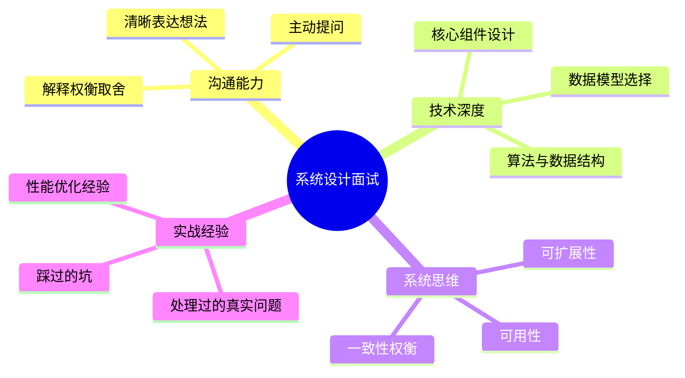
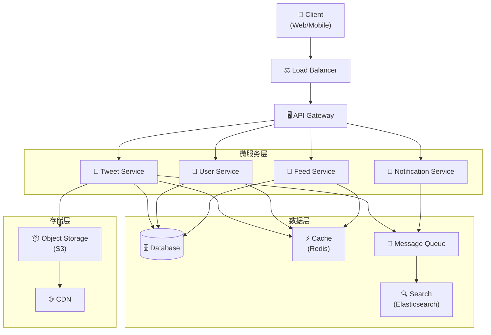
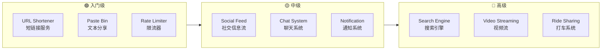
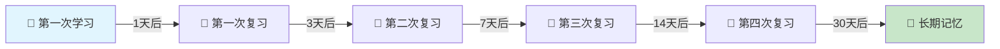
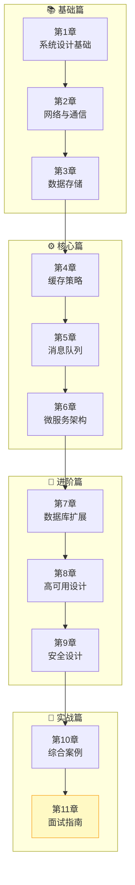

# 🎓 第十一章：面试指南与附录

> **面试不是考试，而是一场关于系统设计思维的对话。** 本章将帮助你掌握面试技巧、估算方法，并提供实用参考资料。

---

## 11.1 系统设计面试概述

### 🎯 面试的本质

系统设计面试考察的**不是标准答案**，而是你的思维过程：



### 👀 面试官在观察什么？

| 评估维度 | 优秀表现 ✅ | 常见问题 ❌ |
|---------|-----------|-----------|
| **问题分析** | 主动提问，明确需求边界 | 直接开始画架构图 |
| **方案设计** | 先给出 high-level 方案，再深入 | 一开始就陷入细节 |
| **技术选型** | 解释为什么选择某个方案 | 只说"用 Redis"但不说为什么 |
| **权衡取舍** | 讨论方案的优缺点 | 认为自己的方案完美无缺 |
| **沟通协作** | 像和同事讨论一样自然 | 沉默不语或自说自话 |
| **扩展思维** | 主动考虑 bottleneck 和扩展 | 只考虑功能实现 |

### ⏰ 45 分钟时间管理

```mermaid
gantt
    title 系统设计面试时间分配（45分钟）
    dateFormat mm
    axisFormat %M分

    section 第一阶段
    需求澄清 & 约束确认    :a1, 00, 5m

    section 第二阶段
    高层架构设计            :a2, after a1, 10m

    section 第三阶段
    核心组件深入设计         :a3, after a2, 20m

    section 第四阶段
    扩展性讨论 & 总结        :a4, after a3, 10m
```



### 🚫 常见错误

1. **不问需求就开始设计** — 这是最大的错误！
2. **过早陷入细节** — 先画大图，再放大局部
3. **忽略非功能需求** — 可用性、延迟、一致性同样重要
4. **沉默设计** — 面试官看不到你脑中的想法，说出来！
5. **只有一个方案** — 展示你能想到多种方案并做权衡
6. **忽略数据规模** — 100 用户和 1 亿用户的设计完全不同

> 💡 **核心原则：沟通是关键！** 把面试当作和高级工程师的协作讨论，而不是一场考试。

---

## 11.2 面试四步法详解

### 📋 Step 1：需求澄清（5 分钟）

**目标：** 明确系统边界，不要做假设！

必须确认的问题：

```
🔹 功能需求（Functional Requirements）
   - 系统的核心功能是什么？
   - 用户是谁？用户量多大？
   - 需要支持哪些平台？（Web / Mobile / API）

🔹 非功能需求（Non-Functional Requirements）
   - 可用性要求？（99.9%? 99.99%?）
   - 延迟要求？（< 200ms? < 1s?）
   - 一致性要求？（强一致 vs 最终一致）

🔹 规模估算（Scale）
   - DAU（日活用户）是多少？
   - 读写比例？（Read-heavy? Write-heavy?）
   - 数据量增长速度？
```

**示例对话：**

> 👨‍💻 "设计一个类似 Twitter 的系统"
>
> 🙋 "好的，我有几个问题想确认：
> 1. 我们需要支持哪些核心功能？发推、关注、Timeline？
> 2. 预期的 DAU 是多少？
> 3. 一条推文的最大长度？支持多媒体吗？
> 4. Timeline 的展示是按时间排序还是需要推荐算法？
> 5. 读写比大概是多少？"

### 🏗️ Step 2：高层架构设计（10 分钟）

**目标：** 画出系统的核心组件和数据流向



**关键提示：**
- 从用户请求开始，画出完整的数据流
- 标注每个组件的职责
- 说明组件之间的通信方式（REST / gRPC / 异步消息）

### 🔬 Step 3：核心组件深入（20 分钟）

**目标：** 选择 1-2 个核心组件深入设计

深入讨论的方向：
- **数据模型设计** — 表结构、索引策略
- **API 设计** — 接口定义、参数设计
- **核心算法** — Feed 排序、推荐算法
- **缓存策略** — 缓存什么、如何失效
- **数据分片** — 如何 Sharding、选择什么 Shard Key

### 📈 Step 4：扩展与总结（10 分钟）

**目标：** 讨论系统的瓶颈和扩展方案

```
🔍 识别瓶颈
   → 数据库读写压力？ → 读写分离、Sharding
   → 热点数据？ → 多级缓存、CDN
   → 单点故障？ → 冗余设计、故障转移
   → 流量突增？ → 限流、降级、弹性扩容

📊 监控与运维
   → 关键 Metrics 监控
   → 告警策略
   → 容量规划
```

---

## 11.3 估算的艺术

### 📐 Back-of-the-Envelope Estimation

系统设计面试中，快速估算能力非常重要。你不需要精确计算，但需要给出**合理的数量级**。

### 🔢 2 的幂次参考表

| 幂次 | 精确值 | 约等于 | 常见用途 |
|------|-------|-------|---------|
| 2^10 | 1,024 | ~1 千 (1 KB) | 千字节 |
| 2^20 | 1,048,576 | ~1 百万 (1 MB) | 兆字节 |
| 2^30 | 1,073,741,824 | ~10 亿 (1 GB) | 吉字节 |
| 2^40 | 1,099,511,627,776 | ~1 万亿 (1 TB) | 太字节 |
| 2^50 | 1,125,899,906,842,624 | ~1 千万亿 (1 PB) | 拍字节 |

**速记技巧：**
- 每增加 10 次幂 ≈ 乘以 1000
- 1 KB → 1 MB → 1 GB → 1 TB → 1 PB

### ⏱️ 每个程序员都应该知道的延迟数字

| 操作 | 延迟 | 类比 |
|-----|------|------|
| L1 Cache 访问 | ~1 ns | 一眨眼 ⚡ |
| L2 Cache 访问 | ~4 ns | 两次眨眼 |
| 主内存访问 | ~100 ns | 打个响指 |
| SSD 随机读取 | ~150 μs | 深呼吸一次 |
| HDD 随机读取 | ~10 ms | 打个哈欠 |
| 同机房网络往返 | ~0.5 ms | 说一个字 |
| 跨城市网络往返 | ~30-100 ms | 说一句话 |
| 跨大洲网络往返 | ~100-300 ms | 说一段话 🌍 |

> 💡 **关键洞察：** 内存比磁盘快 10 万倍，这就是为什么缓存如此重要！

### 📊 常见估算模式

#### QPS（Queries Per Second）估算

```
公式：DAU × 每用户每日请求数 ÷ 86400（秒/天）

示例：Twitter QPS 估算
├─ DAU = 3 亿
├─ 每用户每天平均浏览 Timeline = 5 次
├─ 每次浏览加载 20 条推文
├─ 总请求数 = 3 亿 × 5 × 20 = 300 亿 / 天
├─ 平均 QPS = 300 亿 ÷ 86400 ≈ 350,000
└─ 峰值 QPS = 平均 QPS × 2~3 ≈ 700,000 ~ 1,000,000
```

#### Storage 估算

```
公式：每日新增数据量 × 保存年限 × 365

示例：Twitter 存储估算
├─ DAU = 3 亿，每天有 10% 用户发推
├─ 每天新增推文 = 3000 万条
├─ 每条推文大小：
│   ├─ 文本：~300 bytes
│   ├─ 元数据：~200 bytes
│   └─ 合计：~500 bytes
├─ 每天新增存储 = 3000 万 × 500 B = 15 GB / 天
├─ 如果 20% 包含图片（每张约 500 KB）
│   └─ 图片存储 = 3000 万 × 20% × 500 KB = 3 TB / 天
├─ 每天总存储 ≈ 3 TB
└─ 5 年总存储 ≈ 3 TB × 365 × 5 ≈ 5.5 PB
```

#### Bandwidth 估算

```
公式：每日数据量 ÷ 86400

示例：
├─ 每日传输数据 = 3 TB（入站）
├─ 入站带宽 = 3 TB ÷ 86400 ≈ 35 MB/s
├─ 出站（读多写少，假设 10:1）
└─ 出站带宽 ≈ 350 MB/s
```

---

## 11.4 常见面试题目导航

### 📝 经典系统设计题目



---

### 1️⃣ 设计 URL 短链接服务（TinyURL）

**核心关注点：** 哈希算法、唯一性保证、重定向性能

**重要考量：** 选择 Base62 编码还是哈希函数？如何处理冲突？短链接的过期策略是什么？读写比极高（100:1），缓存策略至关重要。

**建议：** 从最简单的方案开始（自增 ID + Base62），然后讨论分布式 ID 生成的挑战。重点讨论读性能优化和缓存层设计。

---

### 2️⃣ 设计社交媒体信息流（Social Feed）

**核心关注点：** Feed 生成策略（Push vs Pull vs Hybrid）、排序算法、缓存

**重要考量：** 如何处理大 V（百万粉丝）的发帖？推模式会导致 fan-out 过大。拉模式对读取延迟有影响。混合模式如何划分？

**建议：** 重点讨论 Push 和 Pull 模式的 trade-off。对于大 V 用户使用 Pull，对于普通用户使用 Push，展示你理解不同场景的最优解。

---

### 3️⃣ 设计聊天系统（WhatsApp/微信）

**核心关注点：** 实时通信（WebSocket）、消息存储、在线状态、群聊

**重要考量：** 如何保证消息的顺序性和可靠投递？离线消息如何处理？群聊消息如何高效分发？端到端加密如何实现？

**建议：** 从单聊开始设计，展示 WebSocket 长连接的管理。然后扩展到群聊，讨论消息 fan-out 的策略。最后讨论消息已读状态的实现。

---

### 4️⃣ 设计搜索引擎

**核心关注点：** 倒排索引、爬虫系统、排序算法（PageRank）、分布式索引

**重要考量：** 如何构建高效的倒排索引？如何处理网页的实时更新？索引数据如何分片？查询的延迟要求？

**建议：** 先设计爬虫系统和索引构建流程。重点讨论倒排索引的数据结构和分片策略。最后讨论查询排序和相关性算法。

---

### 5️⃣ 设计文件存储系统（Dropbox）

**核心关注点：** 文件分块、同步机制、去重、冲突解决

**重要考量：** 大文件如何分块上传？增量同步如何实现？多设备冲突如何解决？文件去重可以节省多少存储？

**建议：** 重点讨论文件分块（Chunking）策略和增量同步协议。展示如何用 Merkle Tree 检测文件变化。讨论 Content-Addressable Storage 的去重效果。

---

### 6️⃣ 设计视频流服务（YouTube/Netflix）

**核心关注点：** 视频编码转码、CDN 分发、自适应码率（ABR）、推荐系统

**重要考量：** 视频上传后的处理流水线是什么？如何支持不同网络条件下的播放？CDN 的缓存策略？热门视频和长尾视频的存储策略差异？

**建议：** 从视频上传和转码流水线开始。重点讨论 CDN 架构和自适应码率流媒体协议（HLS/DASH）。最后讨论推荐系统的基本架构。

---

### 7️⃣ 设计打车服务（Uber/滴滴）

**核心关注点：** 地理位置匹配、实时调度、ETA 计算、动态定价

**重要考量：** 如何高效匹配附近的司机？使用什么空间索引？（GeoHash / QuadTree）实时位置更新的频率和存储？高峰期的动态定价算法？

**建议：** 重点讨论地理空间索引的选择和匹配算法。展示如何使用 GeoHash 进行范围查询。讨论实时位置更新的系统设计和 ETA 预测。

---

### 8️⃣ 设计通知系统

**核心关注点：** 多渠道投递（Push/SMS/Email）、优先级队列、用户偏好、去重

**重要考量：** 如何保证通知不丢失但也不重复？不同渠道的投递延迟差异？用户的通知偏好如何管理？大规模推送（百万级）如何处理？

**建议：** 从通知的生命周期入手：生成 → 路由 → 投递 → 确认。重点讨论消息队列的使用和幂等投递机制。展示如何处理通知的优先级和限流。

---

## 11.5 实用参考表

### 📊 可用性 SLA 参考

| 可用性 | 年停机时间 | 月停机时间 | 适用场景 |
|-------|----------|----------|---------|
| 99%（两个9） | 3.65 天 | 7.31 小时 | 内部工具 |
| 99.9%（三个9） | 8.77 小时 | 43.83 分钟 | 一般业务系统 |
| 99.99%（四个9） | 52.60 分钟 | 4.38 分钟 | 重要在线服务 |
| 99.999%（五个9） | 5.26 分钟 | 26.30 秒 | 金融/支付系统 |
| 99.9999%（六个9） | 31.56 秒 | 2.63 秒 | 关键基础设施 |

### 🧩 常见组件选型指南

| 场景 | 推荐组件 | 说明 |
|------|---------|------|
| 结构化数据存储 | MySQL / PostgreSQL | ACID 事务支持 |
| 高速缓存 | Redis / Memcached | 微秒级响应 |
| 文档存储 | MongoDB | 灵活 Schema |
| 全文搜索 | Elasticsearch | 倒排索引 |
| 消息队列 | Kafka / RabbitMQ | 异步解耦 |
| 对象存储 | AWS S3 / MinIO | 海量文件存储 |
| CDN | CloudFront / Cloudflare | 静态内容加速 |
| 服务发现 | Consul / etcd / ZooKeeper | 分布式协调 |
| 时序数据 | InfluxDB / Prometheus | 监控指标 |
| 图数据库 | Neo4j / DGraph | 关系网络 |
| 列式存储 | Cassandra / HBase | 大规模写入 |
| 任务调度 | Celery / Airflow | 异步任务 |

### 🔑 CAP 定理速查

```
           一致性（Consistency）
              /          \
            CP            CA
           /                \
  分区容错性 ———— AP ———— 可用性
 (Partition              (Availability)
  Tolerance)

CP 系统：ZooKeeper, HBase, MongoDB（默认配置）
AP 系统：Cassandra, DynamoDB, CouchDB
CA 系统：传统单机 RDBMS（理论存在，分布式中不实际）
```

---

## 11.6 学习资源推荐

### 📚 推荐书籍

| 书名 | 作者 | 适合阶段 | 推荐理由 |
|-----|------|---------|---------|
| *Designing Data-Intensive Applications* | Martin Kleppmann | 中高级 | 系统设计圣经 📖 |
| *System Design Interview* | Alex Xu | 入门 | 面试导向，案例丰富 |
| *System Design Interview Vol. 2* | Alex Xu | 中级 | 更多高级题目 |
| *Web Scalability for Startup Engineers* | Artur Ejsmont | 入门 | 实战性强 |
| *Building Microservices* | Sam Newman | 中级 | 微服务架构详解 |
| *Site Reliability Engineering* | Google | 高级 | Google SRE 实践 |

### 🌐 在线资源

- **[System Design Primer](https://github.com/donnemartin/system-design-primer)** — 本教程的灵感来源 ⭐
- **[Grokking the System Design Interview](https://www.designgurus.io/)** — 结构化的面试准备课程
- **[High Scalability Blog](http://highscalability.com/)** — 大规模系统案例分析
- **[InfoQ](https://www.infoq.com/)** — 技术架构文章与演讲
- **[ByteByteGo](https://bytebytego.com/)** — Alex Xu 的系统设计平台

### 🏢 优秀公司工程博客

| 公司 | 博客地址 | 亮点领域 |
|-----|---------|---------|
| Netflix | techblog.netflix.com | 微服务、流媒体、混沌工程 |
| Meta | engineering.fb.com | 社交网络、大规模系统 |
| Google | cloud.google.com/blog | 分布式系统、AI |
| Uber | eng.uber.com | 实时系统、地理服务 |
| Airbnb | medium.com/airbnb-engineering | 搜索、支付、数据平台 |
| Twitter/X | blog.x.com/engineering | Timeline、实时处理 |
| LinkedIn | engineering.linkedin.com | 数据流、搜索 |
| Stripe | stripe.com/blog/engineering | 支付、API 设计 |
| Cloudflare | blog.cloudflare.com | 网络、安全、CDN |
| Amazon | aws.amazon.com/blogs/architecture | 云架构最佳实践 |

### 🛠️ 练习平台

1. **LeetCode** — System Design 分类题目
2. **Pramp** — 免费的模拟面试平台
3. **Interviewing.io** — 真实工程师模拟面试
4. **Excalidraw** — 在线白板画架构图

---

## 11.7 间隔重复学习法

### 🧠 Spaced Repetition（间隔重复）

间隔重复是一种科学证明有效的学习方法。核心思想是：**在你即将遗忘的时候复习，记忆效果最好。**



### 🃏 Anki 闪卡学习法

本教程系列配套 Anki 闪卡，帮助你通过间隔重复巩固知识：

**推荐使用方式：**

1. **每天学习新卡片** — 每天 10-20 张新卡片
2. **坚持复习** — 每天花 15-20 分钟复习到期卡片
3. **主动回忆** — 先尝试回忆答案，再翻看
4. **自己制作卡片** — 用自己的话总结，效果更好

**闪卡内容示例：**

| 正面（问题） | 背面（答案） |
|-------------|------------|
| CAP 定理是什么？ | 分布式系统最多同时满足一致性、可用性、分区容错性中的两个 |
| 什么时候用 NoSQL？ | 需要灵活 Schema、水平扩展、高写入吞吐量时 |
| Push vs Pull 模式的区别？ | Push：写时 fan-out，读快写慢；Pull：读时聚合，读慢写快 |
| 一致性哈希解决什么问题？ | 减少节点增删时的数据迁移量，从 O(n) 降到 O(k/n) |
| 什么是 Read Replica？ | 数据库的只读副本，用于分散读取压力 |

---

## 11.8 全书总结

### 🗺️ 知识体系全景图



### 📋 各章核心要点速查

| 章节 | 主题 | 核心要点 |
|-----|------|---------|
| 第1章 | 系统设计基础 | 可扩展性、可用性、一致性三大支柱 |
| 第2章 | 网络与通信 | HTTP/TCP/UDP、REST vs gRPC、CDN |
| 第3章 | 数据存储 | SQL vs NoSQL、数据模型、索引策略 |
| 第4章 | 缓存策略 | Cache-Aside、Write-Through、缓存失效 |
| 第5章 | 消息队列 | 异步处理、解耦、削峰填谷 |
| 第6章 | 微服务架构 | 服务拆分、服务发现、API Gateway |
| 第7章 | 数据库扩展 | 分片、复制、一致性哈希 |
| 第8章 | 高可用设计 | 故障转移、降级、熔断、限流 |
| 第9章 | 安全设计 | 认证授权、加密、OWASP Top 10 |
| 第10章 | 综合案例 | Twitter / 短链接 / 聊天系统实战 |
| 第11章 | 面试指南 | 四步法、估算技巧、参考资料 |

### 🎯 面试前最后检查清单

```
✅ 掌握基本概念
   □ 能解释 CAP 定理和应用场景
   □ 理解水平扩展 vs 垂直扩展
   □ 知道常见组件的适用场景

✅ 熟练估算
   □ 能快速估算 QPS
   □ 能估算存储和带宽需求
   □ 知道关键延迟数字

✅ 掌握设计模式
   □ 能画出完整的系统架构图
   □ 能讨论方案的 trade-off
   □ 能识别系统瓶颈并给出解决方案

✅ 准备常见题目
   □ 至少练习 5-8 道经典题目
   □ 每道题目能在 45 分钟内完成
   □ 能用白板清晰地展示设计

✅ 练习沟通
   □ 找朋友进行模拟面试
   □ 练习边画边讲
   □ 练习主动提问和确认需求
```

---

## 🎉 恭喜你完成了全部学习！

```
╔══════════════════════════════════════════════════════════╗
║                                                          ║
║    🌟 恭喜你完成了系统设计入门教程的全部章节！ 🌟        ║
║                                                          ║
║    你已经掌握了：                                         ║
║    ✅ 系统设计的核心概念和原则                            ║
║    ✅ 从网络通信到数据存储的完整技术栈                     ║
║    ✅ 缓存、消息队列、微服务等核心组件                     ║
║    ✅ 高可用、可扩展系统的设计方法                         ║
║    ✅ 面试技巧和实战经验                                  ║
║                                                          ║
║    记住：系统设计是一门实践的艺术，                        ║
║    理论学习只是起点，真正的成长来自于                      ║
║    不断的实践、反思和总结。                                ║
║                                                          ║
║    祝你面试顺利，前程似锦！ 🚀                            ║
║                                                          ║
╚══════════════════════════════════════════════════════════╝
```

> 💬 **"The only way to do great work is to love what you do."** — Steve Jobs
>
> 系统设计的学习之旅永无止境，保持好奇心，持续学习，你会走得更远。

---

[⬅️ 上一章：综合案例实战](../10-case-studies/README.md) | [🏠 返回目录](../README.md)
